# Exercise 1: AVS Connectivity

Azure VMware Solution offers a private cloud environment accessible from On-Premises and Azure-based resources. Services such as Azure ExpressRoute, VPN connections, or Azure Virtual WAN deliver the connectivity.

## Scenario

Customer needs to have connectivity between their workloads in AVS, existing services and workloads in Azure, and access to the internet.

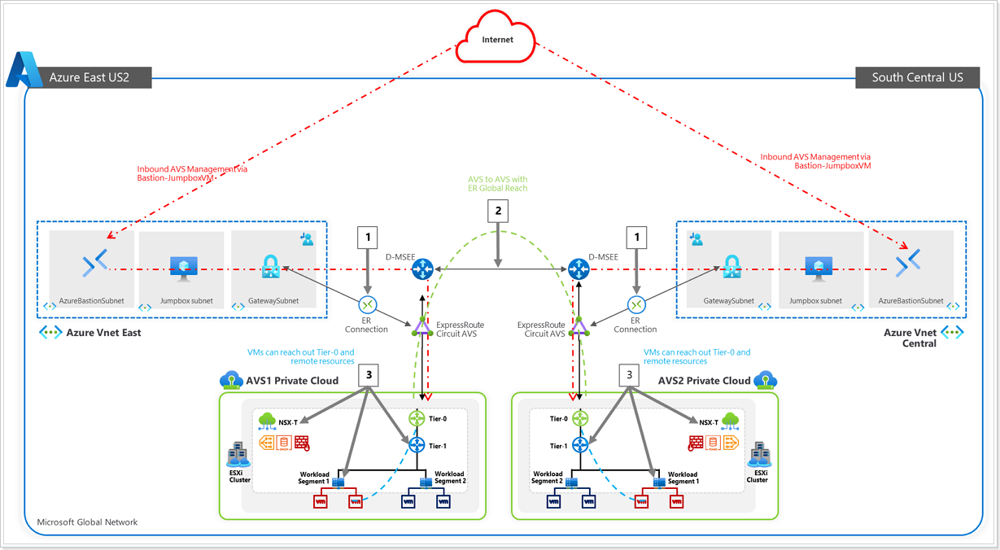

## Connectivity Options for AVS

This hands-on lab will show you how to configure the Networking components of an Azure VMware Solution for:

  * Connecting Azure VNet’s to AVS over an ExpressRoute circuit **(Preconfigured)**.
  * Peering with remote environments using Global Reach **(Not Applicable)**.
  * AVS Interconnect Options.
  * Configuring NSX-T (check DNS and configure DHCP, Segments, and Gateway) to manage connectivity within AVS.

The lab environment has a preconfigured Azure VMware Solution environment with an Express Route circuit. A nested or embedded VMware environment is configured to simulate an On-Premises environment **(PLEASE DO NOT TOUCH)**. Both environments are accessible through Bastions and JumpBoxes.

After this lab is complete, you will have built out this scenario below:

  1. ExpressRoute, for connectivity between Azure VMware Solution and Azure Virtual Networks.
  2. Configure NSX-T to establish connectivity within the AVS environment.
  3. Creation of Test VMs to attach to your NSX-T Network Segments.
  4. Explore some advanced NSX-T features like tagging, creation of groups, Distributed Firewall Features.

## Deploy Azure VMware Solution (AVS)
In this section you will deploy the Azure VMware Solution rom Azure portal, AVS deployment will take 4-5 hours.

1. On Azure portal, click on **Show portal menu** button from upper left corner.

   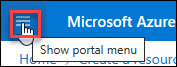
   
2. Click on **+ Create a resource**.

   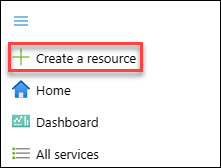
   
3. In search box enter **Azure VMware Solution** and then select **Azure VMware Solutions**.

   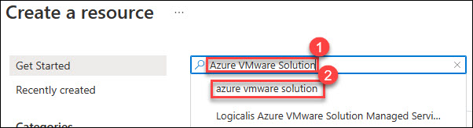
   
4. Click on **Create**.

   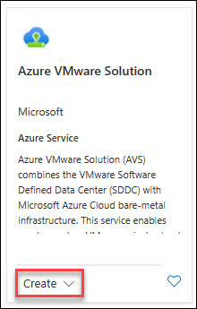
   
5. Click on **Create** button again.

   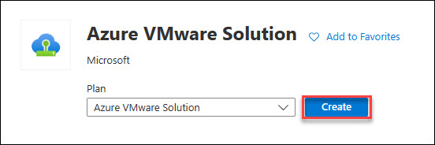
   
6. On the **Prerequisites** blade, click on **Next : Basics >**

   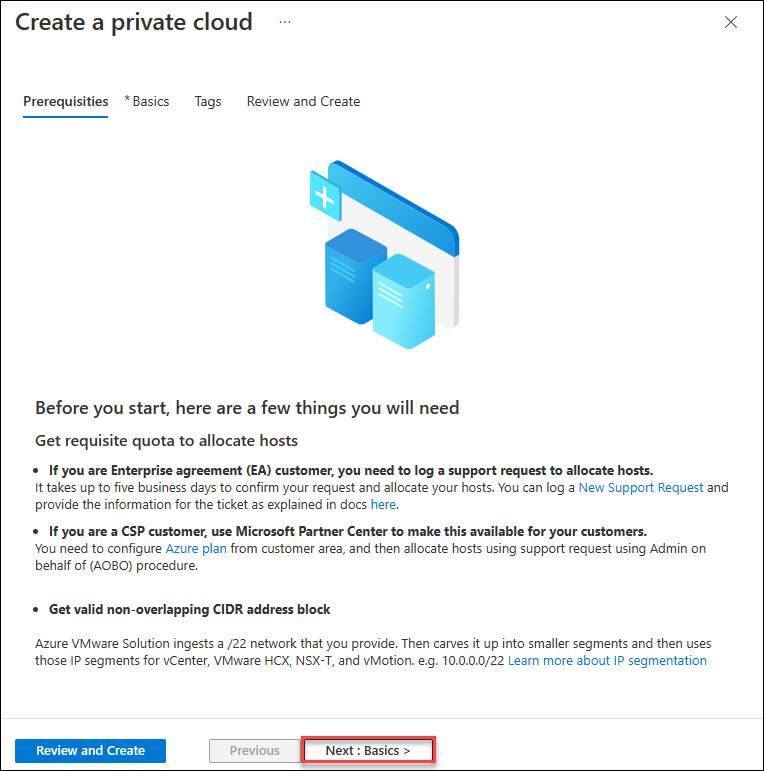
   
7. On **Basics** tab, enter/select following values:
    * Resource Group: `AVS-RG`
    * Resource Name: `AVS-DC`
    * Location: `Same as Resource Group location`
    * Size of Host: `AV36P Node`
    * Number of hosts: `default/3`
    * Address block for private cloud: `10.10.0.0/16`
   Now, click on **Review and Create**
    
   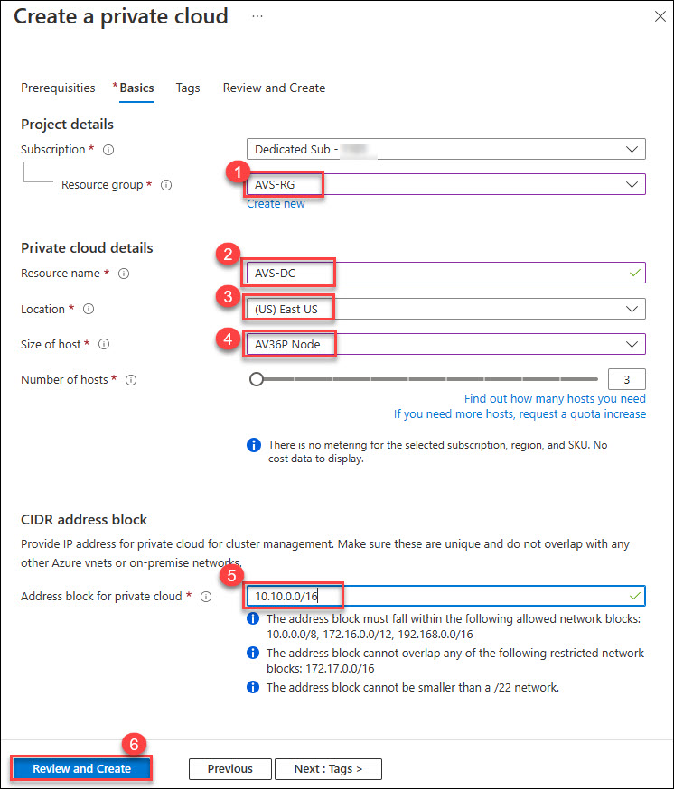
   
8. Validate all the values which you have provided in previous step and click on **Create** to start the Azure Vmware Solution deployment. Please note it will take upto 4-5 hours to get the deployment succeed.

   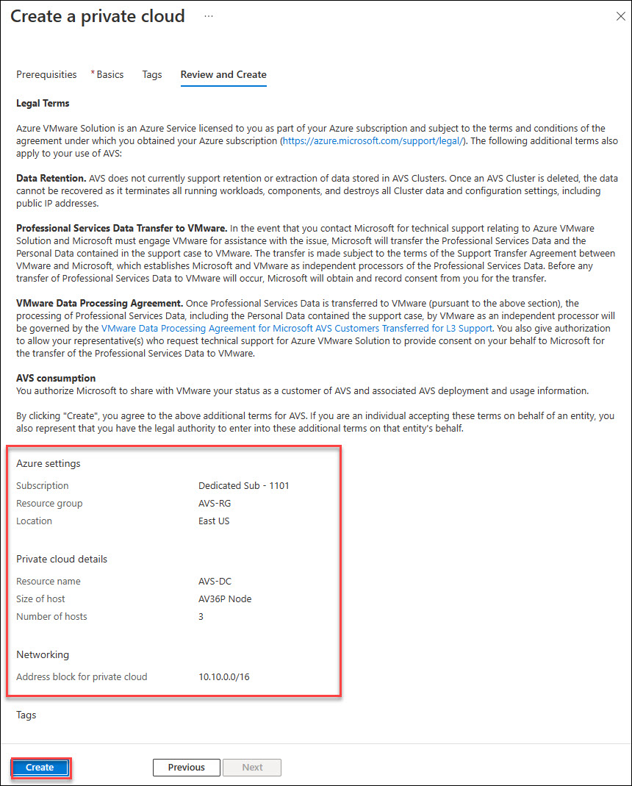
   
9. Once the deployment is succeed you can varify it from the notification icon of Azure portal from the top right corner near settings gear icon.

## Task 1: AVS Connectivity Options

### Overview

In this section you will create a connection between an existing, non-AVS, Virtual Network in Azure and the Azure VMware Solution environment. This allows the jumpbox virtual machine you created to manage key components in the VMware management plane such as vCenter, HCX, and NSX-T. You will also be able to access Virtual Machines deployed in AVS and allow those VMs to access resources deployed in the Hub or Spoke VNet’s, such as Private Endpoints and other Azure VMs or Services.

**Summary**: Generate a new Authorization Key in the AVS ExpressRoute settings, and then create a new Connection from the Virtual Network Gateway in the VNet where the JumpBox is connected to.

### Option 1: Internal ExpressRoute Setup from AVS -> VNet

 > **NOTE**: Since we already have a virtual network gateway, you’ll add a connection between it and your Azure VMware Solution private cloud.

1. On Azure portal, click on the **Resource groups** from the **Navigate** section. 

   
   
2. From the **Resource group** page, open **AVS-RG** by clicking on it.
  
   
   
4. Now, you can see the resources in **AVS-RG**, select **AVS-DC** resource of **AVS Private cloud** type.

   
   
5. From **AVS-DC** blade, click on **VMware credentials** (1), then copy **Web client URL of vCenter Server**.

   
   
6. Now, open the new tab in **Edge** browser in **JumpBox** and paste the **Web client URL of vCenter Server**. You will see it is not avaiable becouse there is no connectivity with AVS-DC Vmware private cloud yet. In next step you will start configuring the connectivity on **AVS-DC** with **JumpBOX-vNet** using Azure Virtual Gateway.

   
   
7. From **AVS-DC** blade, click on **Connectivity** option under **Manage** section and then select **ExpressRoute** from the available connectivity options. In last click on **+ Request an authorization key**.

   

8. Notedown the values of **ExpressRoute ID** and **az-vnet-key** values for next steps.

   

9. From Azure portal, go to the Resource groups and click on **JumpBox-RG**.

   

10. From **JumpBox-RG** overview blade, click on **JumpBox-GW**.

   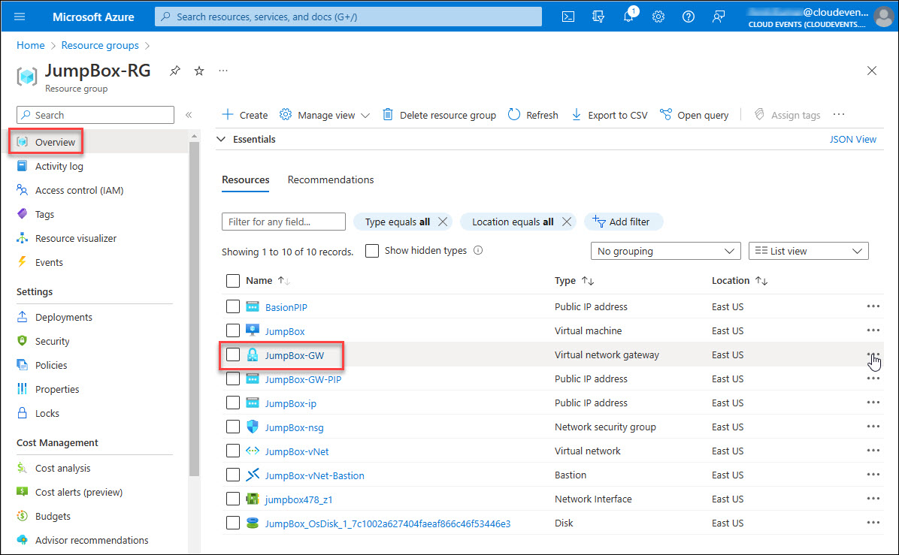

11. gw-connection-add

12. On **Add connection** blade, enter forllowing details:
     * Name (1): `AVS-vNet`
     * Connection type (2): `ExpressRoute`
     * Enable check box for **Redeem authorization** (3)
     * Authorization key: paste the autharization key **az-vnet-key** value which you noted in previous steps. 
     * Peer circuit URI: paste the **ExpressRoute ID** value which you noted in previous steps.
    Now, click on the **OK** button to add the connection, and wait for few seconds to get the connection succeed.
    
    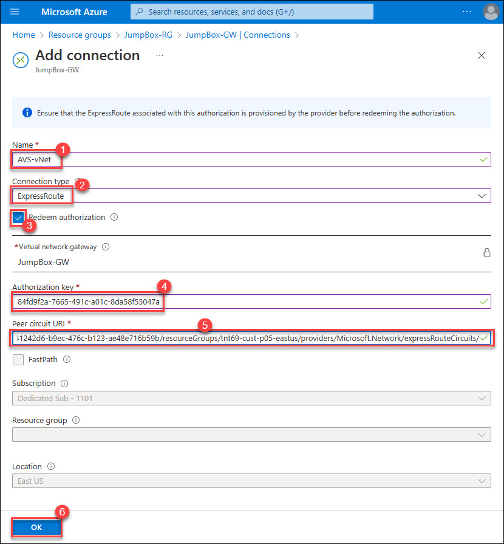
    
13. Within few second you will fing the connection is added and in succeeded state.

    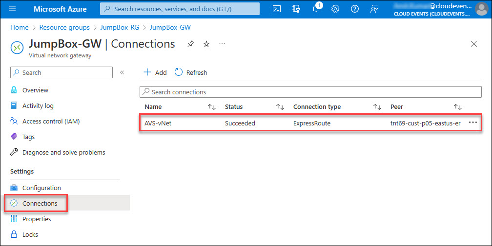

14. Now, from **AVS-DC** blade, click on **VMware credentials** (1), then copy **Web client URL of vCenter Server**.

    * Web client URL of vCenter Server: `https://10.10.0.2/`

   

15. Now, enter the vCenter Server **Web client URL**(1) in edge browser. Click on the **Advanced button**(2).

   

16. Click on **Continue to 10.10.0.2 (unsafe)** to open the vCenter Server. 

   
   
17. You will see that now you can launch the vsphere client (HtML5) successfully now. After launching vsphere client you will have to click on **Advance** button and then procees with unsafe link. You will see the **VMware vSphere** login screen now.

   
   
18. Repeat same steps to access NSX-T Manager using the Web Client URL.
    * https://10.10.0.3/

      
   
   

