# Exercise 1: Understand the AVS deployment architecture.

Azure VMware Solution offers a private cloud environment accessible from On-Premises and Azure-based resources. Services such as Azure ExpressRoute, VPN connections, or Azure Virtual WAN deliver the connectivity.

## Scenario

Customer needs to have connectivity between their workloads in AVS, existing services and workloads in Azure, and access to the internet.

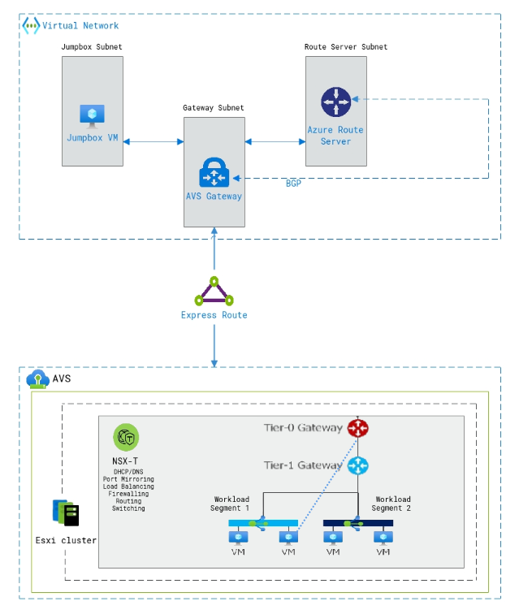

### Task 1: Connectivity Options for AVS

This hands-on lab will show you how to configure the Networking components of an Azure VMware Solution for:

  * Connecting Azure VNet’s to AVS over an ExpressRoute circuit **(Preconfigured)**.
  * Peering with remote environments using Global Reach **(Not Applicable)**.
  * AVS Interconnect Options.
  * Configuring NSX-T (check DNS and configure DHCP, Segments, and Gateway) to manage connectivity within AVS.

The lab environment has a preconfigured Azure VMware Solution environment with an Express Route circuit. A nested or embedded VMware environment is configured to simulate an On-Premises environment **(PLEASE DO NOT TOUCH)**. Both environments are accessible through Bastions and JumpBoxes.

After this lab is complete, you will have built out this scenario below:

  1. ExpressRoute, for connectivity between Azure VMware Solution and Azure Virtual Networks.
  2. Configure NSX-T to establish connectivity within the AVS environment.
  3. Creation of Test VMs to attach to your NSX-T Network Segments.
  4. Explore some advanced NSX-T features like tagging, creation of groups, Distributed Firewall Features.

### Task 2: Review the exisitng resources on the Azure portal

In this task you will review the Pre-created resources on your Azure Portal.

1. Navigate to the **Azure portal** on your **JumpBoxVM** and sign in with your user credentials if you are not already signed in. 

2. On Azure portal, click on the **Resource groups** from the **Navigate** section.

    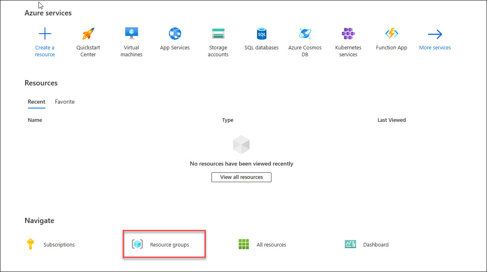
    
3. From the **Resource group** page, notice the resource groups **AVS-RG** and **JumpBox-RG**.

    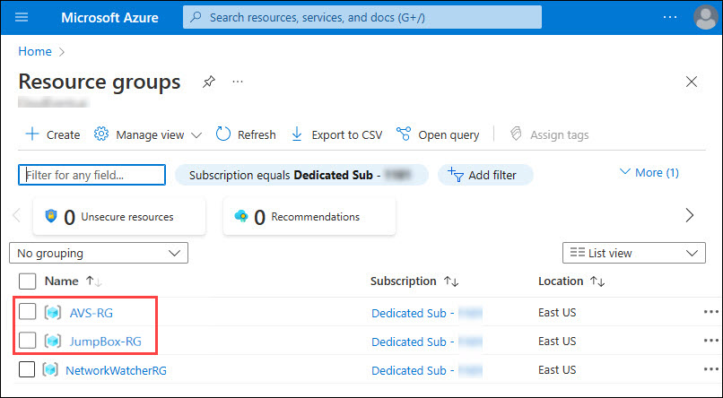

4. Click on **AVS-RG** to view the resources present in it, you should see a resource of the **AVS Private Cloud** type named **AVS-DC**.

    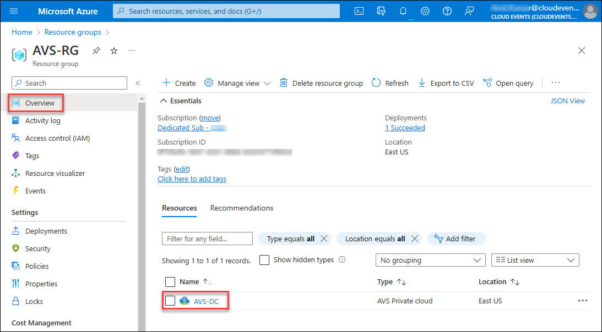

5. Navigate back to the resource group page and click on **JumpBox-RG**. 

    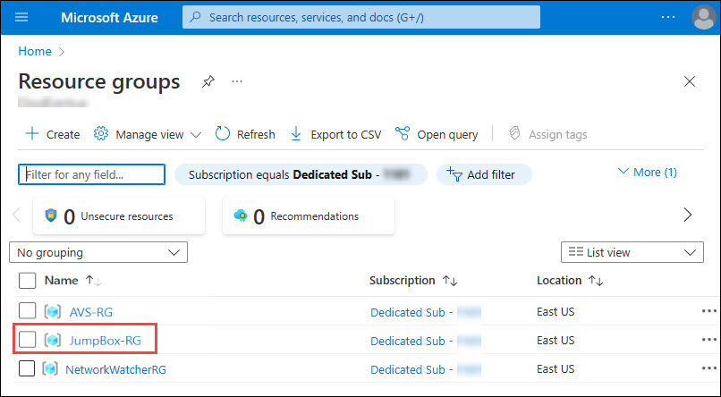

6. In the **JumpBox-RG**, observe the following resources, here the **AVS-GW** is the **Virtual Network Gateway** that is connected to your JumpBox **Virtual Machine**.
   
    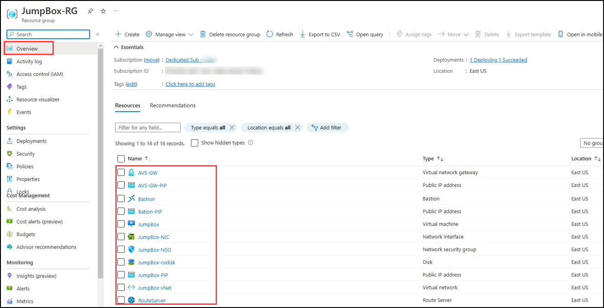

### Task 3: AVS Connectivity Options
In this section you will create a connection between an existing, non-AVS, Virtual Network in Azure and the Azure VMware Solution environment. This allows the jumpbox virtual machine you created to manage key components in the VMware management plane such as vCenter, HCX, and NSX-T. You will also be able to access Virtual Machines deployed in AVS and allow those VMs to access resources deployed in the Hub or Spoke VNet’s, such as Private Endpoints and other Azure VMs or Services.

**Summary**: Generate a new Authorization Key in the AVS ExpressRoute settings, and then create a new Connection from the Virtual Network Gateway in the VNet where the JumpBox is connected to.

### Option 1: Internal ExpressRoute Setup from AVS -> VNet

 > **NOTE**: Since we already have a virtual network gateway, you’ll add a connection between it and your Azure VMware Solution private cloud.

1. On Azure portal, click on the **Resource groups** from the **Navigate** section. 

   
   
2. From the **Resource group** page, open **AVS-RG** by clicking on it.
  
   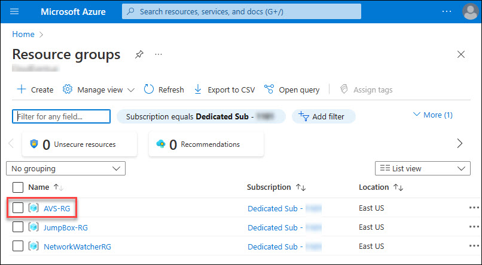
   
4. Now, you can see the resources in **AVS-RG**, select **AVS-DC** resource of **AVS Private cloud** type.

   
   
5. From **AVS-DC** blade, click on **VMware credentials** (1), then copy **Web client URL of vCenter Server**.

   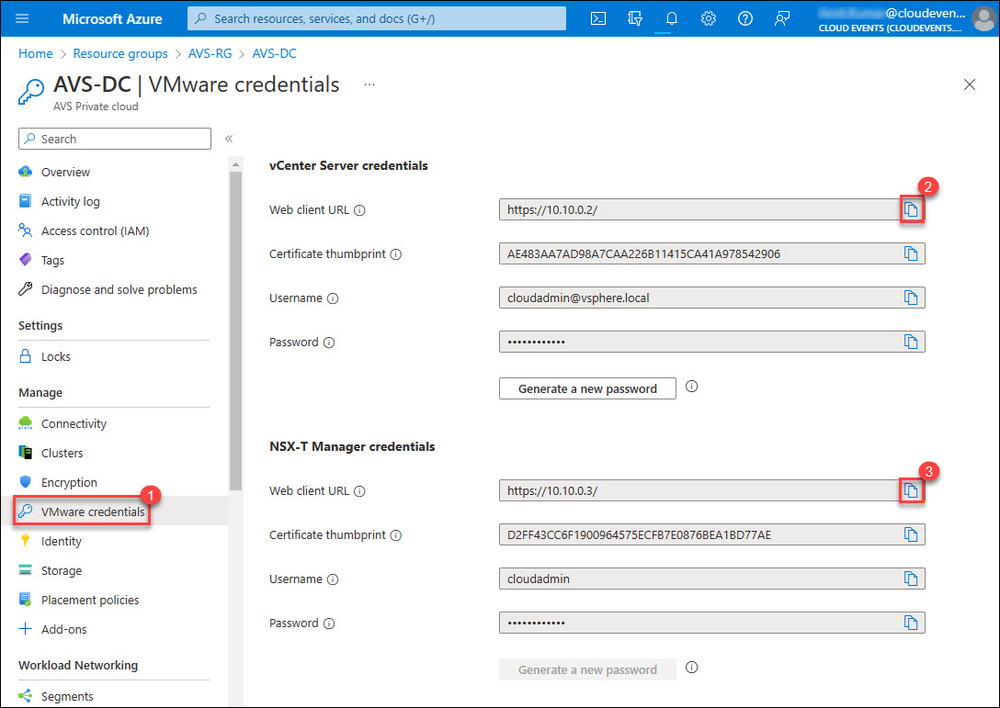
   
6. Now, open the new tab in **Edge** browser in **JumpBox** and paste the **Web client URL of vCenter Server**. You will see it is not available because there is no connectivity with AVS-DC VMware private cloud yet. In next step you will start configuring the connectivity on **AVS-DC** with **JumpBOX-vNet** using Azure Virtual Gateway.

   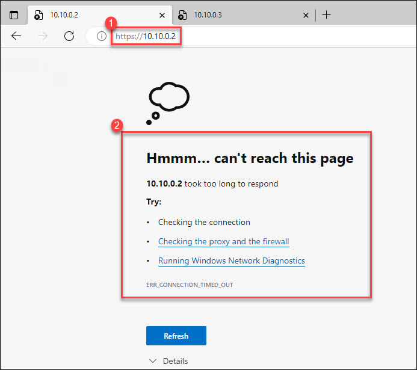
   
7. From **AVS-DC** blade, click on **Connectivity** option under **Manage** section and then select **ExpressRoute** from the available connectivity options. In last click on **+ Request an authorization key**.

   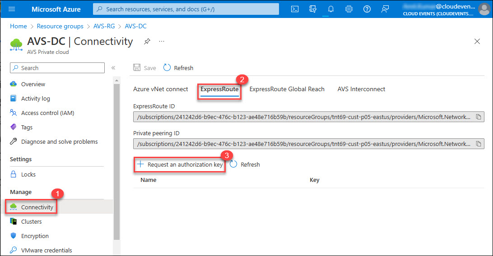
   
8. Give your authorization key a name: `az-vnet-key`. Click **Create**. It may take about 30 seconds to create the key.

   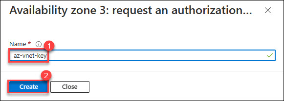
    
### Task 4: Confirm access from Jumpbox

1. Now, from **AVS-DC** blade, click on **VMware credentials** (1), then copy **Web client URL of vCenter Server**.

    * Web client URL of vCenter Server: `https://10.10.0.2/`

     

2. Now, enter the vCenter Server **Web client URL**(1) in edge browser. Click on the **Advanced button**(2).

   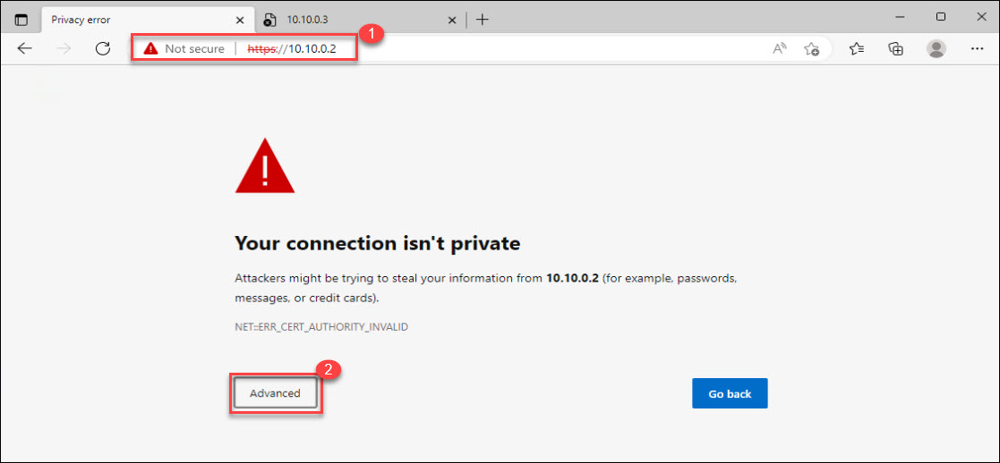

3. Click on **Continue to 10.10.0.2 (unsafe)** to open the vCenter Server. 

   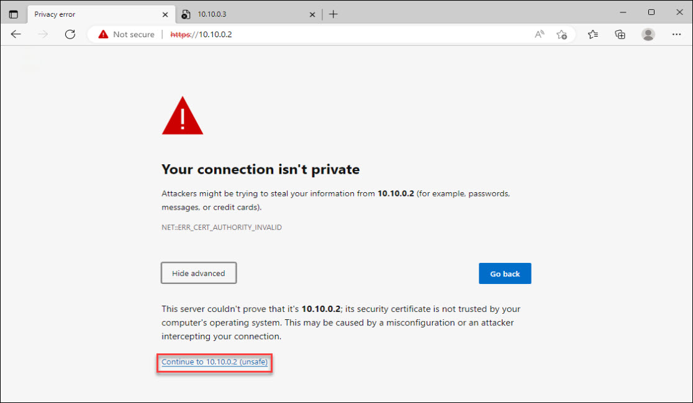
   
4. You will see that now you can launch the vSphere client (HtML5) successfully now. After launching vSphere client you will have to click on **Advance** button and then proceed with unsafe link. You will see the **VMware vSphere** login screen now.

   
   
5. Repeat same steps to access NSX-T Manager using the Web Client URL.
    * https://10.10.0.3/

     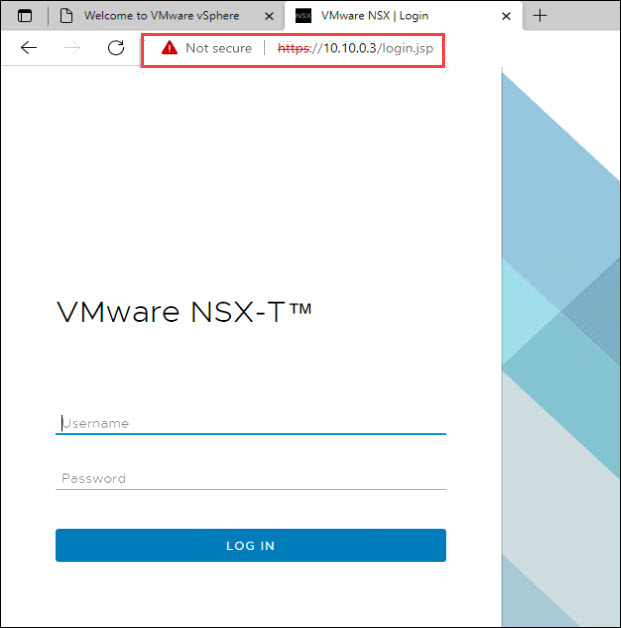  
   
#### Summary:
In this task, you have configured the connectivity between **AVS Private cloud** and the **JumpBox-vNet** using the Azure **Virtual network gateway** connection. So, you can access the **vCenter Server** and **NSX-T Manager** from the **JumpBox**

#### References:
[Tutorial - Configure networking for your VMware private cloud in Azure - Azure VMware Solution | Microsoft Docs](https://docs.microsoft.com/en-us/azure/azure-vmware/tutorial-configure-networking#connect-expressroute-to-the-virtual-network-gateway)
 
