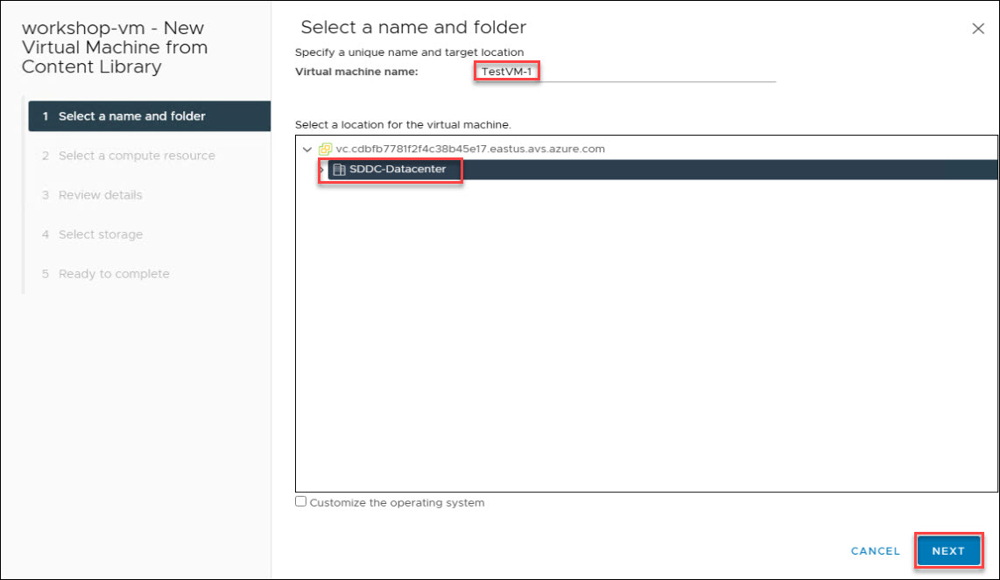
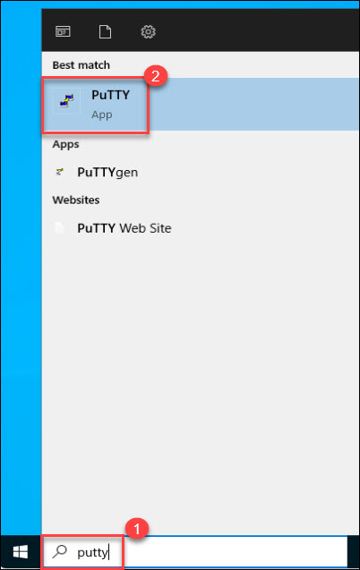
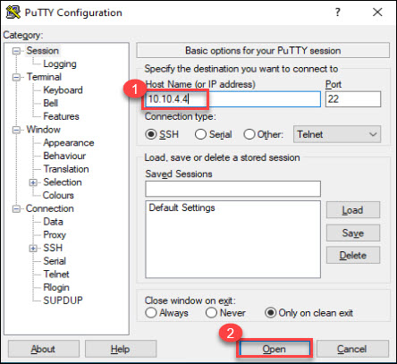
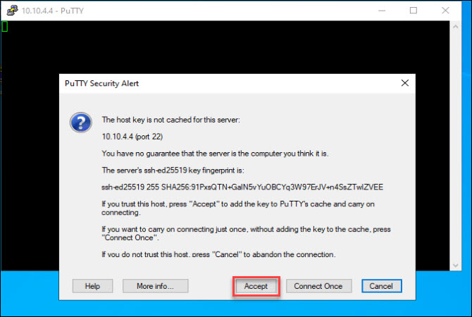
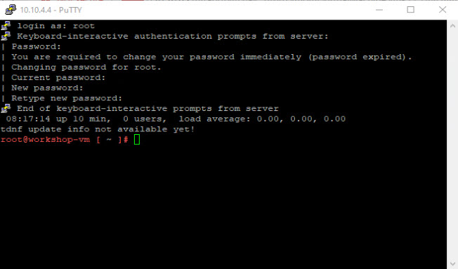
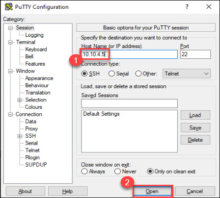

## Exercise 2: Deploy VMware VMs in AVS 

### Create Test VMs
Now that we have our networks created, we can deploy virtual machines and ensure we can get an IP address from DHCP. Go ahead and Login into your AVS vCenter.

## Lab objectives

In this Exercise, you will complete the following tasks:

+ Task 1: Create a Content Library
+ Task 2: Import Item to Content Library 
+ Task 3: Create VMs
+ Task 4: Connect to the VMs

### Task 1: Create a Content Library

1. Under Resource groups tab, launch **AVS-RG**.

   

2. Select your **Azure VMware Solution** `AVS-DC`.

   

3. On the Azure VMware Solution page; click on **VMware credentials (1)** under Manage tab and then copy the **Web client URL**, **Username** and **Password** under vCenter Server Credentials **(2)** and save it in notepad for later use.

   

4. Open VMware vSphere tab where you have logged in earlier. If not opened then follow the below steps to re-login. You can skip next two steps if VMware vSphere is already logged in.

5. Open a new tab in the Microsoft Edge browser, Enter the **Web Client URL** that you copied in step 3, You may see a warning `Your connection isn't private`, then click on **Advanced** button and proceed with **Continue to 10.10.0.2 (unsafe)**. 

   

6. Log in to the **VMware vSphere**; Enter the **Username** and **password** that you copied in step 3 and click on **LOGIN**.

   

7. From AVS vCenter, click on the **Menu (1)** bar and then click on **Content Libraries (2)** under Inventory.

   

8. Click on the **CREATE** button to create the **New Content Libraries**.

   

9. On the **Name and location** pane; Enter name of your Library as `Local-Lib` **(1)** and click on **NEXT (2)**.

   

10. On the **Configure content library** pane; Leave it as default and click on **NEXT**.

    

11. On the **Apply security policy** pane; Leave it as default and click on **NEXT**.

    

12. On the **Add storage** pane; select **Storage (1)** and click on **NEXT (2)**.

    

13. On the **Ready to complete** pane; review your content library settings and click on **FINISH**.

    
   
### Task 2: Import Item to Content Library 

1. Click on your newly created Library i.e. **Local-Lib**.

   

2. On the Local-Lib Library, click on **ACTIONS (1)** and then click on **Import item (2)**.

   

3. Under **Import Library Item tab**, enter the source file URL as `https://gpsusstorage.blob.core.windows.net/ovas-isos/workshop-vm.ova` **(1)** and click on **IMPORT (2)**.

   

4. Once the import is completed, you will see a warning message as **SSL certification from server gpsusstorage.blob.core.windows.net can not be trusted. Do you want to proceed**. Click on **Actions** and then **Continue**.

   

5. You will see the **workshop-vm (3)** under the **OVF & OVA Templates (2)**.

   
   
### Task 3: Create VMs

1. Right click on **workshop-vm (1)**, and then select **New VM from This Template... (2)**.

   

2. On the **Select a name and folder** pane; enter the Virtual machine name as `TestVM-1` **(1)** and then Select a location for the virtual machine i.e. **SDDC-Datacenter (2)**, and then, click on **NEXT (3)**.

   

3. On the **Select a compute resource** pane; Select the destination compute resource for this operation i.e. **Cluster-1 (1)** and click on **NEXT (3)**.

   

4. On the **Review details** pane; you can verify the template details and click on **NEXT**.

   

5. On the **License agreements** pane; Accept the terms and click on **NEXT**.

   

6. On the **Select storage** pane; Select **Storage (1)** and click on **NEXT (2)**.

   

7. On the **Select networks** pane; Select the Destination Network as **Web-Segment** and click on **NEXT**.

   

8. On the **Ready to complete** pane; click on **FINISH**.

   
   
9. Repeat the above steps and create a new VM with name **TestVM-2**.

   

### Task 4: Connect to the VMs

In this task you will be connecting to the VMs using **Putty (SSH Tool)**, which is already installed in the **JumpBox** which is already connected with lab environment.

   > **Important:** Ensure both the test VMs are turned on before performing this task.

1. From the **JumpBox**, from start menu search `Putty` **(1)** and then click on **Putty (2)**

   
   
2. Enter the Private-IP of **TestVM-1** VM in Host Name in putty tool and then click on **Open (2)**.
   * Host Name (or IP address): `10.10.4.4`
    
     
     
3. Click on **Accept** to proceed with the **PuTTY Security Alert**

   
   
4. Next, enter teh VM username and password as below and then provide new password to which you want to change the existing password.

   * Login as: Enter `root`
   * Password: `AVSR0cks!`
   * New Password: `demo@pass123`
   * Retype New Password: `demo@pass123`

     
 
5. Run the following commands to enable ICMP traffic on the VM:

    ```
       iptables -A OUTPUT -p icmp -j ACCEPT
       iptables -A INPUT -p icmp -j ACCEPT
    ```

6. From the **JumpBox**, from start menu search `Putty` **(1)** and then click on **Putty (2)** and open one more putty session for **TestVM-2**.

   
   
7. Enter the Private-IP of **TestVM-2** VM in Host Name in putty tool and then click on **Open (2)**.
   * Host Name (or IP address): `10.10.4.5`
    
     
     
8. Click on **Accept** to proceed with the **PuTTY Security Alert**

   
   
9. Next, enter the VM username and password as below and then provide new password to which you want to change the existing password.

   * Login as: Enter `root`
   * Password: `AVSR0cks!`
   * New Password: `demo@pass123`
   * Retype New Password: `demo@pass123`

     
 
10. Run the following commands to enable ICMP traffic on the VM:

    ```
       iptables -A OUTPUT -p icmp -j ACCEPT
       iptables -A INPUT -p icmp -j ACCEPT
    ```
   
## Review
In this exercise, you have completed:
- Created a Content Library
- Imported Item to Content Library 
- Created VMs
- Connected to the VMs

## References:
- [Deploying OVF and OVA Templates](https://docs.vmware.com/en/VMware-vSphere/7.0/com.vmware.vsphere.vm_admin.doc/GUID-AFEDC48B-C96F-4088-9C1F-4F0A30E965DE.html)
- [Templates in Content Libraries](https://docs.vmware.com/en/VMware-vSphere/7.0/com.vmware.vsphere.vm_admin.doc/GUID-F7BF0E6B-7C4F-4E46-8BBF-76229AEA7220.html)

## You have successfully completed this lab

