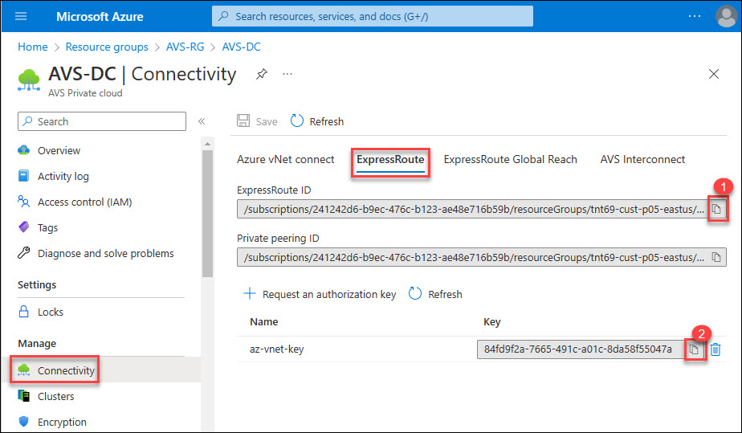
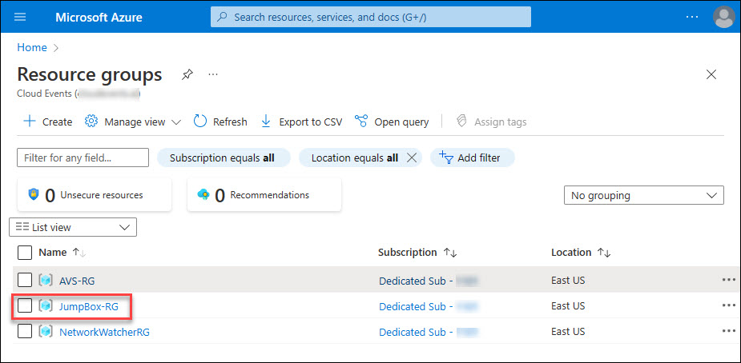
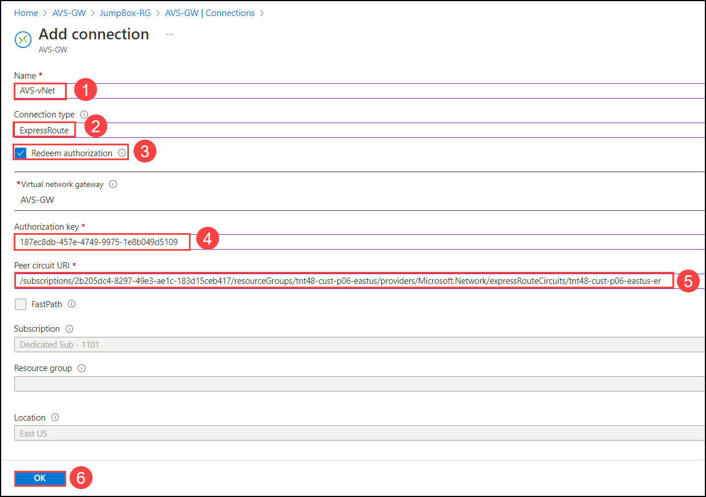
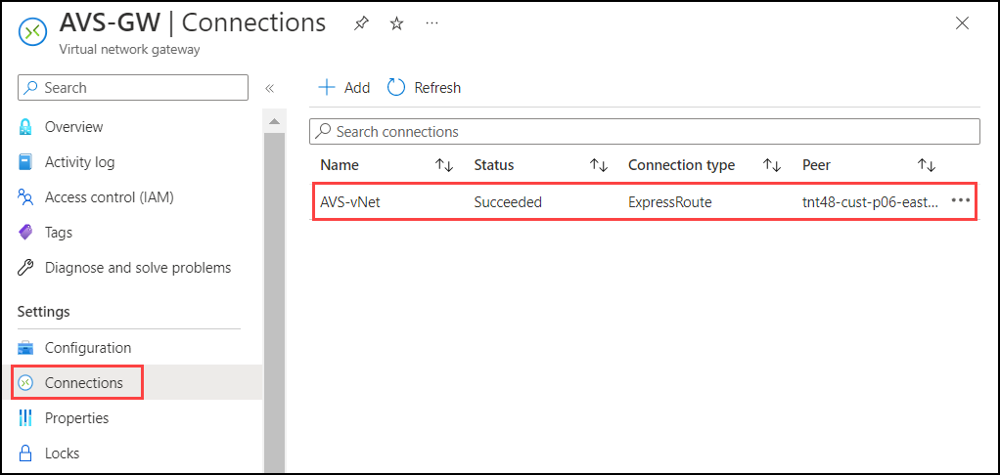

# Exercise 4: Connect Azure VNET to AVS using Express Route Connectivity 

Azure VMware Solution offers a private cloud environment accessible from On-Premises and Azure-based resources. Services such as Azure ExpressRoute, VPN connections, or Azure Virtual WAN deliver the connectivity.

## Lab objectives

In this Exercise, you will complete the following tasks:

+ Task 1: Create connection in VNet Gateway

### Task 1: Create connection in VNet Gateway

1. Once authorization key is created, the new key appears in the list of authorization keys for the private cloud. Copy the authorization key and ExpressRoute ID and keep it handy. You will need them to complete the peering. The authorization key disappears after some time, so copy it as soon as it appears.

   

2. From Azure portal, go to the Resource groups and click on **JumpBox-RG**.

   

3. From **JumpBox-RG** overview blade, click on **AVS-GW**.

   

4. From the **AVS-GW** blade, click on on the **Connections** under **Settings** and then **+ Add** to add the gatway connection.
    
   
   
5. On **Add connection** blade, enter following details:
     * Name (1): `AVS-vNet`
     * Connection type (2): `ExpressRoute`
     * Enable check box for **Redeem authorization** (3)
     * Authorization key: paste the authorization key **az-vnet-key** value which you noted in previous steps. 
     * Peer circuit URI: paste the **ExpressRoute ID** value which you noted in previous steps.
    Now, click on the **OK** button to add the connection, and wait for few seconds to get the connection succeed.
    
       
    
6. Within few second you will find the connection is added and in succeeded state.

      

## Review
In this exercise, you have completed:
- Connected Azure VNET to AVS using Express Route Connectivity

## You have successfully completed this lab
 
