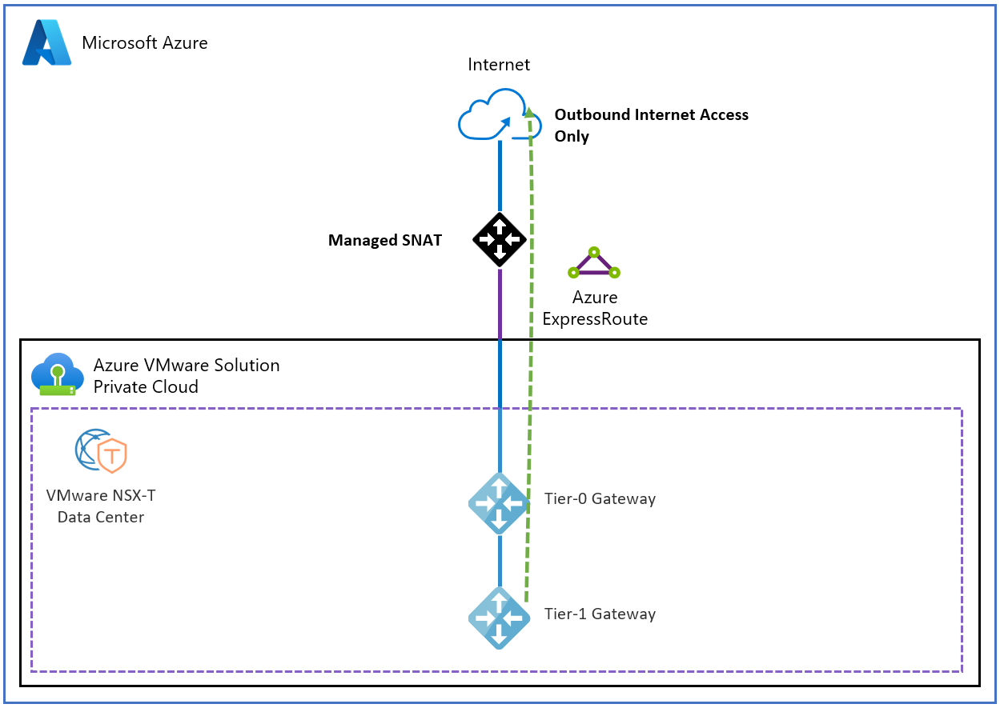
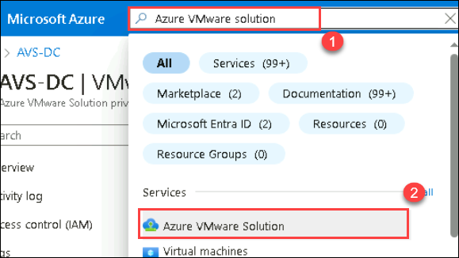
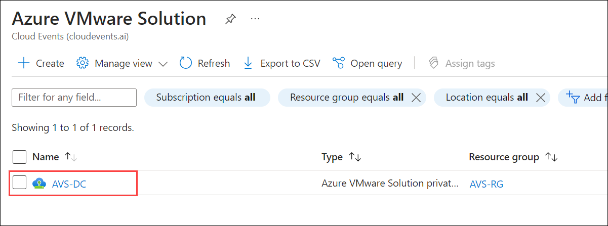
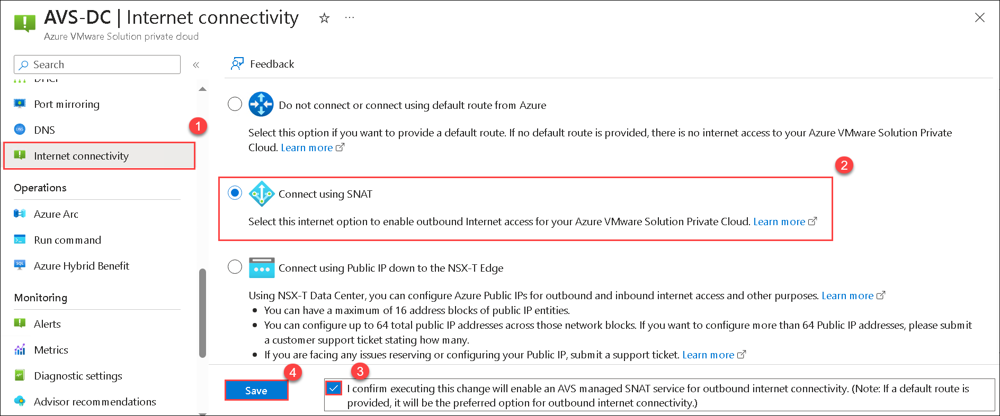

# Exercise 5: Enable Managed SNAT for Azure VMware Solution workloads 

A SNAT service translates from an RFC 1918 space to the public internet for simple outbound internet access. Internet Control Message Protocol (ICMP) is turned off by design so that users can't ping an internet host. The SNAT service doesn't work when you have a default route from Azure.

The Managed SNAT service in Azure VMware Solution gives you:

A basic SNAT service with outbound internet connectivity from your Azure VMware Solution private cloud.
A limit of 128,000 concurrent connections.
By using the Managed SNAT service, you don't have:

Control of outbound SNAT rules.
Control of the public IP address that's used.
The ability to terminate inbound-initiated internet traffic.
The ability to view connection logs.

## Architecture diagram:

## Lab objectives

In this Exercise, you will complete the following tasks:

  + Task 1: Set up outbound internet access by using the Managed SNAT service

## Task 1: Set up outbound internet access by using the Managed SNAT service

To set up outbound internet access via Managed SNAT, use the Azure portal:

1. In the Azure portal search for **Azure VMware Solution (1)**, and then select **Azure VMware Solution (2)** from the results.

   

3. Select **AVS-DC** Azure VMware Solution private cloud.

   

4. On the resource menu under Workload networking, select **Internet connectivity (1)** follow follwing steps:

  -  Select **Connect using SNAT (2)**
  - Select **Checkbox (3)** to **I confirm executing this change will enable an AVS managed SNAT service for outbound internet connectivity.**
  - Select **Save (3)**.

    

## Review
In this exercise, you have completed:

- Set up outbound internet access by using the Managed SNAT service

## You have successfully completed this lab
