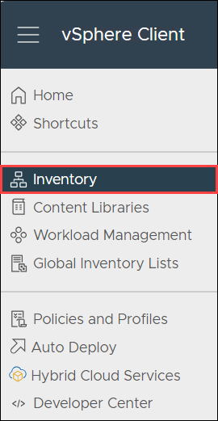
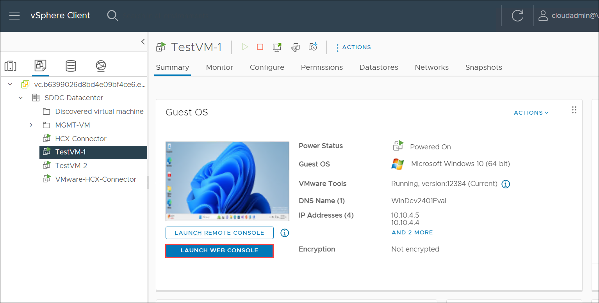
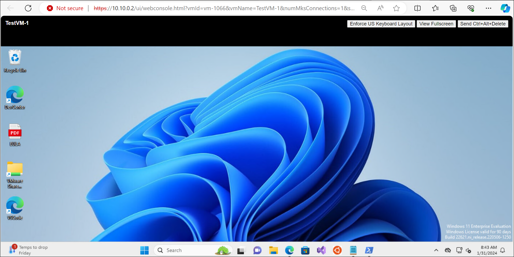

# Exercise 8: Monitor AVS VMs with Azure Monitoring 

## Lab objectives

In this Exercise, you will complete the following tasks:

+ Task 1: Enable Azure Monitor for VMs on AVS
+ Task 2: Install Log Analytics agent on AVS VMs
+ Task 3: Verify Log Analytics Integration
+ Task 4: Set up Alerts
+ Task 5: Explore Metrics and Dashboards


### Task 1: Connect to the VMs

In this task you will be connecting to the VMs.

   > **Important:** Ensure both the test VMs are turned on before performing this task.

1. From AVS vCenter, click on the **Menu** bar and then click on **Inventory**.

   

2. Select **TestVM-1** Under **SDDC Datacenter** and clcik on **LANCH WEB CONSOLE**.

   
  
3. It will redirect you to the windows **TestVM-1**.

   

### Task 2: Install Log Analytics agent on AVS VMs

1. In the TestVM-1, click on the Microsoft Edge browser which is present on the taskbar.

2. In the left-hand navigation pane, select "Azure VMware Solution."

3. Navigate to your AVS Private Cloud.

4. Click on "VMs" in the AVS Private Cloud menu.

5. Select the VMs for which you want to enable monitoring.

6. In the VM details pane, click on the "Connect" button.

7. From the "Connect to VM" blade, download the Log Analytics agent setup for Windows or Linux, based on your VM OS.

8. Install the Log Analytics agent on the selected VMs.

9. During installation, provide the Workspace ID and Key from the Azure Monitor workspace where you want to store the monitoring data.

### Task 3: Verify Log Analytics Integration

1. Go back to the Azure portal.

2. In the Azure Monitor workspace, navigate to the "Logs" section.

3. Run a query to check if data is flowing from your AVS VMs. For example:

   ```kusto
   Heartbeat
   | summarize arg_max(TimeGenerated, *) by Computer
   ```

   This query should return a list of computers reporting to Azure Monitor.

### Task 4: Set up Alerts

1. In the Azure portal, go to the Azure Monitor workspace.

2. Navigate to the "Alerts" section.

3. Click on "New alert rule" and configure the conditions based on your requirements.

4. Specify the action group that will be notified when the alert condition is met.

### Task 5: Explore Metrics and Dashboards

1. In the Azure portal, go to the Azure Monitor workspace.

2. Navigate to the "Metrics" section.

3. Explore and visualize metrics related to your AVS VMs.

### Task 6: Create a Dashboard:

1. In the "Monitor" menu, select "Dashboards."

1. Click on the "+ New dashboard" button.

1. Provide a name for your dashboard, choose the subscription, resource group, and location.

1. Click on the "Review + create" button, review your settings, and then click "Create."

### 3. Add Tiles to the Dashboard:

1. Once your dashboard is created, click on it to open it.

1. Click on the "+ Add" button to add tiles to the dashboard.

### 4. Add Log Analytics Queries to Tiles:

1. For each tile, you can add different types of data, including log analytics queries.

1. Click on "Add a query" or "Add metric" based on your data source.

1. For Log Analytics queries, you can use the "Log Analytics" tile type.

1. Enter your Log Analytics query in the query editor.

### 5. Example Dashboard Tiles:

Here are examples of tiles you might want to add to your AVS dashboard:

#### 5.1. Overview Tile:

- **Query:**
  ```kusto
  Resources
  | where ResourceId contains "<Your AVS Resource ID>"
  | project Location, ProvisioningState, ResourceGroup
  ```

#### 5.2. Event Tile:

- **Query:**
  ```kusto
  Event
  | where Resource == "<Your AVS Resource ID>"
  | summarize count() by EventLevelName
  ```

#### 5.3. Performance Counter Tile:

- **Query:**
  ```kusto
  Perf
  | where Resource == "<Your AVS Resource ID>" and CounterName == "Processor Time"
  | summarize avg(CounterValue) by Computer
  ```

>**Note**: Replace `<Your AVS Resource ID>` with the actual Resource ID of your AVS instance.

### Task 6: Review and Optimize

1. Periodically review the metrics, alerts, and logs to ensure your AVS VMs are performing optimally.

2. Adjust alert thresholds and configurations based on your evolving requirements.

## Review
In this exercise, you have completed:
- Deployed OVA from download
