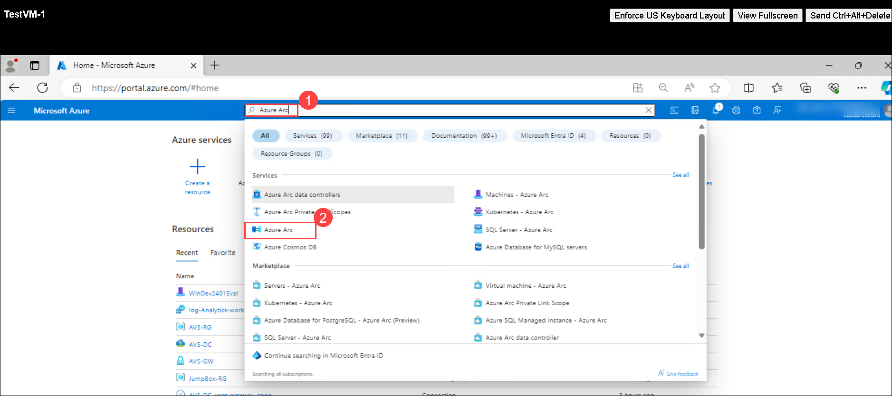
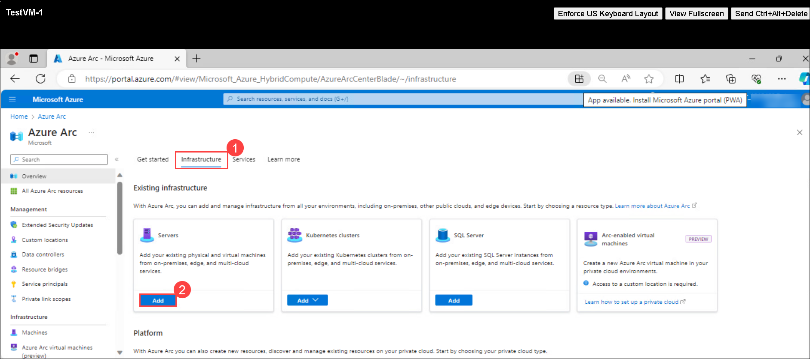
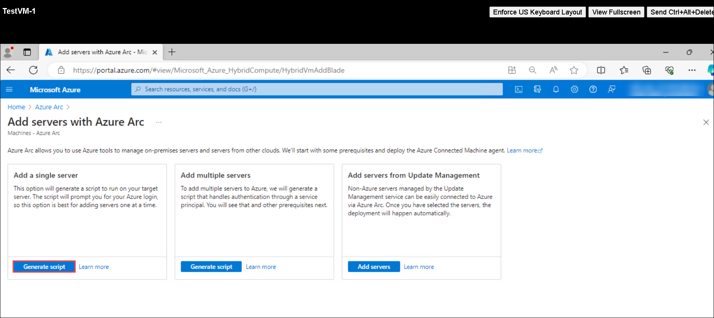
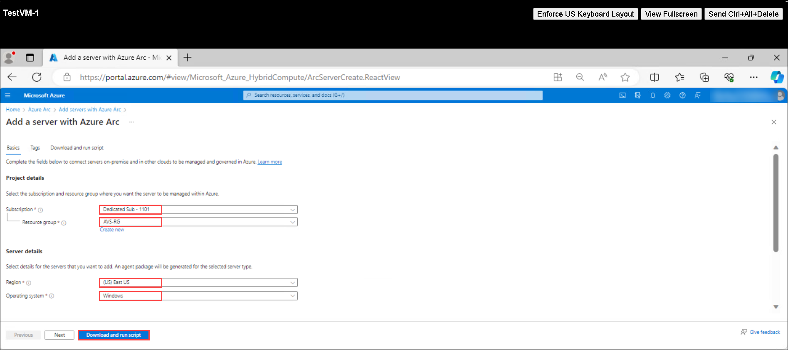
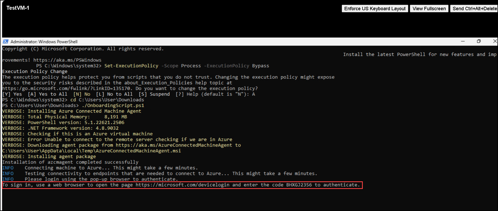
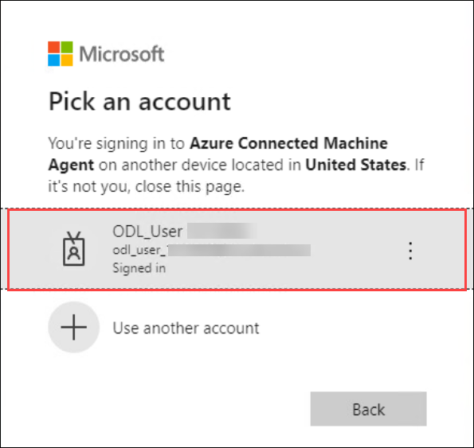
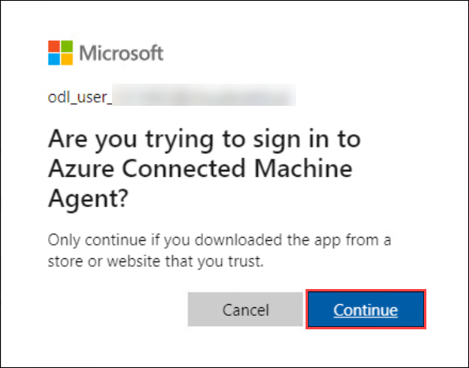
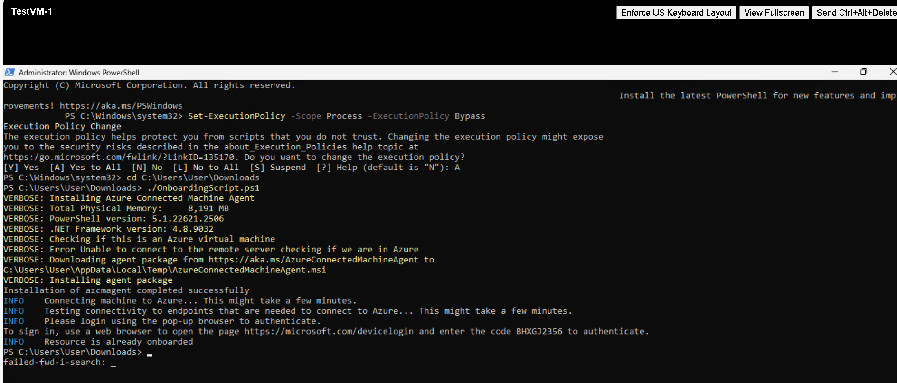

# Exercise 8: Monitor AVS VMs with Azure Monitoring 

## Lab objectives

In this Exercise, you will complete the following tasks:

+ Task 1: Enable Azure Monitor for VMs on AVS
+ Task 2: Install Log Analytics agent on AVS VMs
+ Task 3: Verify Log Analytics Integration
+ Task 4: Set up Alerts
+ Task 5: Explore Metrics and Dashboards


### Task 1: Connect to the VMs

In this task you will be connecting to the VMs.

   > **Important:** Ensure both the test VMs are turned on before performing this task.

1. From AVS vCenter, click on the **Menu** bar and then click on **Inventory**.

   

2. Select **TestVM-1** Under **SDDC Datacenter** and clcik on **LANCH WEB CONSOLE**.

   
  
3. It will redirect you to the windows **TestVM-1**.

   

### Task 2: Install Log Analytics agent on AVS VMs

1. In the **TestVM-1**, click on the Azure portal shortcut of Microsoft Edge browser which is present on the desktop.
    
1. On the **Sign in to Microsoft Azure** tab, you will see the login screen. Provide the following **Email/Username** and then click on **Next**.

   * Email/Username: <inject key="AzureAdUserEmail"></inject>

   
   
1. Now enter the following **Password** and click on **Sign in**.
   
   * Password: <inject key="AzureAdUserPassword"></inject>

   
   
1. If you see the pop-up **Stay Signed in?**, click No.

1. If you see the pop-up **You have free Azure Advisor recommendations!**, close the window to continue the lab.

1. If **Welcome to Microsoft Azure** pop-up window appears, click on **Maybe Later** to skip the tour.

1. In the Azure portal, search for Azure Arc and select **Azure Arc**

   

1. On the Azure Arc page, select **Infrastructure** then select **Add** under servers.

   

1. On the **Add servers with Azure arc** page, select **Generate Script** under Add a single server.

   

1. On the **Add a server with Azure Arc** page, provide the details and select **Download and run script**

   |Setting|Value|
   |---|---|
   |Subscription|the name of the Azure subscription you are using in this lab|
   |Resource group|**AVS-RG**|
   |Region|**(US) East US**|
   |Operating system|**Windows**|
   |Connectivity method|**Public endpoint**|

   

1. In windows search bar, search powershell and run as administrator and run the following commands to configure the script execution policy. Type **A** and press enter: 

   ```powershell
   Set-ExecutionPolicy -Scope Process -ExecutionPolicy Bypass
   ```

1. Now, run the command go to the path where script has been downloaded:

   ```powershell
   cd C:\Users\User\Downloads
   ```

1. Now, run the command to run the script which was downloaded in step 10:

   ```powershell
   ./OnboardingScript.ps1
   ```

1. After running the script, open the edge browser, navigate to **https://microsoft.com/devicelogin** page and provide the code shown in powershell to authenticate.

   

1. Enter the code and select **Next** button in Microsoft tab.

   

1. Under Pick an account tab, select the ODL user which you are using in the lab.

   

1. Under Action Required tab, select **Next**.

   

1. On the Are you trying to sign in to Azure Connected Machine agent tab, select **Continue**.

   

1. You will see new tab, Azure Connected Machine Agent with notification **You have signed in to the Azure Connected Machine Agent application on your device**.

   

1. Upon returning to PowerShell, you'll observe that the PowerShell script has finished executing..

   


### Task 3: Verify Log Analytics Integration

1. Go back to the Azure portal.

2. In the Azure Monitor workspace, navigate to the "Logs" section.

3. Run a query to check if data is flowing from your AVS VMs. For example:

   ```kusto
   Heartbeat
   | summarize arg_max(TimeGenerated, *) by Computer
   ```

   This query should return a list of computers reporting to Azure Monitor.

### Task 4: Set up Alerts

1. In the Azure portal, go to the Azure Monitor workspace.

2. Navigate to the "Alerts" section.

3. Click on "New alert rule" and configure the conditions based on your requirements.

4. Specify the action group that will be notified when the alert condition is met.

### Task 5: Explore Metrics and Dashboards

1. In the Azure portal, go to the Azure Monitor workspace.

2. Navigate to the "Metrics" section.

3. Explore and visualize metrics related to your AVS VMs.

### Task 6: Create a Dashboard:

1. In the "Monitor" menu, select "Dashboards."

1. Click on the "+ New dashboard" button.

1. Provide a name for your dashboard, choose the subscription, resource group, and location.

1. Click on the "Review + create" button, review your settings, and then click "Create."

### 3. Add Tiles to the Dashboard:

1. Once your dashboard is created, click on it to open it.

1. Click on the "+ Add" button to add tiles to the dashboard.

### 4. Add Log Analytics Queries to Tiles:

1. For each tile, you can add different types of data, including log analytics queries.

1. Click on "Add a query" or "Add metric" based on your data source.

1. For Log Analytics queries, you can use the "Log Analytics" tile type.

1. Enter your Log Analytics query in the query editor.

### 5. Example Dashboard Tiles:

Here are examples of tiles you might want to add to your AVS dashboard:

#### 5.1. Overview Tile:

- **Query:**
  ```kusto
  Resources
  | where ResourceId contains "<Your AVS Resource ID>"
  | project Location, ProvisioningState, ResourceGroup
  ```

#### 5.2. Event Tile:

- **Query:**
  ```kusto
  Event
  | where Resource == "<Your AVS Resource ID>"
  | summarize count() by EventLevelName
  ```

#### 5.3. Performance Counter Tile:

- **Query:**
  ```kusto
  Perf
  | where Resource == "<Your AVS Resource ID>" and CounterName == "Processor Time"
  | summarize avg(CounterValue) by Computer
  ```

>**Note**: Replace `<Your AVS Resource ID>` with the actual Resource ID of your AVS instance.

### Task 6: Review and Optimize

1. Periodically review the metrics, alerts, and logs to ensure your AVS VMs are performing optimally.

2. Adjust alert thresholds and configurations based on your evolving requirements.

## Review
In this exercise, you have completed:
- Deployed OVA from download
