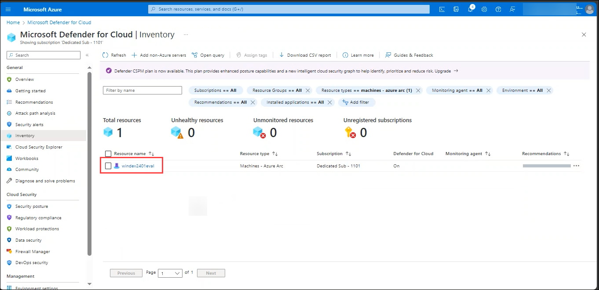
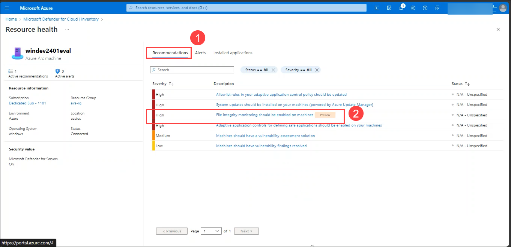

### Task 1: Enabling Microsoft Defender for Cloud
In this task, you will be getting started with the functionality of Microsoft Defender for Cloud and how to enable Microsoft Defender for Cloud on a subscription.

   >**Note**: Enabling Microsoft Defender for Cloud is a proactive step toward securing your Azure resources, identifying vulnerabilities, and responding to potential security threats. It helps organizations maintain a robust security posture and adhere to compliance standards in the dynamic landscape of cloud computing.

1. On Azure Portal page, in **Search resources, services and docs (G+/)** box at the top of the portal, enter **Microsoft Defender for Cloud(1)**, and then select **Microsoft Defender for Cloud(2)** under services.

    

1. From left navigation menu and click on **Getting started**.

1. On the **Getting Started** page, under the **Upgrade** tab, make sure **log analytics workspace (1)** is also selected and then select the **Upgrade (2)** button at the bottom of the page.

    

### Task 2: View recommendations and passed assessments

1. In Microsoft Defender for Cloud, select **Inventory** from the left pane.

   

1. On the command bar, select **Resource Type == All (1)** and under the value section, select the **Machines - Azure Arc (2)** and then select ok.
   

1. Select the **Machines - Azure Arc**.

   

1. On the **WinDev2401Eval** resource. A page opens showing the security health details of your resource.

   

1. Select **Recommendation** tab and in the list, select any Recommendations to view these details.

   

1. On the selected recommendation page, explore the details and understand the **Remediation steps** to fix the resource health.

   
