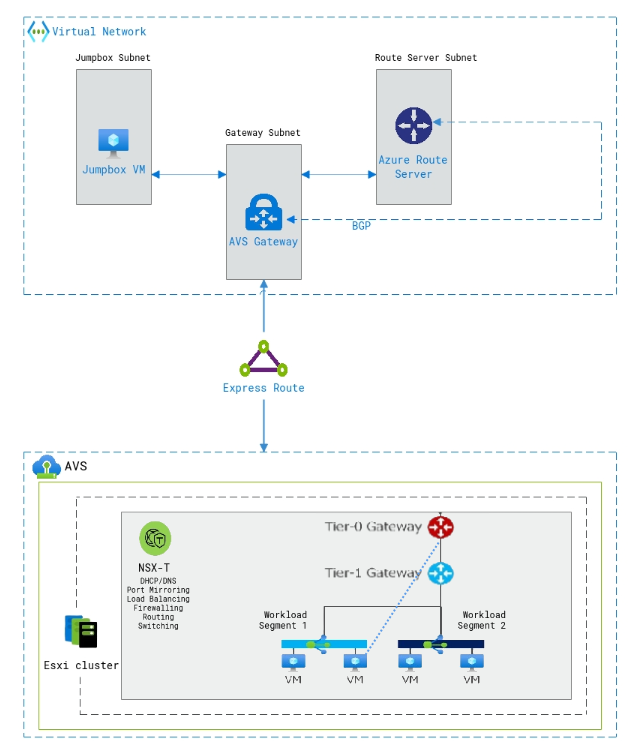

# Introduction to AVS Architecture

## Architecture diagram:

   

## Initial Connection and Management:

* The process starts with the **Jumpbox VM** in the Jumpbox Subnet. This isolated VM serves as the secure entry point for initial AVS configuration and management.
You connect to the jumpbox VM remotely using SSH or RDP through the internet and the **AVS Gateway**.

## Internal Routing and Management:

* **The Azure Route Server** in the Route Server Subnet dynamically learns and manages routes within the AVS private cloud. This simplifies routing configuration and centralizes its control.

## External Connectivity :

* While not explicitly shown, the architecture allows for an **ExpressRoute** connection. This dedicated private link between your on-premises network and Azure offers increased security, low latency, and high bandwidth compared to the public internet.

## Core AVS Infrastructure:

* The **AVS** component represents the core VMware SDDC environment running on Azure infrastructure. This is where you deploy and manage your virtual machines.

## Advanced Networking and Security:

* This architecture incorporate **NSX-T**. This service provides advanced networking and security features like firewalls, microsegmentation, and load balancing within the AVS private cloud.

## Network Segmentation and Workloads:

* This architecture illustrates two **Tier-1 Gateways** connecting various **Workload Segments**. These segments strategically isolate different workloads, such as development, test, and production, ensuring improved security, management, and resource allocation.

## Virtual Machines and Management:

* VMs reside within the Workload Segments, representing your applications and workloads.
* You manage these VMs using familiar **vSphere Client** or other compatible tools, treating them similarly to on-premises deployments.

### Monitoring and Optimization:

* **DHCP/DNS, Port Mirroring, Load Balancing, Firewalling, Routing, and Switching** services support core network functionality within the AVS private cloud.
* **Azure Monitor** integration, achievable through **Azure Arc for Servers**, provides optional insights into AVS VM performance and health.
* **Log Analytics** can be used for centralized logging and analysis of AVS events and activities.
