# Exercise 3: Configure DHCP for Azure VMware Solution

### NSX-T on AVS
After deploying the Azure VMware Solution, you can configure an NSX-T network segment from NSX-T Manager or the Azure portal. Once configured, the segments are visible in Azure VMware Solution, NSX-T Manager, and vCenter.

NSX-T comes pre-provisioned by default with an NSX-T Tier-0 gateway in Active/Active mode and a default NSX-T Tier-1 gateway in Active/Standby mode. These gateways let you connect the segments (logical switches) and provide East-West and North-South connectivity. Machines will not have IP addresses until statically or dynamically assigned from a DHCP server or DHCP relay.

## Lab objectives
In this exercise, you will complete the following tasks:

+ Task 1: Add DHCP Profile in AVS Private Cloud
+ Task 2: Create an NSX-T T1 Logical Router
+ Task 3: Add the DHCP Profile to the T1 Gateway
+ Task 4: Create Network Segment for AVS VM workloads

### Task 1: Add DHCP Profile in AVS Private Cloud
A DHCP profile specifies a DHCP server type and configuration. You can use the default profile or create others as needed. A DHCP profile can be used to configure DHCP servers or DHCP relay servers anywhere in your SDDC network.

|AVS NSX-T Details|	  |
|-------|-------|
|DHCP Server IP	| 10.10.5.1/30|
|Segment Name| Web-Segment|
|Segment Gateway| 10.10.4.1/2|
|DHCP Range| 10.10.4.4-10.10.4.2544|

1. In the Azure portal search for **Azure VMware Solution (1)**, and then select **Azure VMware Solution (2)** from the results.

   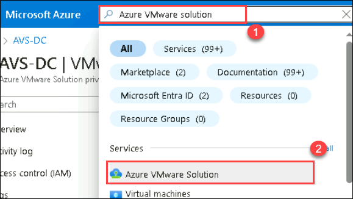

2. Select **AVS-DC** Azure VMware Solution private cloud.

   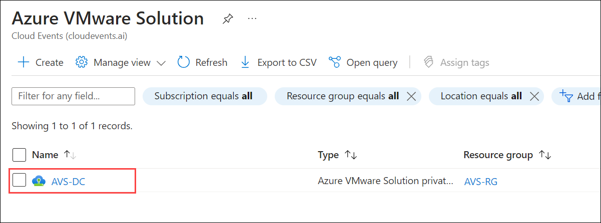

3. On the **AVS Private cloud** page, select **VMware credentials (1)** under **Manage** tab. From **NSX-T Manager credentials (2)** copy the **Username (3)**, **Password (4)**, and **Web client URL (5)**.
 
   
   
4. Open the **VMware NSX-T** login page on the web browser using the **Web client URL**.

   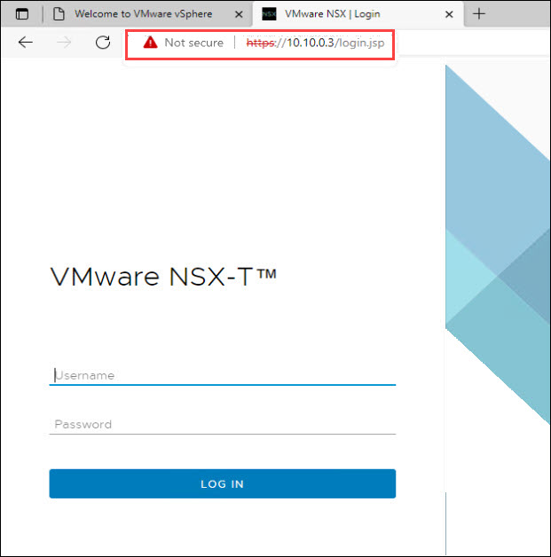  

   
5. On **VMware NSX-T** login page paste the **Username (1)** and **Password (2)**. Click on **LOG IN (3)**.

   

6. Once successfully logged in click on **POLICY** on the top right. On the **User Interface Mode Toggle** pop-up, check the **Don't show this again** box and click on **GOT IT!**.

   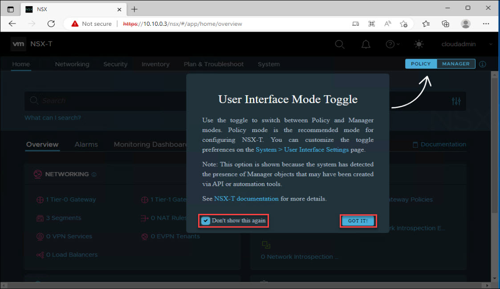

7. In the **NSX-T Console**, click **Networking**. Select **DHCP** under management, if you see any DHCP already there, then remove that. Click on ellipse (**⋮**) (3) and then select **Delete** (4).

   
   
8. Once existing DHCP is deleted, then Click on **ADD DHCP PROFILE**.

   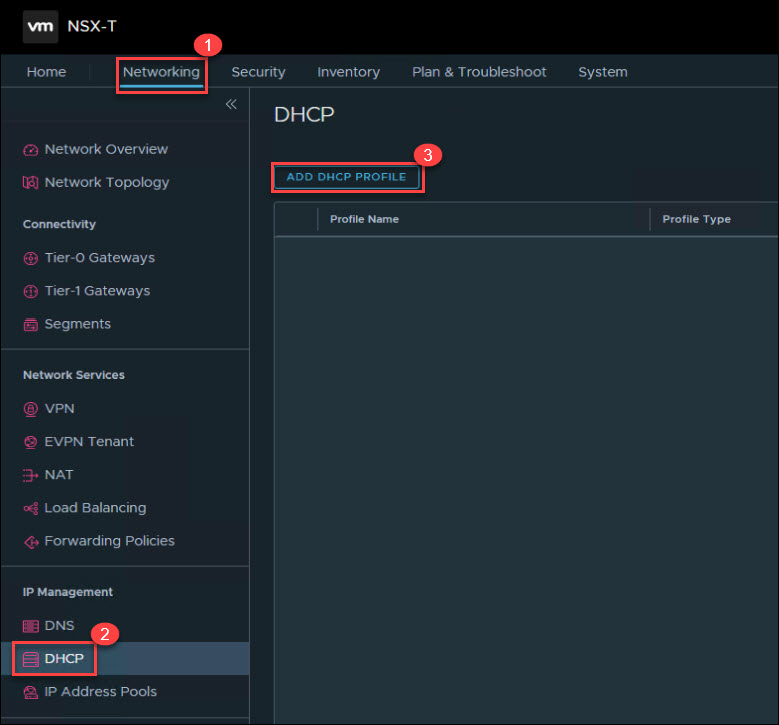

9. On the DHCP profile page provide the following details and **Save (4)**.
  
   - **Profile Name:** `Web-DHCP` **(1)**
   - **Profile Type:** `DHCP Server` **(2)**
   - **Server IP Address:** `10.10.5.1/30` **(3)**

      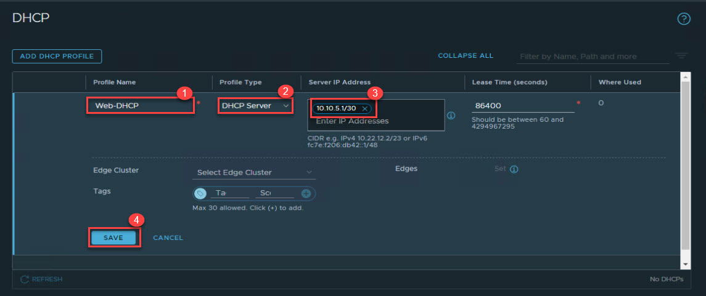

10. The **DHCP profile** has been added successfully.

   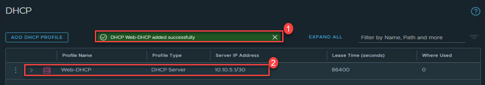

## Task 2: Create an NSX-T T1 Logical Router
NSX-T has the concept of Logical Routers (LR). These Logical Routers can perform both distributed or centralized functions. In AVS, NSX-T is deployed and configured with a default T0 Logical Router and a default T1 Logical Router. The T0 LR in AVS cannot be manipulated by AVS customers, however the T1 LR can be configured however an AVS customer chooses. AVS customers also have the option to add additional T1 LRs as they see fit.

   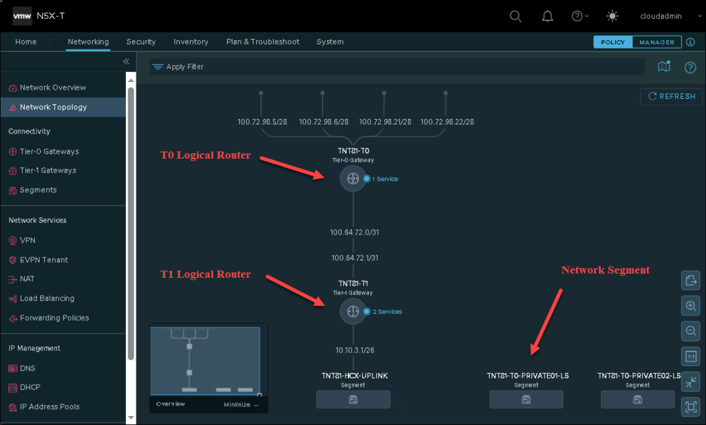

1. In the **NSX-T Console**, click **Networking (1)**. Select **Tier-1 Gateways (2)** under connectivity, If you see any existing **Tier-1 Gateways**, then click on ellipse (**⋮**) (3) and then select **Delete** (4).

   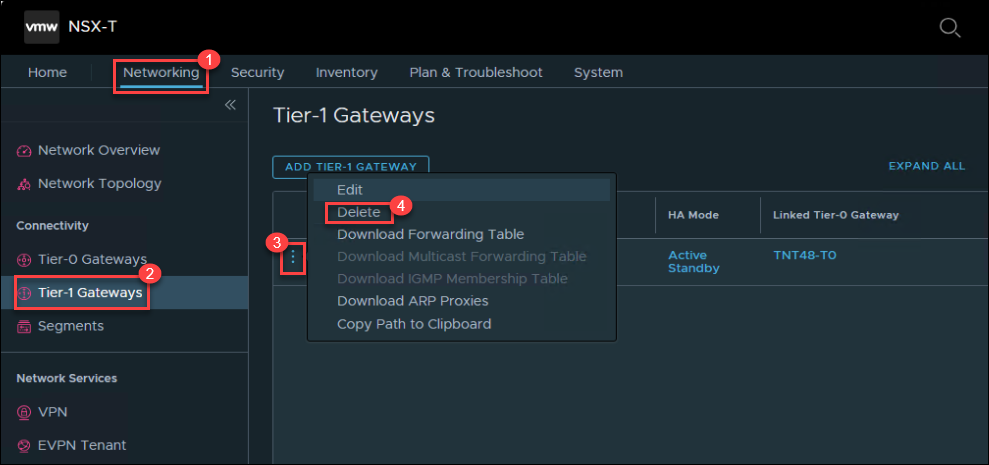

1. Now, click **ADD TIER-1 GATEWAY (3)** to create a new Tier-1 Gateway.

1. Now, click **ADD TIER-1 GATEWAY (3)** to create a new Tier-1 Gateway.

   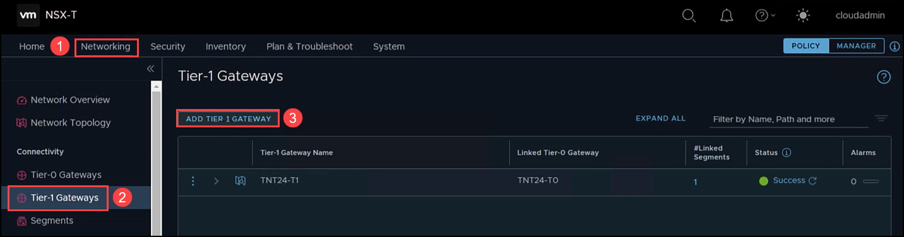
   
1. Enter the following detail the create the Tier-1 Gateway.
 
    - **Tier-1 Gateway Name**:  `TNTxx-T1 `, you will have two replace the xx as per the numerical value comes for Linked Tier-0 Gateway.
    - **Linked Tier-0 Gateway**: Select the default T0 Gateway.   
    - **Edge Cluster**: Select the available cluster from the drop-down.
    
    > **Note:** Replace the _xx_ in the **Tier-1 Gateway** name with the numbers present in your **Linked Tier-0 Gateway** name. Similar to the image shown below
   
   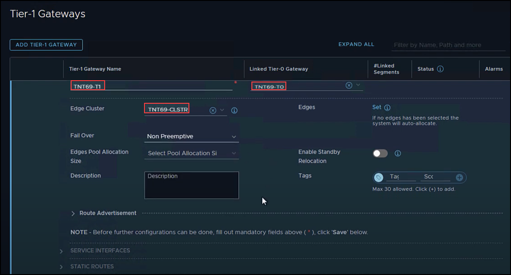

1. On the same screen, expand **Route Advertisement** and enable the following options shown as below and click in **Save**.
    
      - All Static Routes
      - All DNS Forwarder Routes
      - All Connected Segments & Service Ports
      - All IPSec Local Endpoints
      - All NAT IP's

   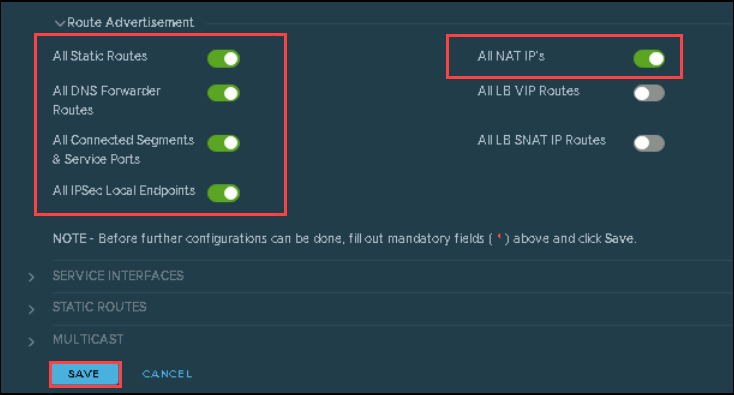

1. Select **NO** on the **Tier-1 Gateway Lab-T1** is successfully created.

   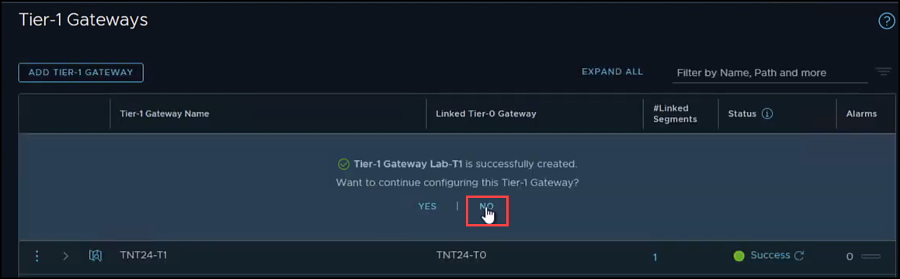

### Task 3: Add the DHCP Profile to the T1 Gateway

NSX-T has the concept of Logical Routers (LR). These Logical Routers can perform both distributed or centralized functions. In AVS, NSX-T is deployed and configured with a default T0 Logical Router and a default T1 Logical Router. The T0 LR in AVS cannot be manipulated by AVS customers, however the T1 LR can be configured however an AVS customer chooses. AVS customers also have the option to add additional T1 LRs as they see fit.

1. On **Tier-1 Gateways** page, click on three vertical dots besides the tier-1 gateway `TNTxx-T1` you just created then click on **Edit** .

   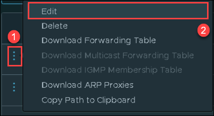

1. On **Tier-1 Gateways** page, click on **Set DHCP Configuration**. 

   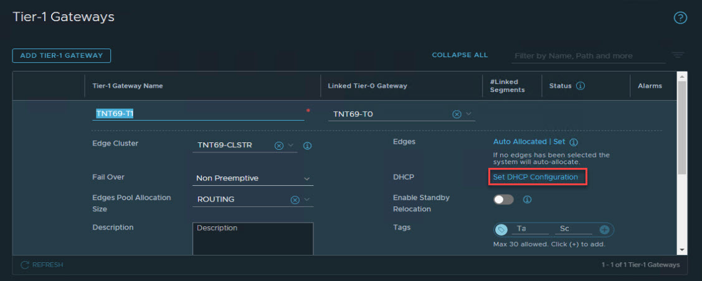

2. In **Set DHCP Configuration** pane, select **Type** as **DHCP Server (1)** in place of `No Dynamic IP Address Allocation` and **DHCP Server Profile** option will be visible, select **Web-DHCP (2)** from list then click **Save (3)**.

   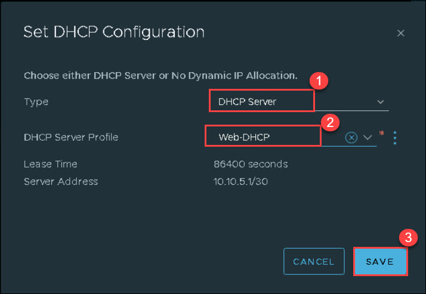 

3. On the  **Tier-1 Gateways** page, select **Save (1)** and **CLOSE EDITING (2)**.

   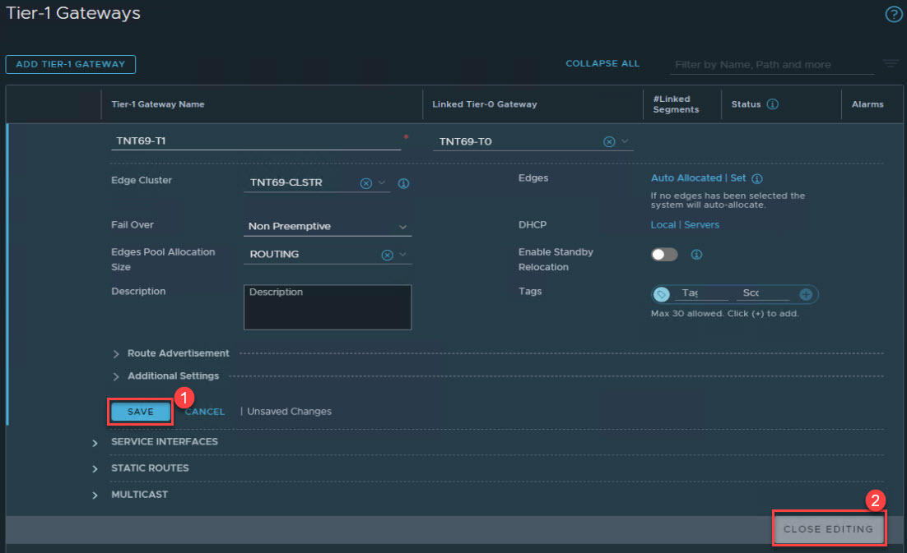

### Task 4: Create a Network Segment for AVS VM workloads
Network segments are logical networks for use by workload VMs in the SDDC compute network. Azure VMware Solution supports three types of network segments: routed, extended, and disconnected.

   - A routed network segment (the default type) has connectivity to other logical networks in the SDDC and, through the SDDC firewall, to external networks.

   - An extended network segment extends an existing L2VPN tunnel, providing a single IP address space that spans the SDDC and an On-Premises network.

   - A disconnected network segment has no uplink and provides an isolated network accessible only to VMs connected to it. Disconnected segments are created when needed by HCX. You can also create them yourself and can convert them to other segment types.

1. In the **NSX-T Console**, click **Networking (1)**. Select **Segments** under connectivity, review existing SEGMETS, if you see any SEGMET except below **3** SEGMENTS, then delete. If there is no extra Segment apart from these **3**, then proceed to next step.

   
  
2. In the **NSX-T Console**, click **Networking (1)**. Select **Segments** under connectivity and click on **ADD SEGMENT**.

   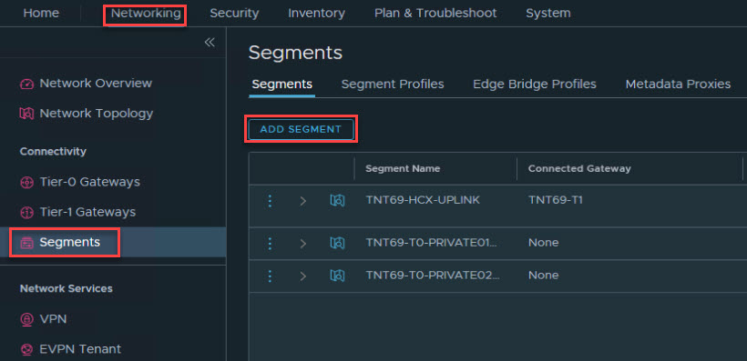   

3. On the Segments page provide the following details:

   - **Segment Name:**  `Web-Segment` **(1)**
   - **Connected Gateway:**  `TNTxx-T1| Tier1` **(2)**. Here, xx is a numeric value.
   - **Transport Zone:** `TNTxx-OVERLAY-TZ | Overlay ` **(3)** from the drop-down. Here, xx is a numeric value.
   - **Subnets:** `10.10.4.1/24` **(4)**
   Select **SET DHCP CONFIG**.

   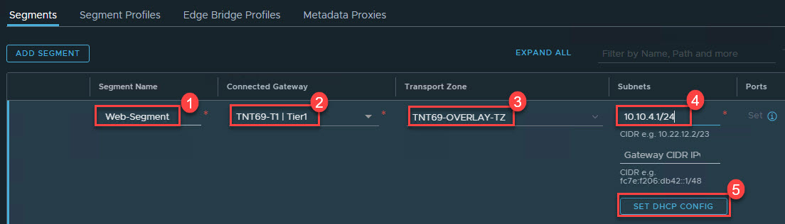

4. On **SET DHCP CONFIG** pane under **Gateway DHCP Server (1)** ensure to add the following and click on **APPLY (5)**: 

    - **DHCP Server Address:** `10.10.5.1/30` **(2)** 
    - **DHCP Ranges:** 10.10.4.4-10.10.4.254 **(3)**
    - **DNS Servers:** `10.10.0.192` **(4)**

       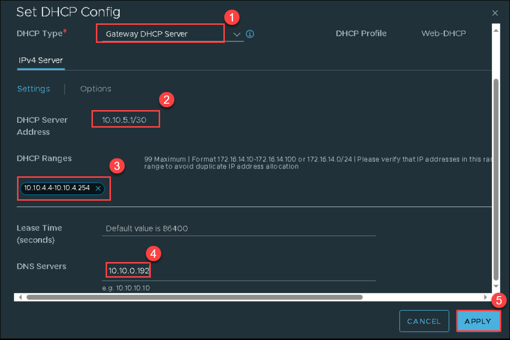   

5. Click on **Save**.

   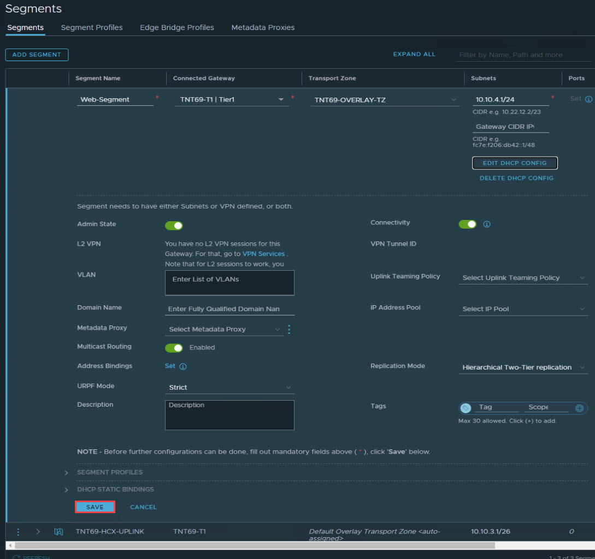 

6. Select **NO** on the **Segment Web-Segment is successfully created.**

   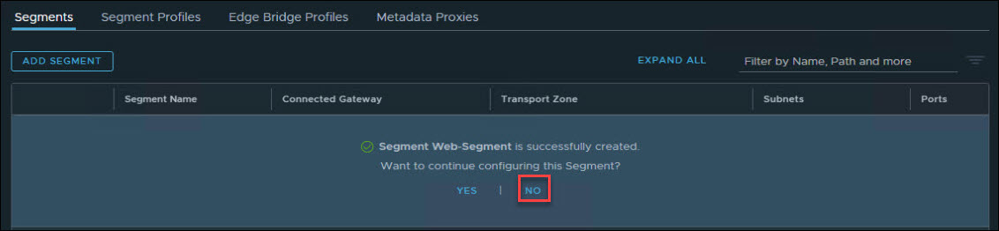 

## Review
In this exercise, you have completed:
- Added DHCP Profile in AVS Private Cloud
- Created an NSX-T T1 Logical Router
- Added the DHCP Profile to the T1 Gateway
- Created Network Segment for AVS VM workloads

## References:
  * [Create or Modify a Network Segment (vmware.com)](https://docs.vmware.com/en/VMware-Cloud-on-AWS/services/com.vmware.vmc-aws.networking-security/GUID-267DEADB-BD01-46B7-82D5-B9AA210CA9EE.html)
  * [Configure Segment DHCP Properties (vmware.com)](https://docs.vmware.com/en/VMware-Cloud-on-AWS/services/com.vmware.vmc-aws.networking-security/GUID-F6D433BE-753E-4B44-82FF-236CEBA17F8B.html)
