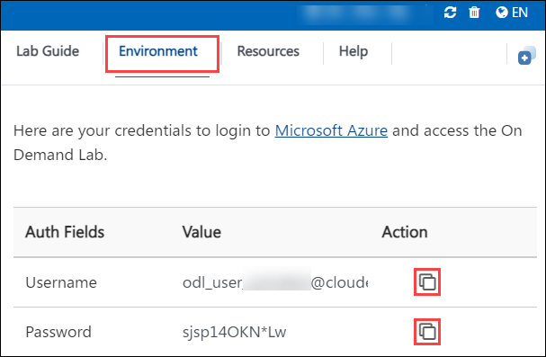

# **Getting Started with the Lab Environment**

Welcome to your Azure VMware Solution workshop! We've prepared a seamless environment for you to explore and learn about Azure VMware Solution, You will understand the AVS deployment architecture, Connect Azure VNET to AVS using Express Route Connectivity, and Configure DHCP for Azure VMware Solution. Let's begin by making the most of this experience.

### **Let's Get Started with the Azure Portal**

1. Access the lab environment details by navigating to the **Environment Details** tab. Take note of the provided username and password for reference.

   
 
1. On your desktop open Microsoft Edge and navigate to the `https://portal.azure.com/`.
 
2. You'll see the **Sign into Microsoft Azure** tab. Here, enter your credentials:
 
   - **Email/Username:** <inject key="AzureAdUserEmail"></inject>
 
    
 
3. Next, provide your password:
 
   - **Password:** <inject key="AzureAdUserPassword"></inject>
 
   
 
4. If prompted to stay signed in, you can click "No."

5. If you are prompted with a window for MFA, click on **Ask Later**.

6. If a **Welcome to Microsoft Azure** pop-up window appears, simply click "Maybe Later" to skip the tour.
 
7. Click "Next" from the bottom right corner to embark on your lab journey!
 
     
 
Now you're all set to explore the powerful world of technology. Feel free to reach out if you have any questions along the way. Enjoy your workshop!

