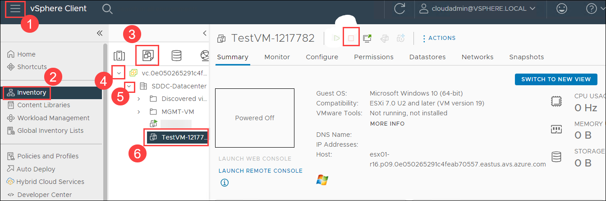
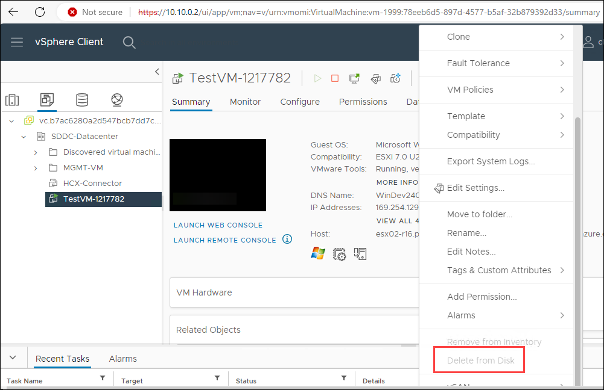
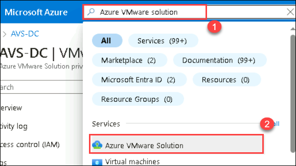
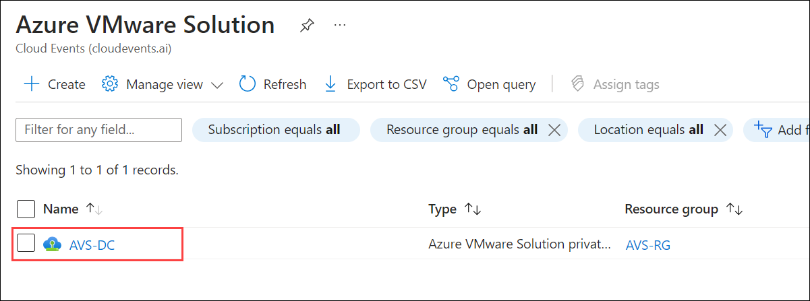
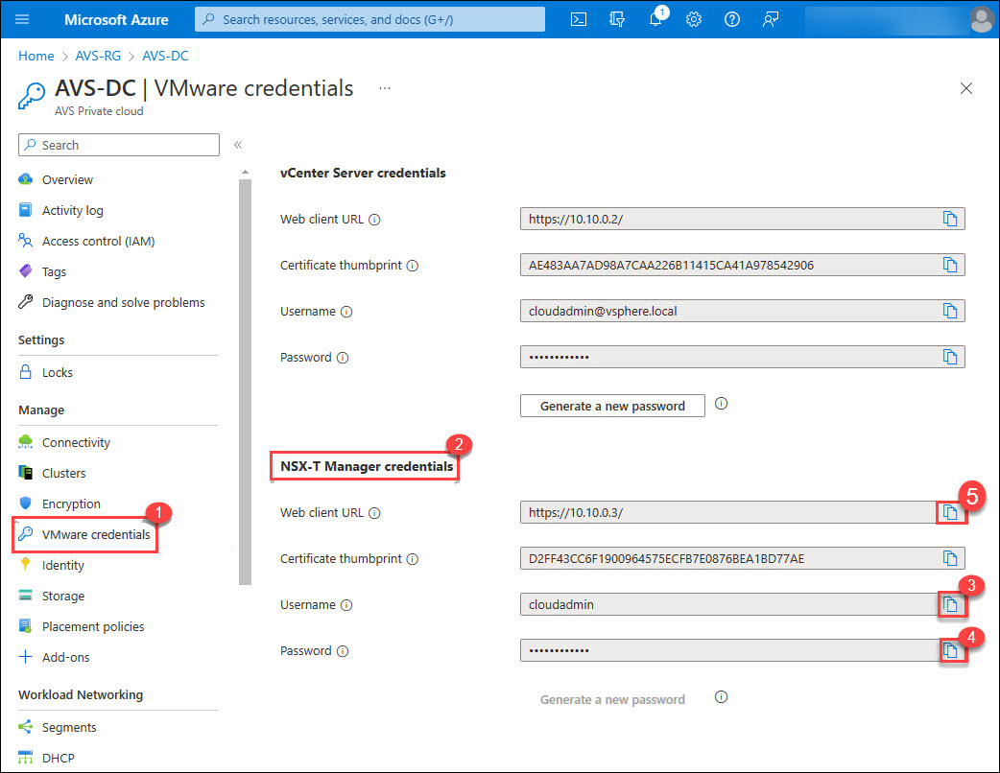
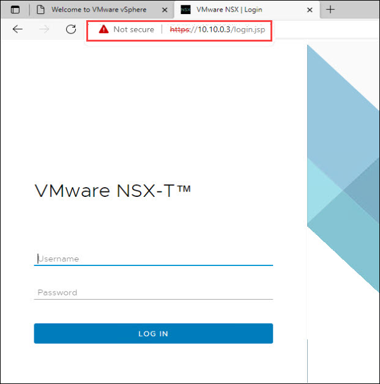
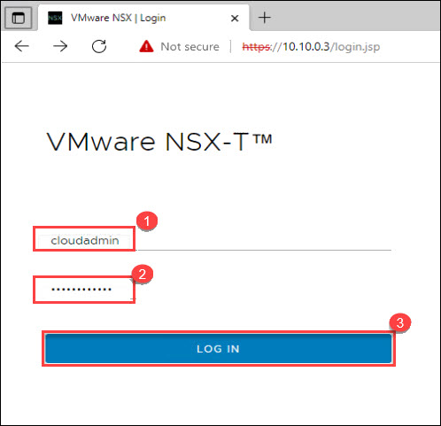
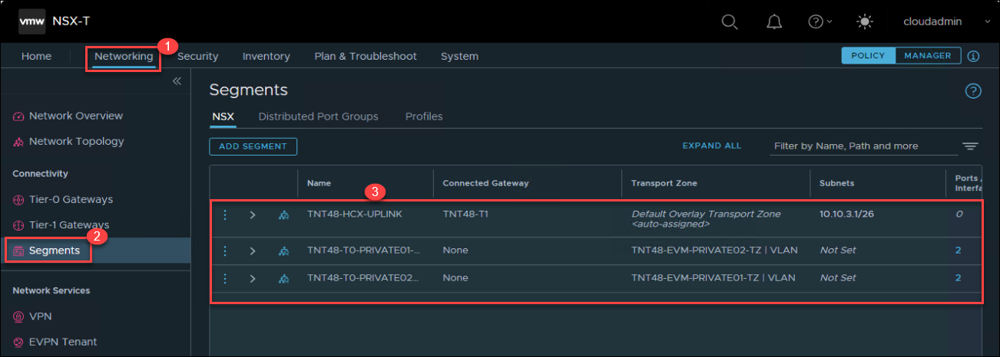
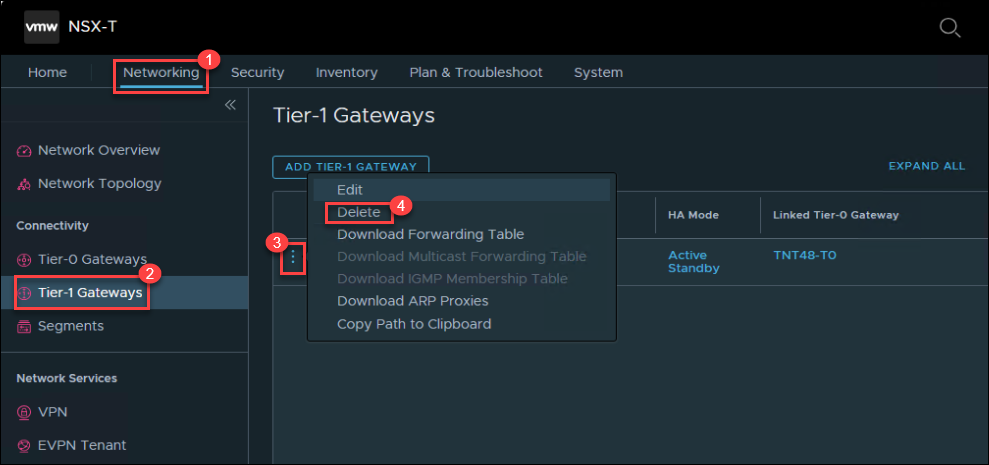
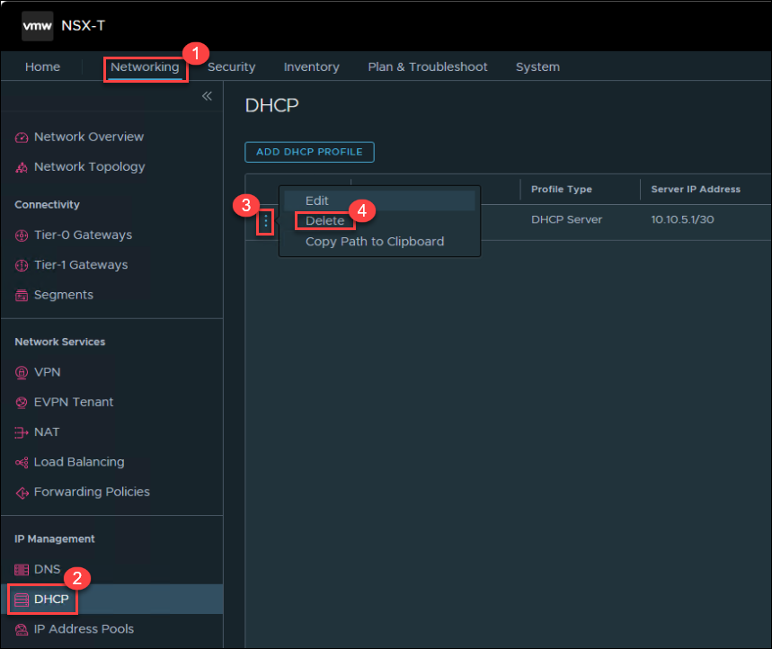

# Cleanup the existing resources

The objective of this lab is to ensure thorough cleanup of previously established resources, thereby facilitating a seamless transition to subsequent lab activities for an uninterrupted learning experience.

## Task 1: Cleanup the Connected existing VMs

1. Navigate back to the **Azure portal** where the **Azure VMware Solution page** is open.

1. On the Azure VMware Solution page; click on **VMware credentials (1)** under Manage tab and then copy the **Web client URL**, **Username** and **Password** under vCenter Server Credentials **(2)** and save it in notepad for later use.

   

1. Open the VMware vSphere tab where you have logged in earlier. If not opened then follow the below steps to re-login. You can skip the next two steps if VMware vSphere is already logged in.

1. Open a new tab in the Microsoft Edge browser, Enter the **Web Client URL** that you copied in step 3, You may see a warning `Your connection isn't private`, then click on the **Advanced** button and proceed with **Continue to 10.10.0.2 (unsafe)**. 

   

1. From AVS vCenter, click on the **Menu** (1) bar. Then go to **Inventory** (2). Under **Inventory** select the **Cluster** (3) option, then expend through 4, 5. Now, click on the exesting **TestVM-xxxx** (6) and then click on **stop icon**.

   

1. Once the VM is stopped, click on **(...) Action** and then select **Delete from Disk**.

   

   **Note:** Repeat the same steps for more than one VMs present to delete before moving to next lab, including HCX-Connectors.

## Task 2: Cleanup the existing Networking resources

1. In the Azure portal search for **Azure VMware Solution (1)**, and then select **Azure VMware Solution (2)** from the results.

   

2. Select **AVS-DC** Azure VMware Solution private cloud.

   

3. On the **AVS Private cloud** page, select **VMware credentials (1)** under **Manage** tab. From **NSX-T Manager credentials (2)** copy the **Username (3)**, **Password (4)**, and **Web client URL (5)**.
 
   
   
4. Open the **VMware NSX-T** login page on the web browser using the **Web client URL**.

     

   
5. On **VMware NSX-T** login page paste the **Username (1)** and **Password (2)**. Click on **LOG IN (3)**.

   

6. In the **NSX-T Console**, click **Networking (1)**. Select **Segments** under connectivity, review existing SEGMETS, if you see any SEGMET except below **3** SEGMENTS, then delete. If there is no extra Segment apart from these **3**, then proceed to next step.

   

7. To delete the web-segment Segments, click on (...) and click on **Delete**.

8. In the **NSX-T Console**, click **Networking (1)**. Select **Tier-1 Gateways (2)** under connectivity, If you see any existing **Tier-1 Gateways**, then click on ellipse (**⋮**) (3) and then select **Delete** (4).

   

9. In the **NSX-T Console**, click **Networking**. Select **DHCP** under management, if you see any DHCP already there, then remove that. Click on ellipse (**⋮**) (3) and then select **Delete** (4).

   

# You have successfully completed the cleanup
