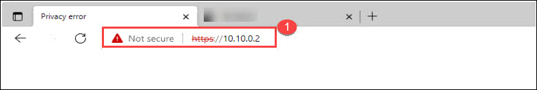

# Cleanup the Exesting resources

## Task 1: Cleanup the Connected exesting VMs

1. Navigate back to the **Azure portal** where the **Azure VMware Solution page** is open.

1. On the Azure VMware Solution page; click on **VMware credentials (1)** under Manage tab and then copy the **Web client URL**, **Username** and **Password** under vCenter Server Credentials **(2)** and save it in notepad for later use.

   

1. Open the VMware vSphere tab where you have logged in earlier. If not opened then follow the below steps to re-login. You can skip the next two steps if VMware vSphere is already logged in.

1. Open a new tab in the Microsoft Edge browser, Enter the **Web Client URL** that you copied in step 3, You may see a warning `Your connection isn't private`, then click on the **Advanced** button and proceed with **Continue to 10.10.0.2 (unsafe)**. 

   

1. 
