# Exercise 6: Configure a DNS forwarder in the Azure portal

This capability uses the DNS Forwarder Service in the NSX-T Data Center. A DNS service and default DNS zone are provided as part of your private cloud. To enable Azure VMware Solution management components to resolve records from your private DNS systems, you must define an FQDN zone and apply it to the NSX-T Data Center DNS Service. The DNS Service conditionally forwards DNS queries for each zone based on the external DNS servers defined in that zone.

## Architecture Diagram

The diagram shows that the NSX-T Data Center DNS Service can forward DNS queries to DNS systems hosted in Azure and on-premises environments.

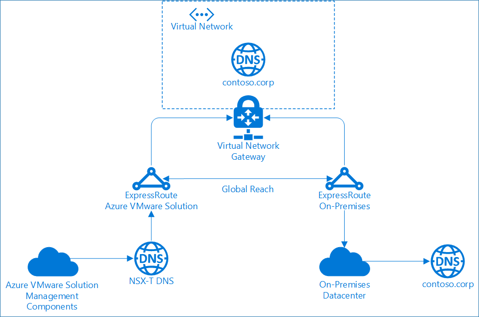

## Lab objectives

In this exercise, you will complete the following tasks:

  + Task 1: Configure DNS forwarder
  + Task 2: Change Default T1 DNS Forwarder Zone
  + Task 3: Verify name resolution operations

### Task 1: Configure DNS forwarder

1. In your Azure VMware Solution private cloud, under Workload Networking, select **DNS > DNS zones (1)**. Then select **Add (2)**.

   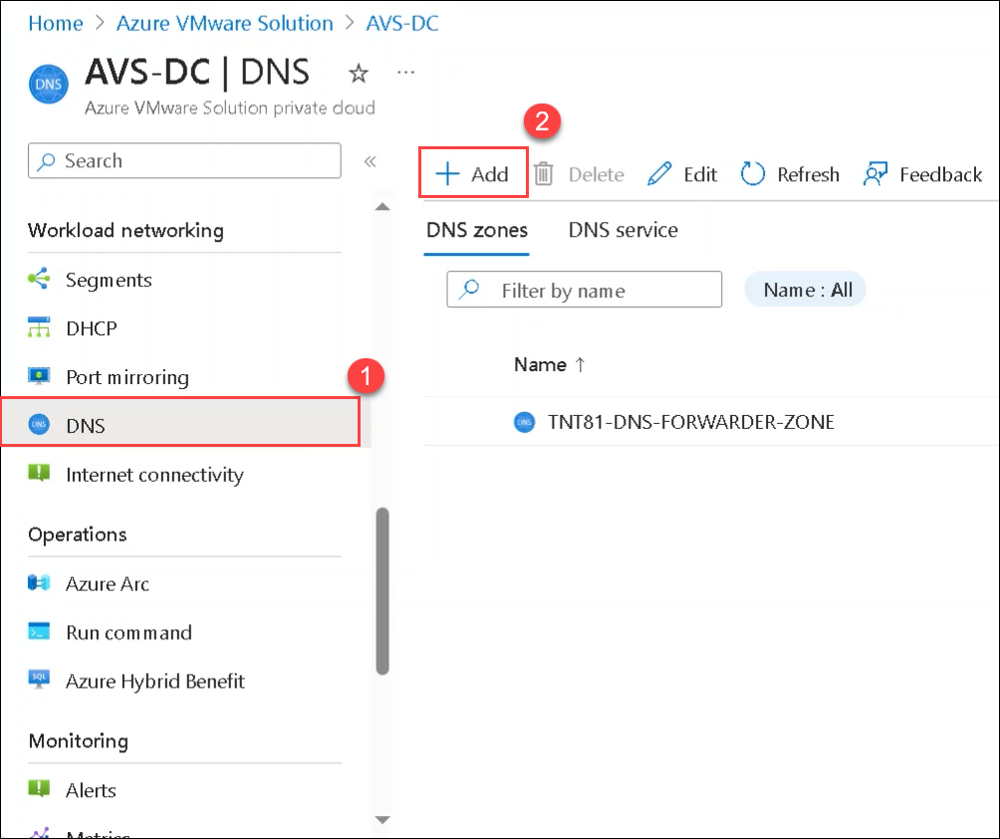

1. Select **FQDN zone (1)**, provide following details:

   - DNS Zone Name : **contoso (2)**
   - Domain : **contoso.corp (3)**
   - DNS server IP (up to 3): **10.0.0.53, 10.0.0.65, and 10.0.0.73 (4)**
   - select **OK (4)**.

   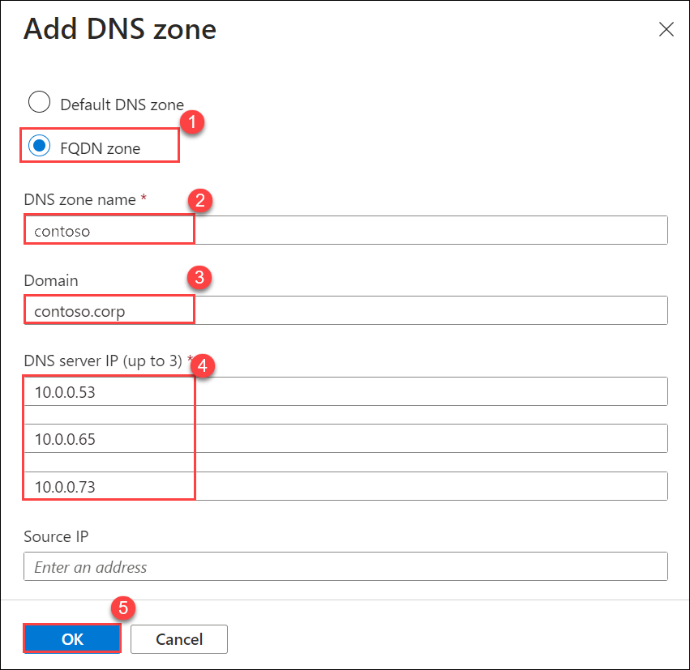

   > **Note**: It takes several minutes to complete, you can follow the progress from Notifications. You see a message in the Notifications when the DNS zone is created.

1. Ignore the message about a default DNS zone because one gets created for you as part of your private cloud.

1. Select the DNS service tab and then select Edit.

   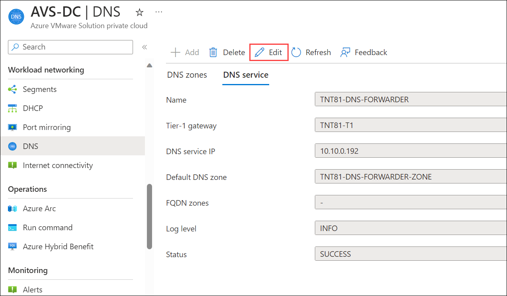

1. From the FQDN zones drop-down, select the newly created FQDN, and then select **OK**.

   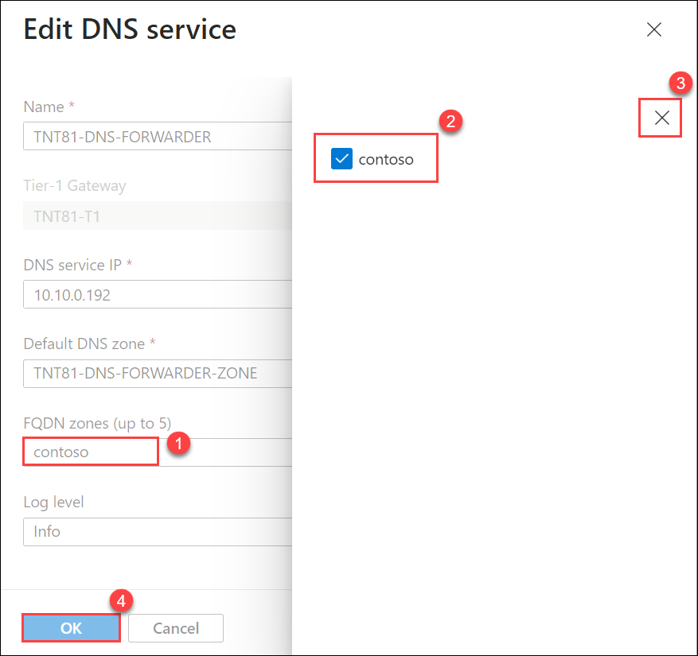

   **Note**: It takes several minutes to complete and once finished, you see the Completed message from Notifications. At this point, management components in your private cloud should be able to resolve DNS entries from the FQDN zone provided to the NSX-T Data Center DNS Service.

1. Repeat the above steps for other FQDN zones, including any applicable reverse lookup zones.

### Task 2: Change Default T1 DNS Forwarder Zone

1. In your Azure VMware Solution private cloud, under Workload Networking, select DNS > DNS zones > Check TNT##-DNS-FORWARDER-ZONE. Then select Edit.

   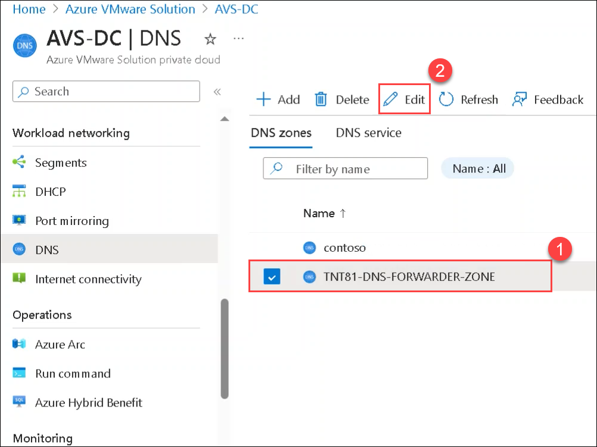

1. Change DNS server entries to valid reachable IP addresses. Then select OK

   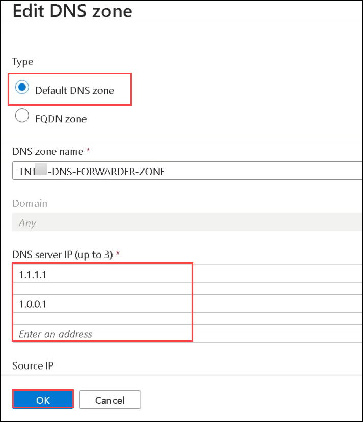

   **Note**: A DNS endpoint that is unreachable by the NSX-T DNS server will result in an NSX-T alarm stating that the endpoint is unreachable. In cases of the default configuration provided with Azure VMware Solution, this is due to the internet that is disabled by default. The alarm can be acknowledged and ignored, or the default configuration can be changed to a valid endpoint.

### Task 3: Verify name resolution operations
After you configure the DNS forwarder, you have some options available to verify name resolution operations.

### NSX-T Manager
NSX-T Manager provides the DNS Forwarder Service statistics at the global service level and on a per-zone basis.

1. On the **AVS Private cloud** page, select **VMware credentials (1)** under **Manage** tab. From **NSX-T Manager credentials (2)** copy the **Username (3)**, **Password (4)**, and **Web client URL (5)**.
 
   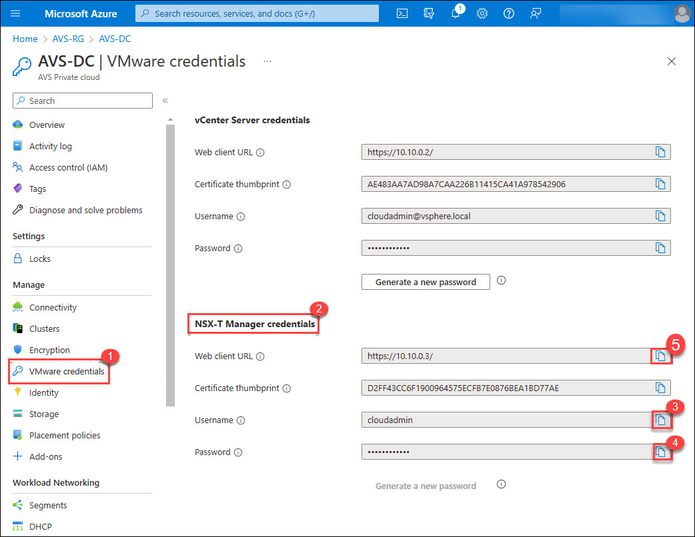
   
3. Open the **VMware NSX-T** login page on the web browser using the **Web client URL**.

     

   
4. On **VMware NSX-T** login page paste the **Username (1)** and **Password (2)**. Click on **LOG IN (3)**.

   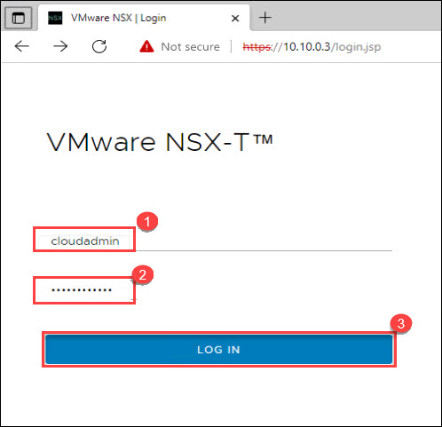

1. In NSX-T Manager, select **Networking (1)** > **DNS (2)**, and then expand your **DNS (3)** Forwarder Service and Select **View Statistics (4)**.

   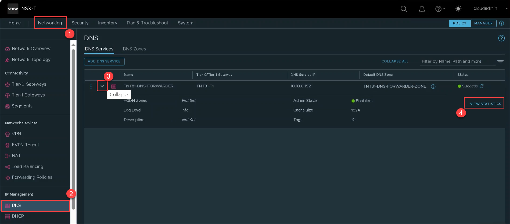

1. From the Zone Statistics drop-down, select **contoso** FQDN Zone.
   **Note**: The top half shows the statistics for the entire service, and the bottom half shows the statistics for your specified zone. In this example, you can see the forwarded queries to the DNS services specified during the configuration of the FQDN zone.

   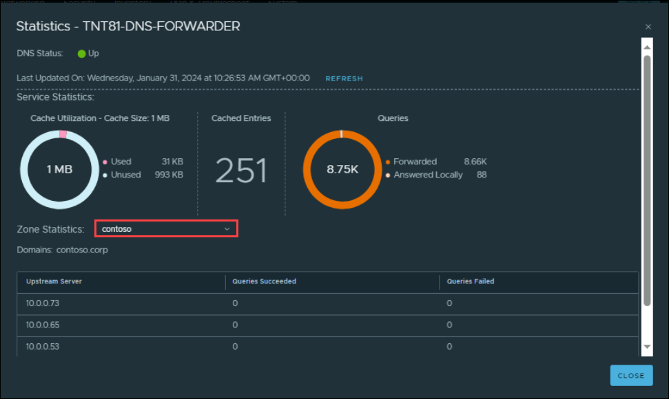

## Review
In this exercise, you have completed:

  - Configured DNS forwarder
  - Changed Default T1 DNS Forwarder Zone
  - Verified name resolution operations

## References:
- [Configure a DNS forwarder in the Azure portal](https://learn.microsoft.com/en-us/azure/azure-vmware/configure-dns-azure-vmware-solution)