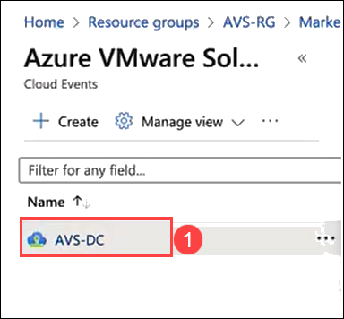
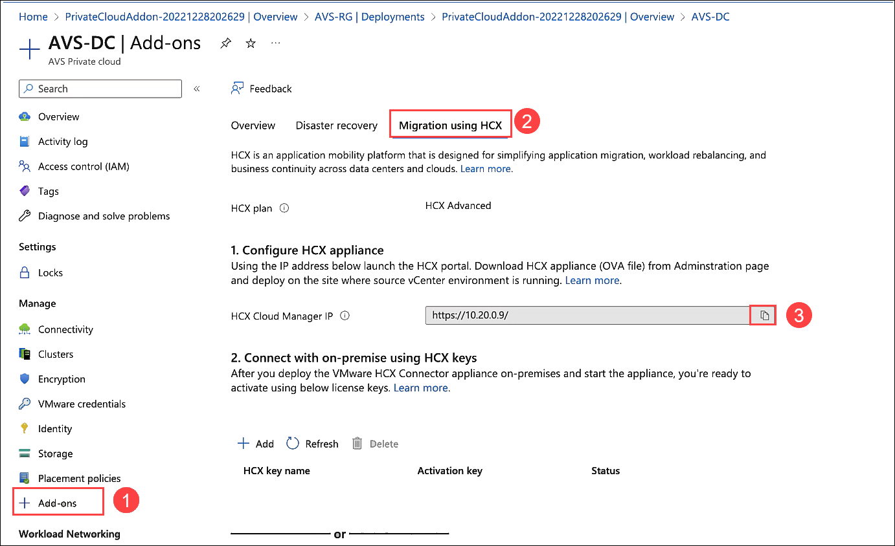
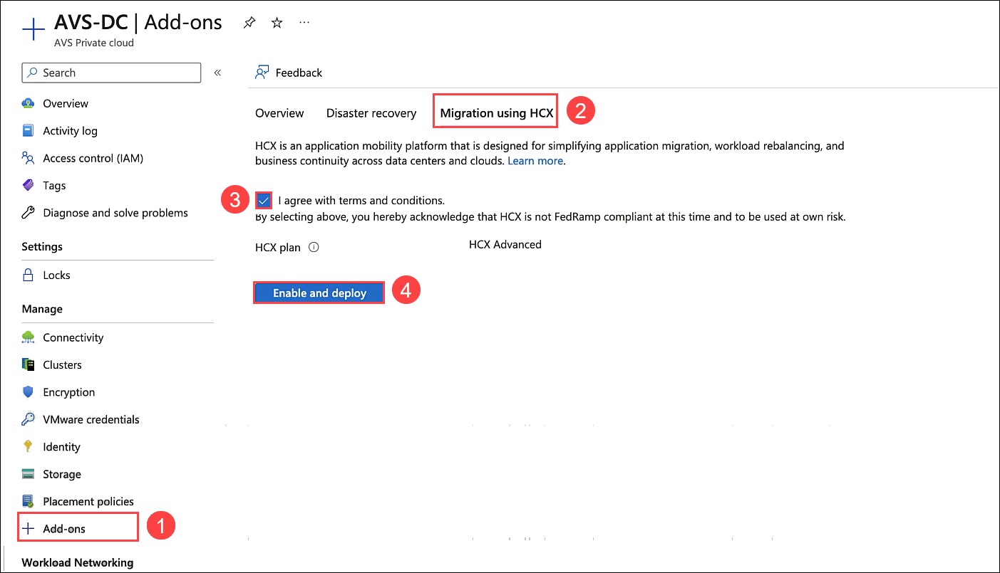

# Exercise 7: Deploy HCX for VM Migration

Introduction to VMware HCX
VMware HCX™ is an application mobility platform designed for simplifying application migration, workload rebalancing, and business continuity across data centers and clouds. HCX supports the following types of migrations:

 * Cold Migration - Offline migration of VMs.
 * Bulk Migration - scheduled bulk VM (vSphere, KVM, Hyper-V) migrations with reboot – low downtime.
 * HCX vMotion - Zero-downtime live migration of VMs – limited scale.
 *Cloud to Cloud Migrations – direct migrations between VMware Cloud SDDCs moving workloads from region to region or between cloud providers.
 * OS Assisted Migration – bulk migration of KVM and Hyper-V workloads to vSphere (HCX Enterprise feature).
 * Replication Assisted vMotion - Bulk live migrations with zero downtime combining HCX vMotion and Bulk migration capabilities (HCX Enterprise feature).

In this module, we will go through the steps to Install HCX, and configure and migrate a test VM to Azure VMware Solution (AVS).

## Lab objectives

In this exercise, you will complete the following tasks:

+ Task 1: Install VMware HCX on AVS Private Cloud

## HCX Setup for Azure VMware Solution (AVS) 

 

# Task 1: Install VMware HCX on AVS Private Cloud

##  Enable HCX on AVS Private Cloud

In the following task, we will be installing HCX on your AVS Private Cloud. This is a simple process from the Add-ons section in the Azure Portal. This can also be achieved via Bicep/ARM/PowerShell.

> **NOTE:** This task may or may not have been completed for you in your AVS environment. Only one participant per group can enable HCX in the SDDC so if you’re not the first participant in the group to enable HCX, just use these instructions for reference.

1. Navigate to the [**Azure Portal**](http://portal.azure.com/), search for **Azure VMware Solution (1)** in the search bar and click on **Azure VMware Solution (2)**.

   
  
2. Select **AVS-DC (1)** private cloud.
  
   
  
3. From your Private Cloud blade, click on **+ Add-ons (1)** under **Manage** section. If you can see **HCX Cloud Manager IP** (3), then you can go to next exercise by skipping next 2 steps, else perform the next steps to ****Enable and deploy** under **Migration using HCX**.
 
   

4. Under **Migration using HCX (2)**. Select the checkbox to agree with terms and conditions **(3)**. Click on **Enable and deploy (4)**.
  
   
   
5. HCX will start getting deployed in your **AVS Private Cloud** and it will take about 10-20 minutes to complete. Once the deployment is completed click on **Go to resource**.

   

#### Review:
In this exercise, you have completed:

  - Installed VMware HCX on AVS Private Cloud

#### References:
- [VMware’s HCX Documentation](https://www.vmware.com/products/hcx.html).
- [Install and activate VMware HCX in Azure VMware Solution](https://learn.microsoft.com/en-us/azure/azure-vmware/install-vmware-hcx)
