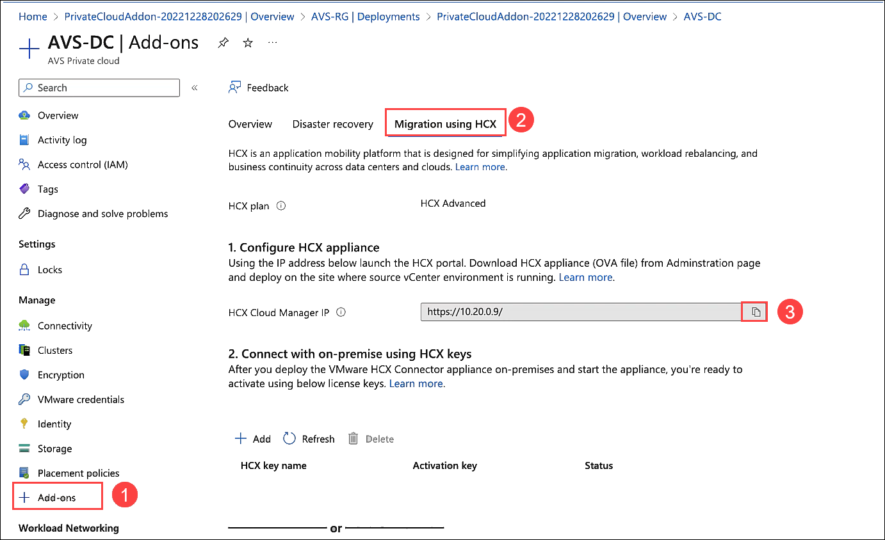
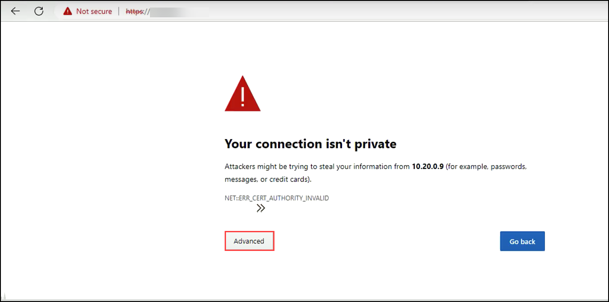
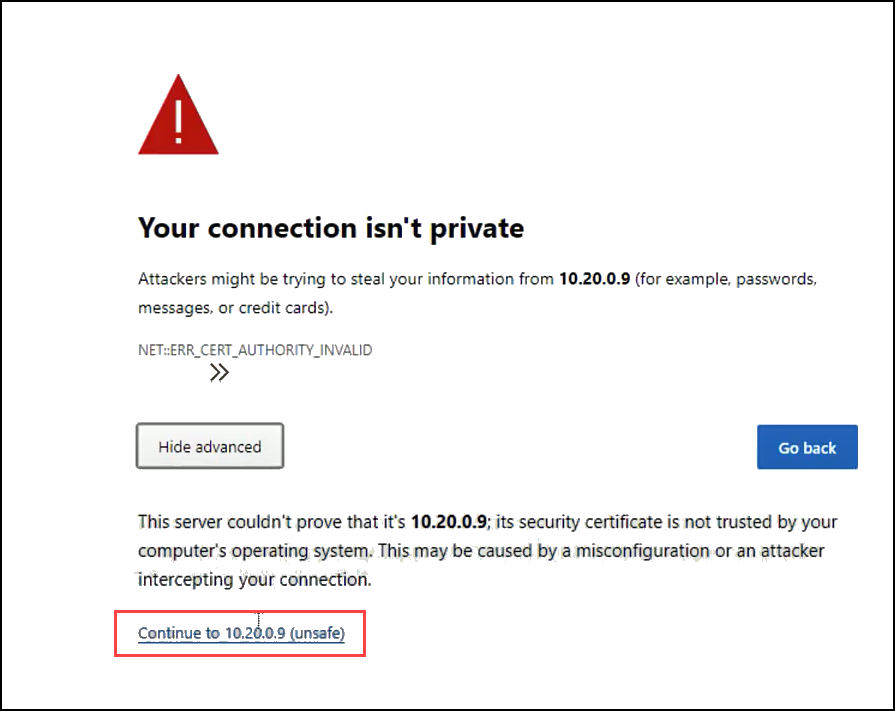
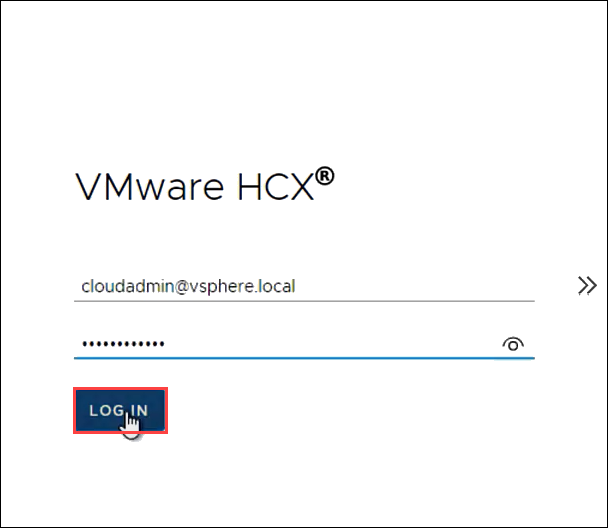

# Exercise 8: Download the HCX OVA to JumpBox-VM vCenter

## Lab objectives

In this exercise, you will complete the following tasks:

+ Task 1: Download HCX OVA for Deployment of HCX JumpBox-VM

## Task 1: Download HCX OVA for Deployment of HCX JumpBox-VM

The next step after installing HCX on your AVS Private Cloud is to download HCX onto our JumpBox-VM VMware environment, this will allow us to set up the connectivity to AVS and allow us to migrate. The HCX appliance is provided by VMware and has to be requested from within the AVS HCX Manager.

1. On the Azure VMware Solution page, click on **VMware credentials (1)** under the Manage tab and then copy the **Username** and **Password** under **vCenter Server Credentials** **(2)** and save it in Notepad for later use.

   
  
2. Next under **Manage** section, click **+ Add-ons (1)**. Select **Migration using HCX (2)** and copy the **HCX Cloud Manager IP URL (3)**, open a new browser tab and paste it. 

   

3. You may see a warning Your connection isn't private, then click on the **Advanced** button.

    

4. Proceed with clicking on **Continue to 10.10.0.2 (unsafe)**.   

    
    
5. Enter the cloudadmin credentials obtained in **Step 1** and **LOG IN**.  

    

#### Review:
In this exercise, you have completed:

  - Downloaded HCX OVA for Deployment of HCX JumpBox-VM

#### References:
[Deploy VMware HCX Connector in your JumpBox-VM](https://blogs.oracle.com/cloud-infrastructure/post/deploy-vmware-hcx-connector-in-your-on-premises-vmware-environment-and-establish-a-site-pairing-with-oracle-cloud-vmware-solution)
