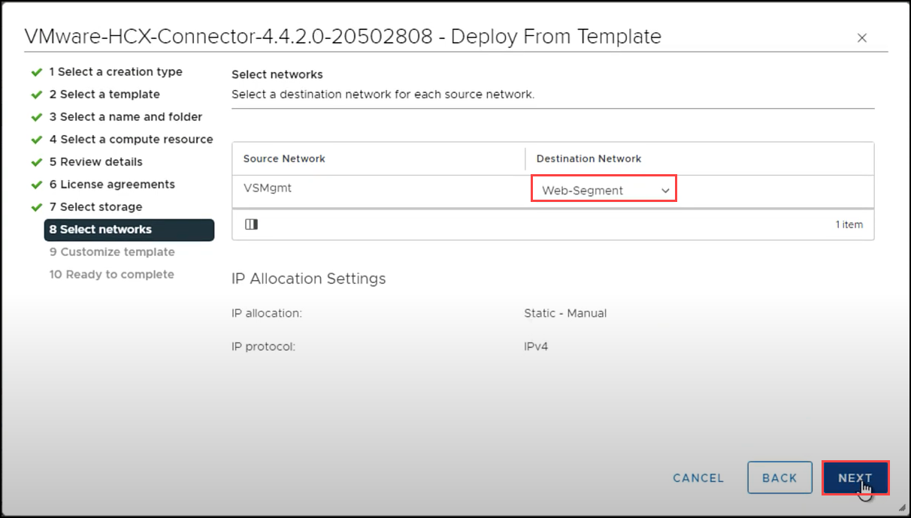

# Exercise 10: Setup HCX on AVS 

## Lab objectives

In this exercise, you will complete the following tasks:

+ Task 1: Deploy HCX OVA

## Task 1: Deploy HCX OVA

In this step, we will deploy the HCX VM with the configuration from the JumpBox-VM VMware Lab Environment section.

## Deploy HCX from Content Library

1. Once the import is completed from the previous task, click on **Menu**, and select **Inventory**. 

    
    
2. Right click on **SDDC-Datacenter** and select **New Virtual Machine**.

    
   
3. Select **Deploy from template** for **Select a creation type** and click on **NEXT**.

    
    
4. Next on **Select a template** select **VMware-HCX-Connector** and click on **NEXT**.    

    
    
5. Enter **HCX-Connector** as the **Virtual machine name** in **Select a name and folder** and click **NEXT**.  

     
     
6. On the **Select a compute resource** select **Cluster-1** and click on **NEXT**.

    
     
7. Click **Next** on **Review details**, in **License Agreement** accept the agreement and click **NEXT**.

   

8. Next for **Select storage** select the available storage and click **NEXT**.

    
  
9. For **Select networks** set the **Destination Network** as **Web-Segment** and click **NEXT**.
  
    

10.  Next on **Customize template** provide and following details and scroll down to **Network Properties** in same page.

       |Property| Value| 
       |---|---|
       |CLI “admin” User Password| MSFTavs1!|
       |CLI “admin” Confirm Password| MSFTavs1!|
       |CLI “admin” root Password/| MSFTavs1!|
       |CLI “admin” Confirm Password/| MSFTavs1!|
 
     

       |Property| Value| 
       |---|---|
       |Hostname| hcx-connector|
       |Network 1 IPv4 Address| 10.10.4.100|
       |Network 1 IPv4 Prefix Length| 24|
       |Default IPv4 Gateway| 10.10.4.1|
     
       

       |Property| Value| 
       |---|---|
       |DNS Server list| 1.1.1.1|

      

       |Property| Value| 
       |---|---|
       |Enable SSH| Enabled|
    
      
   
11. On **10 Ready to complete** click on **FINISH** to complete the setup of new virtual machine.

     
   
12. Once done, navigate to newly created **HCX-Connector VM** and **Power on**. The boot process may take 10-15 minutes to complete.   

     
     
#### Review:

In this exercise you completed:

- Deployed OVA from downloads, configured and deployed **VMware-HCX-Connector** VM. 
- Deployed HCX from Content Library, configured and deployed **HCX-Connector VM** VM. 

#### References:

[Configure JumpBox-VM VMware HCX Connector](https://learn.microsoft.com/en-us/azure/azure-vmware/configure-vmware-hcx)
