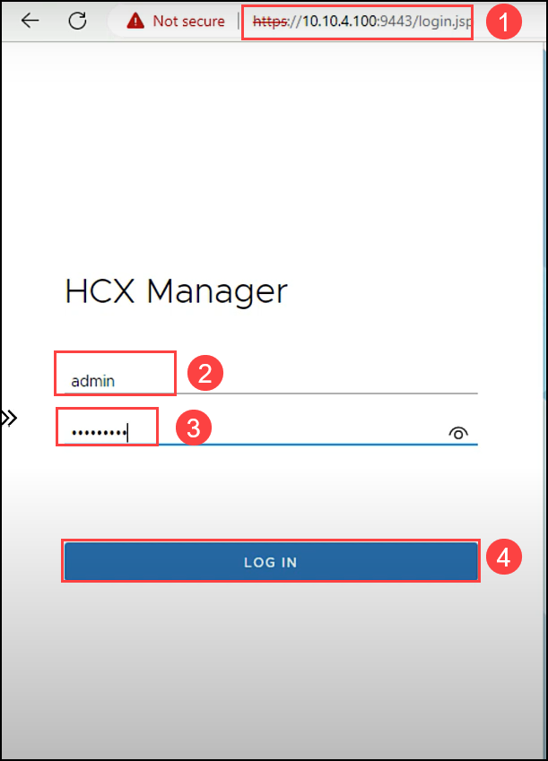

# Exercise 12: Activate VMware HCX

In this task, we will activate the JumpBox-VM HCX appliance that we just deployed in Exercise 7.

## Lab objectives

In this exercise, you will complete the following tasks:

+ Task 1: Activate JumpBox-VM HCX

## Task 1: Activate JumpBox-VM HCX

1. Browse to the JumpBox-VM HCX Manager IP `https://10.10.4.100:9443` **(1)** specified in Task 4 on port 9443 IP.

2. Use the HCX credentials to log in to HCX Manager.
   
   - Username **(2)**: admin
   - Password **(3)**: MSFTavs1!
   - Click on LOG IN **(4)**.

   

3. On the **Activate your HCX instance** page, for **HCX License Key (1)** enter the **Activation key** you copied earlier and click **ACTIVATE (2)**.
 
    > **Note:** This process can take several minutes.
  
   
   
4. Next on **Where is your HCX system located?** page provide the nearest city to your location **(1)** for installing the VMware HCX Manager JumpBox-VM. Then select **Continue (2)**.   

   
   
5. Leave default value for **System Name** and click on **Continue**.

    
    
6. Click **YES, CONTINUE** to complete activating your HCX. After a few minutes, HCX should be successfully activated.    

       

#### Review:

In this exercise, you have completed:

  - Activated JumpBox-VM HCX

#### References:
[Activating and Configuring HCX](https://docs.vmware.com/en/VMware-HCX/4.4/hcx-user-guide/GUID-CB8D13A2-D3E2-4B1E-A46A-0B662FEF4541.html)
