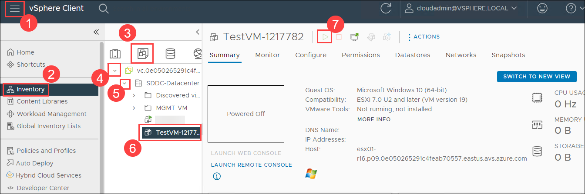
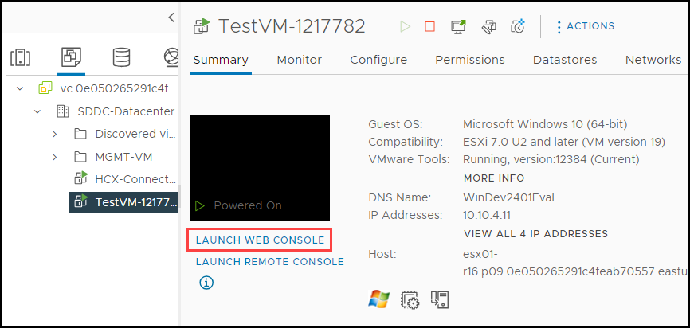
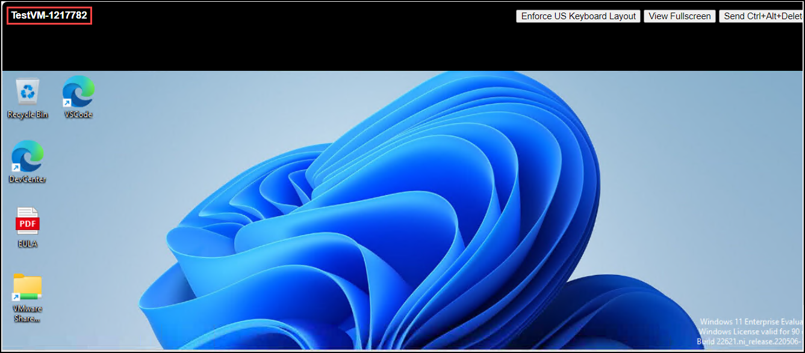
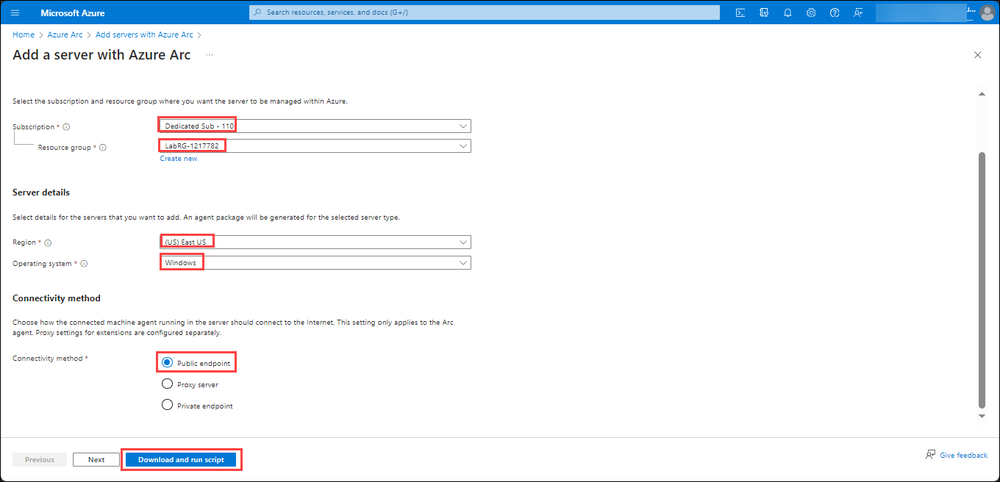

# Exercise 14: Manage with Azure Arc

## Lab Overview
In this exercise, you will gain practical insights into leveraging Azure Arc for extending Azure management capabilities to servers hosted in Azure VMware Solution (AVS), enabling streamlined operations and enhanced governance across hybrid environments.

## Lab Objectives
In this Exercise, you will complete the following tasks:

+ Task 1: Connect to the VMs
+ Task 2: Onboarding AVS servers using Azure Arc

### Task 1: Connect to the VMs

In this task, you will establish connections to the servers within the Azure VMware Solution (AVS) environment

1. From AVS vCenter, click on the **Menu** (1) bar. Then go to **Inventory** (2). Under **Inventory** select the **Cluster** (3) option, then expend through 4, 5. Now, click on the **TestVM-<inject key="DeploymentID" />** (6) and then click on **start icon** (7).

   

2. Once the VM is started, click on **LAUNCH WEB CONSOLE**.

   
  
3. It will redirect you to the Windows **TestVM-<inject key="DeploymentID" />**.

   

### Task 2: Onboarding AVS servers using Azure Arc

In this task, you will onboard servers hosted in Azure VMware Solution (AVS) to Azure Arc for centralized management and monitoring.

1. In the **TestVM-<inject key="DeploymentID"></inject>**, click on the Azure portal shortcut of Microsoft Edge browser which is present on the desktop.
    
1. On the **Sign in to Microsoft Azure** tab, you will see the login screen. Provide the following **Email/Username** and then click on **Next**.

   * Email/Username: <inject key="AzureAdUserEmail"></inject>

   
   
1. Now enter the following **Password** and click on **Sign in**.
   
   * Password: <inject key="AzureAdUserPassword"></inject>

   
   
1. If you see the pop-up **Stay Signed in?**, click No.

1. If you see the pop-up **You have free Azure Advisor recommendations!**, close the window to continue the lab.

1. If **Welcome to Microsoft Azure** pop-up window appears, click on **Maybe Later** to skip the tour.

1. In the Azure portal, search for Azure Arc and select **Azure Arc**

   

1. On the Azure Arc page, select **Infrastructure** then select **Add** under servers.

   

1. On the **Add servers with Azure arc** page, select **Generate Script** under Add a single server.

   

1. On the **Add a server with Azure Arc** page, provide the details and select **Download and run script**

   |Setting|Value|
   |---|---|
   |Subscription|the name of the Azure subscription you are using in this lab|
   |Resource group|**AVS-RG**|
   |Region|**(US) East US**|
   |Operating system|**Windows**|
   |Connectivity method|**Public endpoint**|

   

1. In windows search bar, search powershell and run as administrator and run the following commands to configure the script execution policy. Type **A** and press enter: 

   ```powershell
   Set-ExecutionPolicy -Scope Process -ExecutionPolicy Bypass
   ```

1. Now, run the command go to the path where script has been downloaded:

   ```powershell
   cd C:\Users\User\Downloads
   ```

1. Now, run the command to run the script which was downloaded in step 10:

   ```powershell
   ./OnboardingScript.ps1
   ```
1. To sign in, choose the ODL user from the pop-up to complete the signin process.

   >**Note**: If the pop-up doesn't appear, proceed to the below following steps to finalize the signin process.

1. After running the script, open the edge browser, navigate to **https://microsoft.com/devicelogin** page and provide the code shown in powershell to authenticate.

   

1. Enter the code and select **Next** button in Microsoft tab.

   

1. Under Pick an account tab, select the ODL user which you are using in the lab.

   

1. Under Action Required tab, select **Next**.

   

1. On the Are you trying to sign in to Azure Connected Machine agent tab, select **Continue**.

   

1. You will see new tab, Azure Connected Machine Agent with notification **You have signed in to the Azure Connected Machine Agent application on your device**.

   

1. Upon returning to PowerShell, you'll observe that the PowerShell script has finished executing.

## Review
In this exercise, you have completed:

+ Connect to the VMs
+ Onboarding AVS servers using Azure Arc
