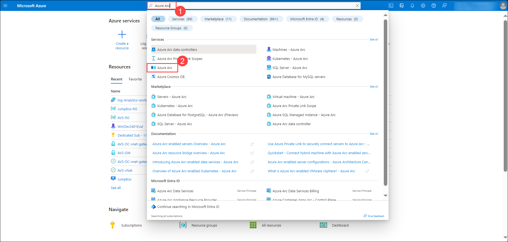

# Excercise 15: Configuring Log Analytics Workspace and Agent for Azure Arc-enabled Server

## Lab Overview
In this exercise, you will set up a Log Analytics workspace and configure the Log Analytics agent for an Azure Arc-enabled server, enabling the collection and analysis of telemetry data for monitoring and troubleshooting purposes.

## Lab Objectives
In this exercise, you will complete the following tasks:

+ Task 1: Create a Log Analytics Workspace
+ Task 2: Configure Log Analytics Agent for Azure Arc-enabled Server

### Task 1: Create a Log Analytics Workspace

In this task, you will create a Log Analytics workspace for to store the log information and analysing the machines onboarded through Azure Arc.

1. In the Search bar of the Azure portal, type **Log Analytics(1)**, then select **Log Analytics workspaces(2)**.
   
   

1. Select **+ Create** from the command bar.
    
   

1. Select Resource Group from the drop down(avs-rg).

1. For the Name, enter something unique like **log-analytics-ws-avs**.

1. Select the default Region 

1. On the Create Log Analytics workspace page, add the below settings and click on **Review + Create**.

      | Setting | Value|
      |----------|--------|
      | Resource Group | **AVS RG** |
      | Name | **log-analytics-ws-avs**|
      | Region | **East US**|

   

1. Once the workspace validation has passed, select **Create**. Wait for the new workspace to be provisioned, this may take a few minutes.

   

### Task 2: Configure Log Analytics Agent for Azure Arc-enabled Server

In this task, you will configure the Log Analytics agent for an Azure Arc-enabled server (WinDev2401Eval) to connect it to a Log Analytics workspace. This allows you to monitor and collect telemetry data from the server using Azure Monitor.

1. Once the deployment got succeeded, Click on **Go to resource** and click on **Agents** under Settings section.

   

1. On **log-analytics-ws-avs | Agents page(1)**, expand **Log Analytics agent instructions(2)** copy the **Workspace ID(3)** and **Primary key(4)** in notepad you needs this values in upcoming steps.

   

1. On Azure Portal page, in Search resources, services and docs (G+/) box at the top of the portal, enter **Azure Arc(1)**, and then select **Azure Arc(2)** under services.

   

1. Select **Machines(1)** under **Infrastructure** section from the left pane, and select **WinDev2401Eval(2)** machine from the list.
 
   

1. On **WinDev2401Eval** machine page, select **Extensions** under settings.

   

1. On **Install extension** page, search and select **Log Analytics Agent - Azure Arc (on a deprecation path)(2)** and click on **Next(3)**

   

1. On **Configure Log Analytics Agent - Azure Arc (on a deprecation path) extension** page, enter the Workspace ID and Primary key copied for the workspace id and workspace key respectively and click on **Review + create**

   

1. Click on **Create**. Wait for the deployment to get succeeded.

   

1. Once the deployment get succeeded, navigate to the Log Analytics workspce which was created earlier and select **Logs(1)** from the left pane and close the query window pop-up and enter the below query(2) and click on **Run(3)** to verify the log analytics connectivity with the machine.

     ```
     Heartbeat
     | where OSType =="Windows"
     | distinct Computer
     ```

     

1. In the **Results** window, the **WinDev2401Eval** entry is listed, indicating the machine is connected to Log Analytics workspace.

   

  ## Review
In this exercise, you have completed:
+ Task 1: Create a Log Analytics Workspace
+ Task 2: Configure Log Analytics Agent for Azure Arc-enabled Server

   

