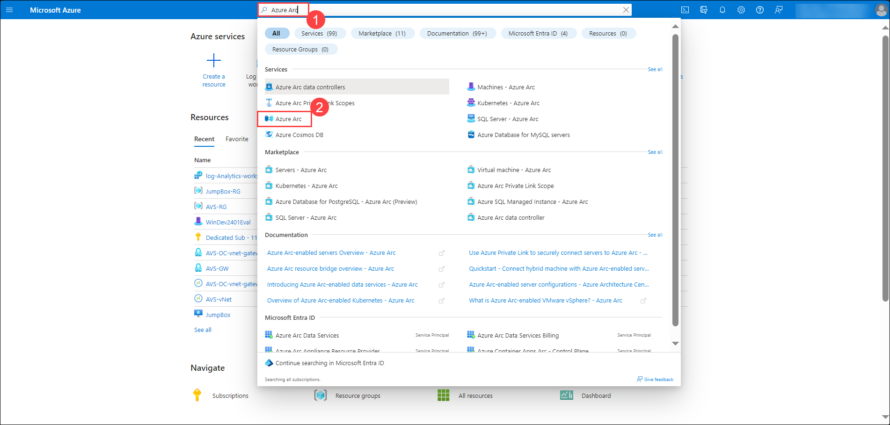
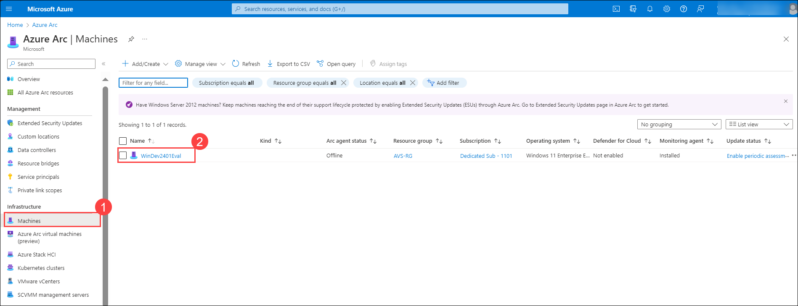
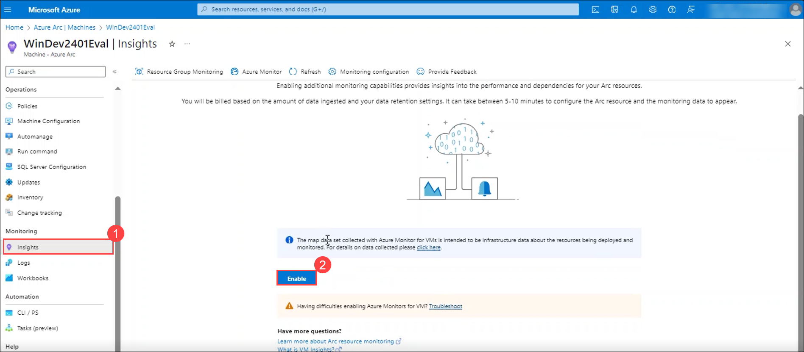
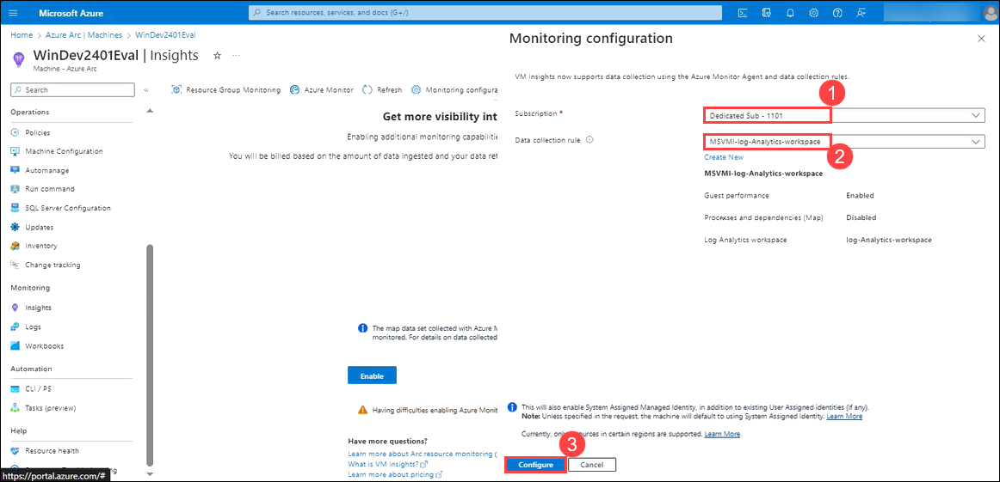
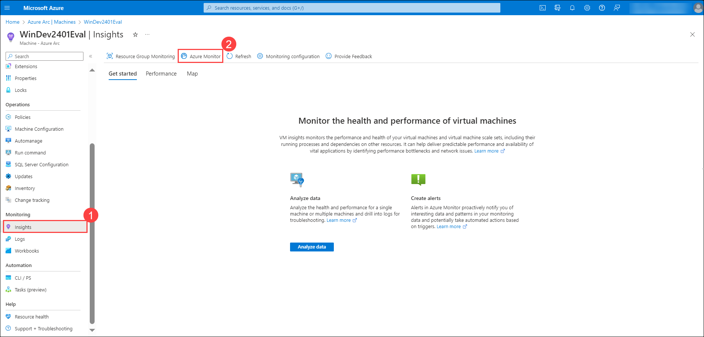
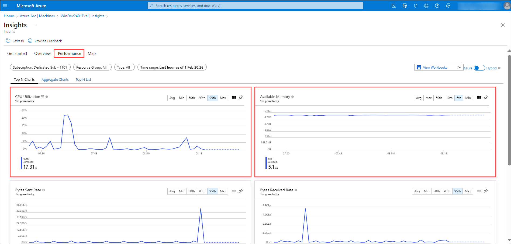

## Excercise 16: Configure Azure Monitor Insights for Azure Arc-enabled Server

## Lab objectives
In this exercise, you will complete the following tasks:

+ Task 1: Enable Monitoring Insights for Azure Arc server

### Task 1: Enable Monitoring Insights for Azure Arc server

In this task, you will learn how to configure Azure Monitor insights for Azure Arc-enabled servers. You will enable monitoring and performance insights for a specific machine, allowing you to visualize key metrics such as CPU utilization and available memory. This lab will provide you with hands-on experience in configuring monitoring settings and utilizing Azure Monitor to gain insights into the performance of Azure Arc-enabled servers.

1. On Azure Portal page, in Search resources, services and docs (G+/) box at the top of the portal, enter **Azure Arc**, and then select **Azure Arc** under services.

   

1. Select **Machines** under **Infrastructure** section from the left pane, and select **WinDev2401Eval** machine from the list.

   

1. Select **Insights** under **Monitoring** section and click on **Enable** to configure the Insights from the Machine.

   

1. On the **Monitoring Configuration** page, add the below settings and click on **Configure**.

      | Setting | Value|
      |----------|--------|
      | Subscription | **Choose the default subscription** |
      | Data collection rule | **Choose the log analytics workspace which was created earlier**|

   

1. Wait for the deployment to complete and select the **Azure Monitor** on the **Insights** page.

   

1. Select the **Performance** to view the different charts related to **CPU Utilization** and **Available memory**

   

## Review
In this exercise, you have completed:
- Enable Monitoring Insights for Azure Arc server
