# Exercise 18: SIEM with Sentinel

## Lab Overview

In this exercise, you will work with Microsoft Sentinel, a cloud-native security information and event management (SIEM) service provided by Microsoft. By completing the tasks outlined below, you will set up and configure data connectors to ingest security events from various sources, create rules to identify security threats, and review ingested data within Microsoft Sentinel.

## Lab Objectives

In this exercise, you will complete the following tasks:

+ Task 1: Adding workspace to the sentinel
+ Task 2: Ingesting data to Sentinel from Windows security event connector
+ Task 3: Ingesting data to Sentinel from Microsoft Defender for cloud
+ Task 4: Create rules to identify security threats

### Task 1: Adding workspace to the sentinel

In this task, you will create Microsoft Sentinel workspace where you will be monitoring and analyzing security events.

1. On Azure Portal page, in **Search resources, services and docs (G+/)** box at the top of the portal, enter **Microsoft Sentinel**, and then select **Microsoft Sentinel** under services.

    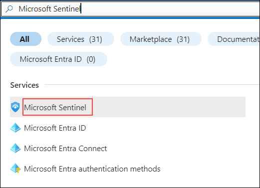

1. Click on **+Create**, select the **log-analytics-ws-avs** workspace and click on **Add**.

    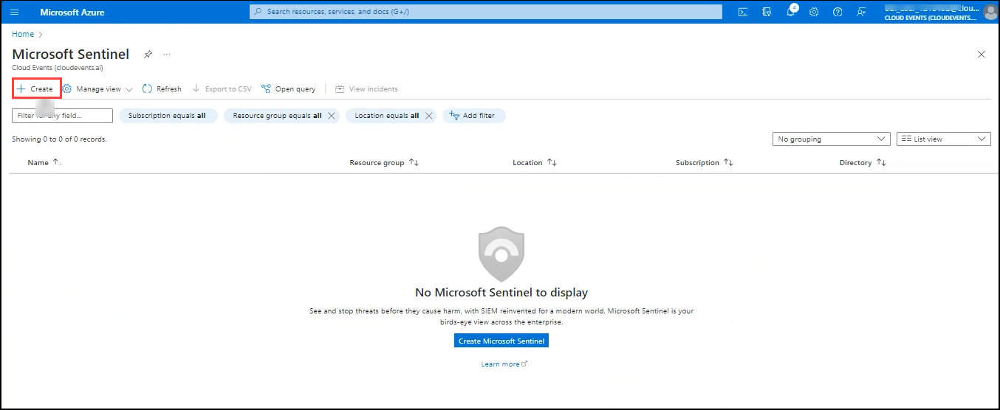

    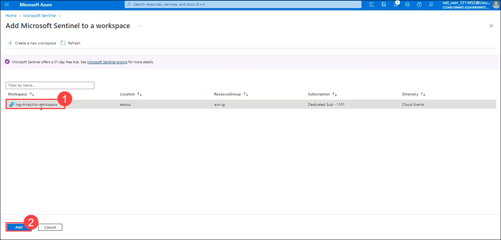

1. Once the workspace is added, the Microsoft Sentinel | News & guides page will display., including that the Microsoft Sentinel free trial is activated. Select **OK** .

    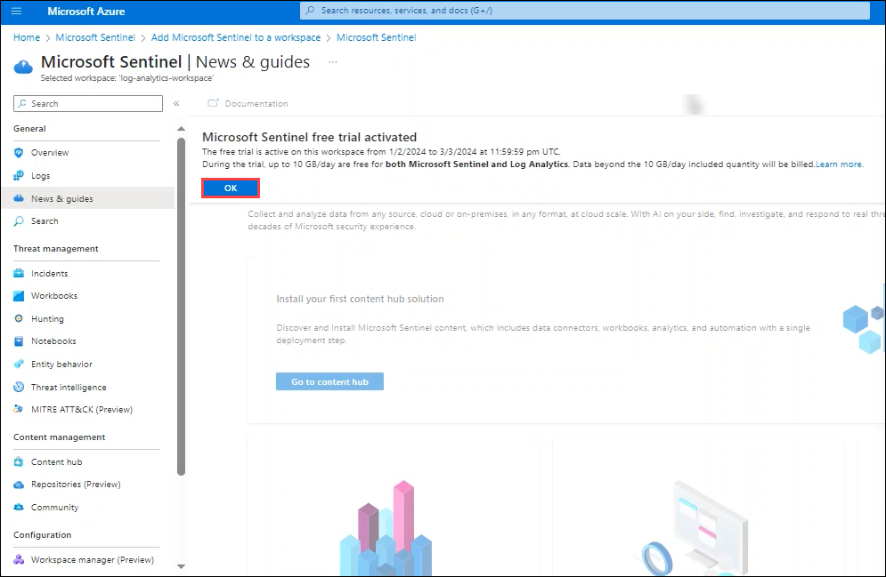

### Task 2: Ingesting data to Sentinel from Windows security event connector

1. From the **Microsoft Sentinel** blade, from left menu select **Content hub(1)** under **Content management** section.

1. On the content hub page search for **Windows Security Events(2)** and select, **Install(3)**.

     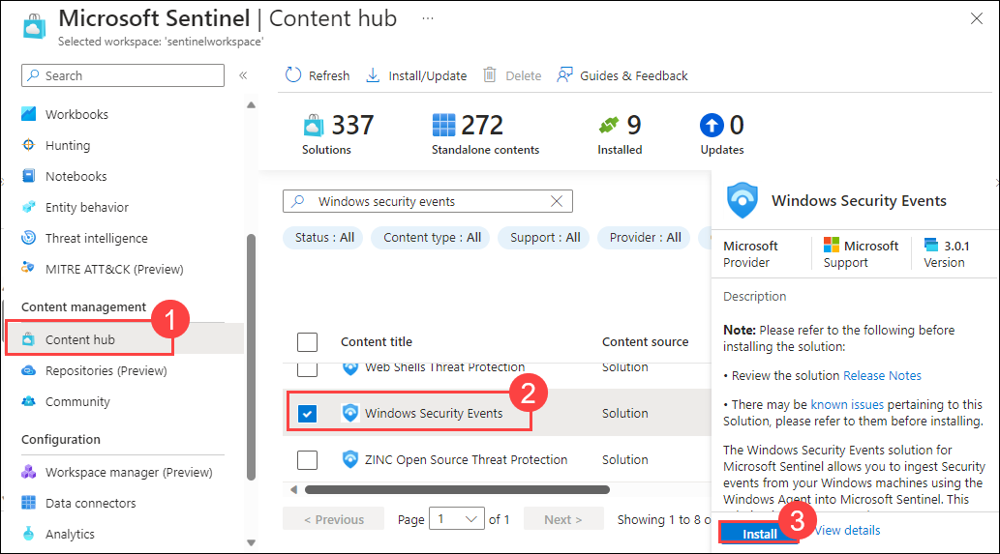
   
1. Once you receive the notification of successful installation go back to the **Data connectors(1)** tab and click on **Refresh(2)**

1. You can see **Security events Via Legacy agent** and **windows security events via AMA**

1. Select **Security events Via Legacy agent(3)** and click on **open connector page(4)**.

    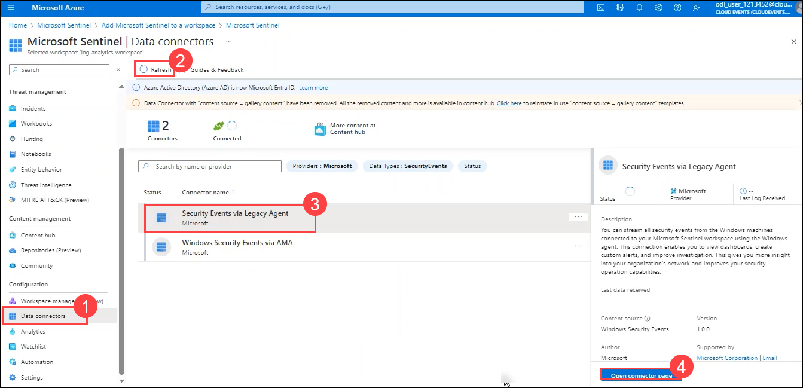
   
1. Under configuration choose **Install agent on non Azure Windows Machine(1)** and select **Download & install agent for non Azure Windows machines(2)**  

    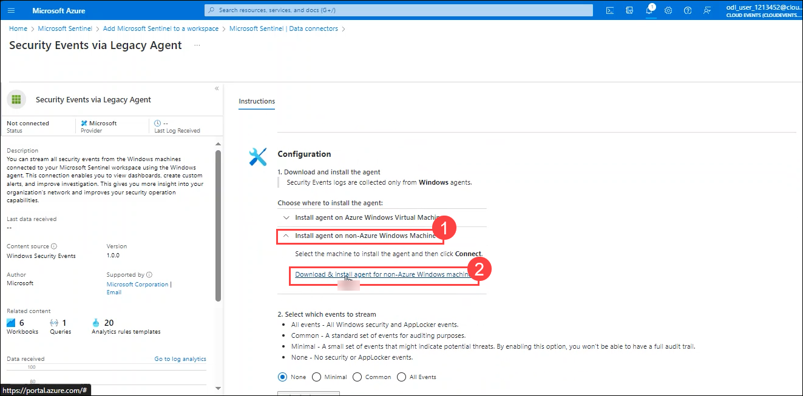

1. On the **log-analytics-workspace | Agent Management** page, notice that windows machine is already connected via Log analytics windows agent (legacy).

    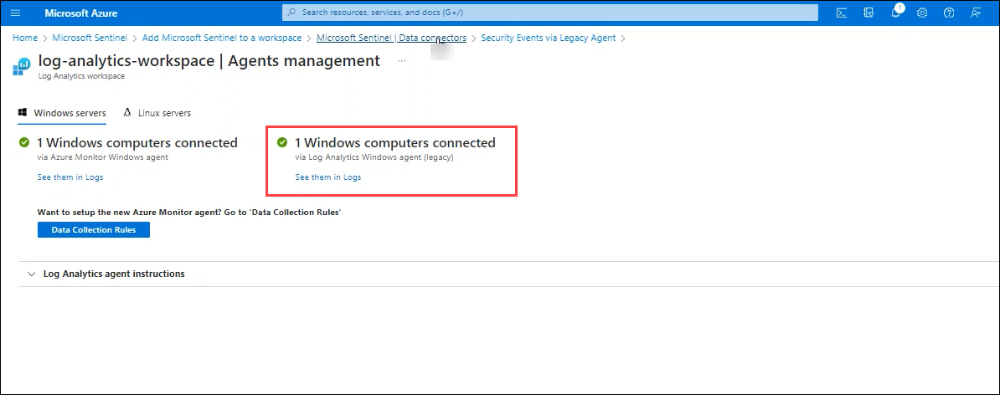

1. Navigate back to the **Security Events via legacy agent** configuration page, scroll down a bit you can find **Select which events to stream** Click on **All Events(1)**

    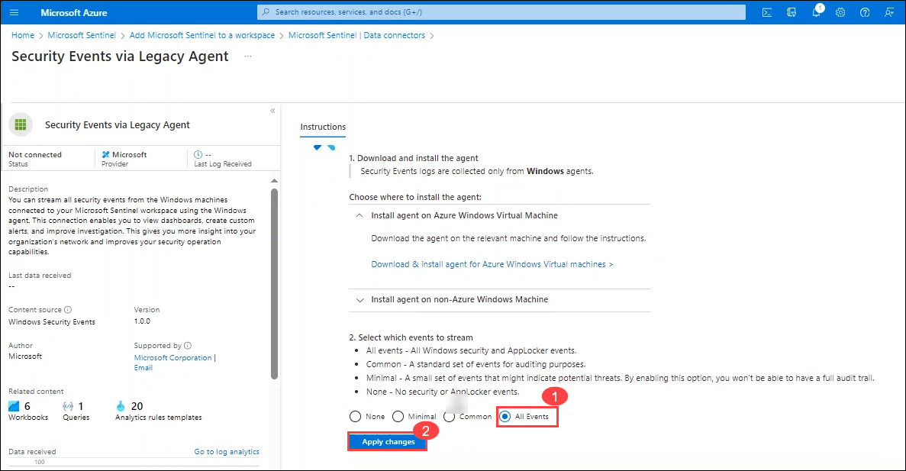
 
1. Click on **Apply changes(2)** now if you refresh the data connector page you can see the status connected for **Security events Via Legacy agent**.

### Task 3: Ingesting data to Sentinel from Microsoft Defender for cloud

1. From the left navigation pane select **Data connectors(1)** under Configuration section and click on **Go to content hub(2)**.

    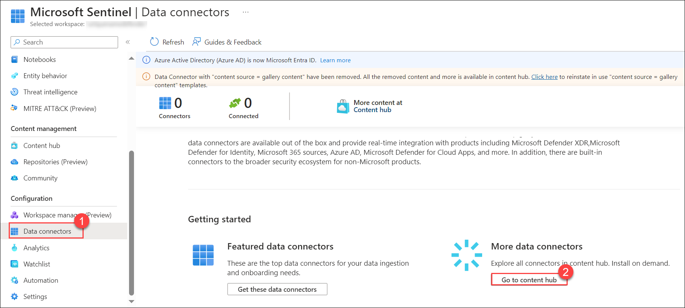

1. On the content hub page search for **Microsoft Defender for cloud(1)** and select, **Install(2)**.

    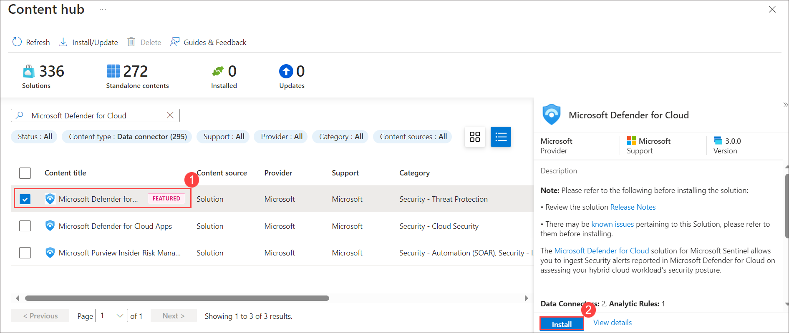

1. Once Installed, you will find below two data connectors listed in the Data Connector page.
      * Tenant-based Microsoft Defender for Cloud (Preview) : It allows you to collect Defender for Cloud alerts over your entire tenant, without having to enable each subscription separately.
      * Subscription-based Microsoft Defender for Cloud (Legacy) :  It allows you to collect Defender for Cloud alerts per subscription.

     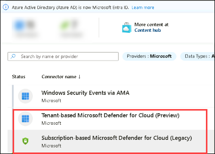

1. Select **Subscription-based Microsoft Defender for Cloud (Legacy)** data connector.
    
    >**Note**: The connector can be enabled only on subscriptions that have at least one Microsoft Defender plan enabled in Microsoft Defender for Cloud, and only by users with Contributor permissions on the subscription.

1. In the details pane for the connector, select Open connector page.

1. On the configuration page, select the **subscription(1)** and click on **Connect(2)**.

     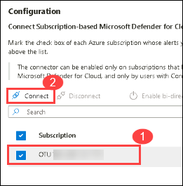

### Task 4: Create rules to identify security threats

In this task, you will create rules to generate alerts for detected threats. In the following example, we create a rule for attempts to sign in to Windows server with the wrong password.

1. On the Microsoft Sentinel overview page, under Configurations, select **Analytics**.

   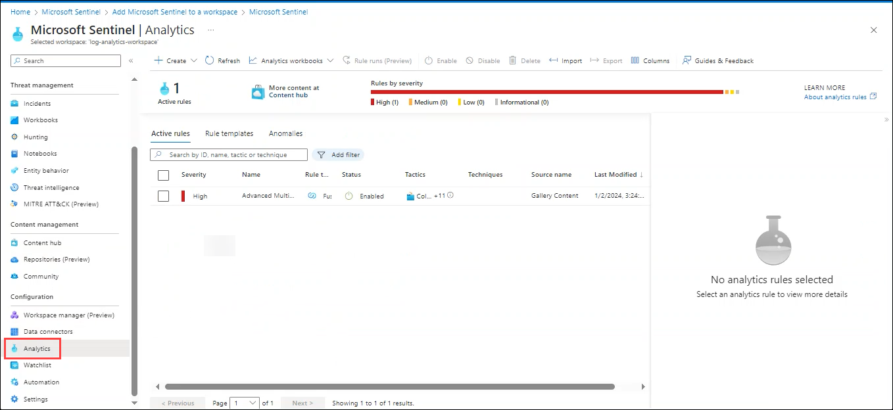

1. Select **+Create (1)** and on the drop-down, select **Scheduled query rule (2)**.

   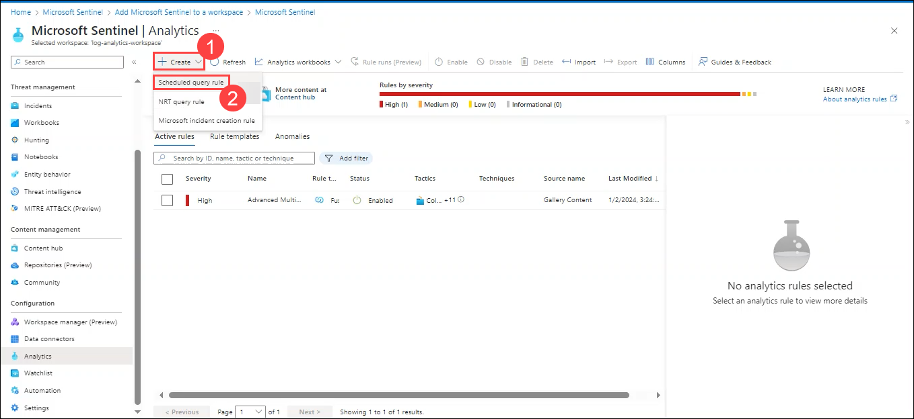

1. On the General tab, enter the required information and then select **Next: Set rule logic (3)**.

    |General tab | Details|
    |-------|-------|
    |Name	| **sigin_with_wrong_password** (1) |
    |Description| Leave blank|
    |Severity| **High** (2)|

    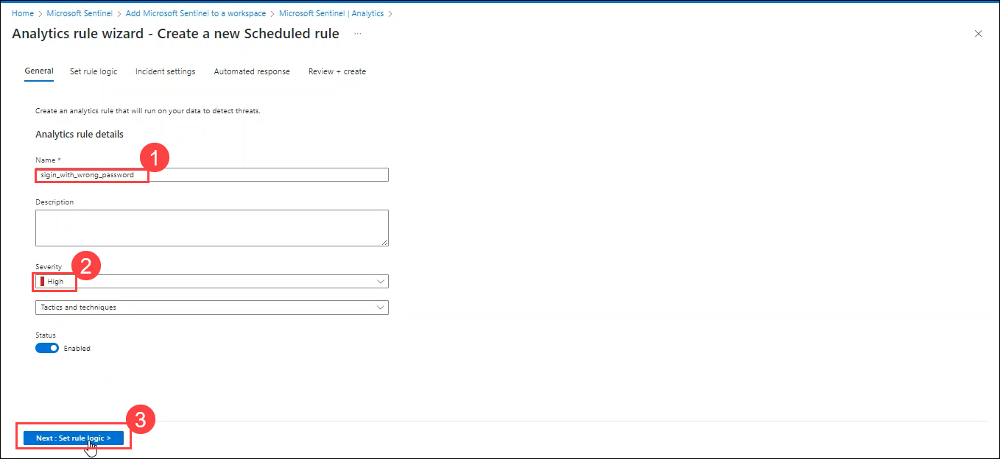

1. On the Set rule logic tab, enter the required information, then select Next.

1. Under the **Rule query** box, paste the below query and select **Next: Incident settings**:

    ```
    SecurityEvent
    |where Activity startswith '4625'
    |summarize count () by IpAddress,Computer
    |where count_ > 3
    ```

    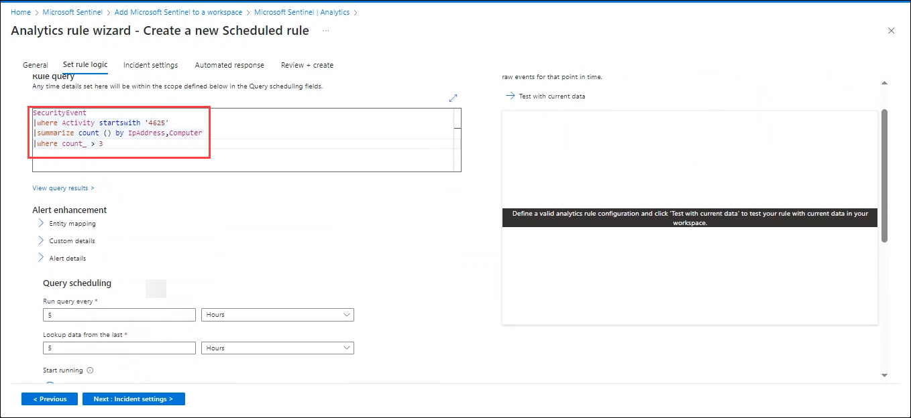

1. On the Incident settings tab, enable **Create incidents from alerts triggered by this analytics rule** and select Next: Automated response.

    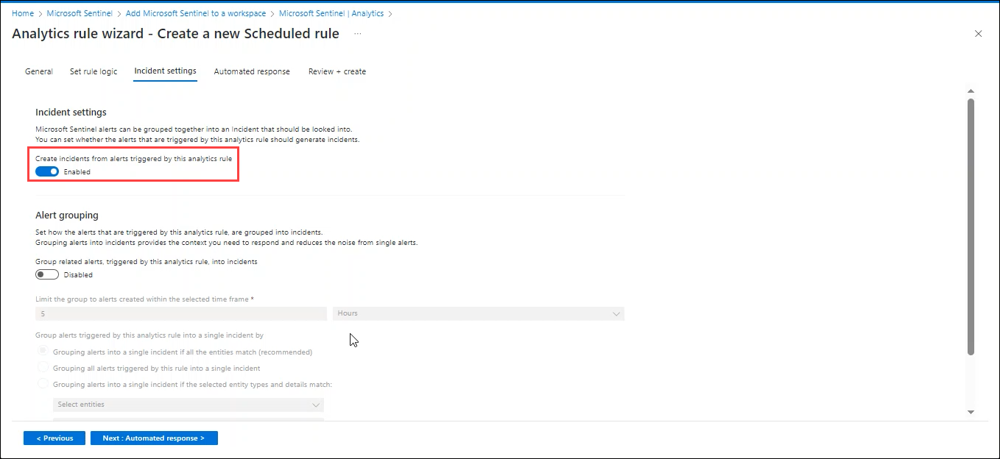

1. Select Next: Review.

1. On the Review and create tab, review the information, and select Create.

### Task 5: View data ingested into Microsoft Sentinel

In this task, you will be inspecting and reviewing the data that has been successfully ingested into Microsoft Sentinel from data connectors. 

1. In Microsoft Sentinel, select **Data connectors**.

1. Search and select the **Security events Via Legacy agent** data connector.

1. In the details pane for the connector, select **Open connector page**.

1. Review the Status of the data connector. It should be **Connected**.

1. Select **Logs** from the general section of the pane.

1. In the query pane, run the below query, to view the activity data ingested into the workspace.

    ```
    SecurityEvent
    | where Computer =="WinDev2401Eval"
    ```
    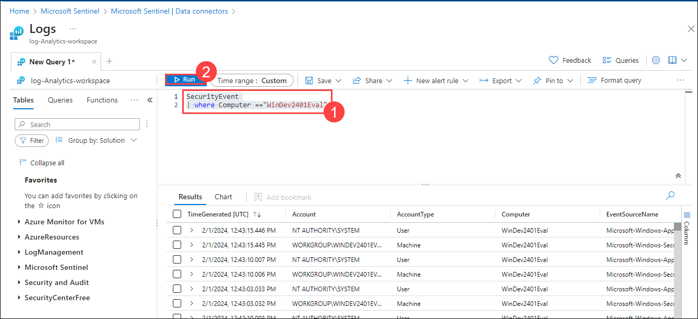

## Review
In this exercise, you have completed:
+ Adding workspace to the sentinel
+ Ingesting data to Sentinel from Windows security event connector
+ Ingesting data to Sentinel from Microsoft Defender for cloud
+ Create rules to identify security threats
