# Task 3: Import the OVA file to the On-Premises vCenter

## Install HCX in your on-premises vCenter Server

In this step we will import the HCX appliance into the on premises vCenter. We can accomplish this task in two methods. 

# Option 1: Download and deploy HCX OVA to on-premises vCenter

1. In the Dashboard pane under **Administration** click on **System Updates (1)**. Select the **Current version (2)** available in the **Loacal HCX**. Then click on **REQUEST DOWNLOAD LINK (3)**.

   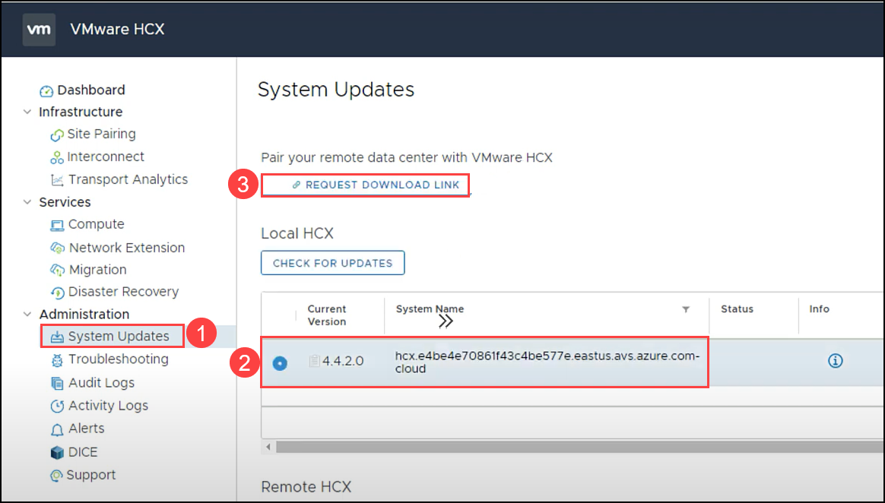
   
2. Select **VMware HCX** to download the HCX OVA.

   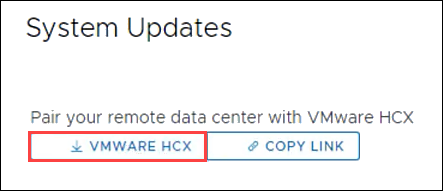
   
   
# Option 2: Deploy HCX from a vCenter Content Library 

1. Click on **COPY LINK** and save it in notepad for later use.

    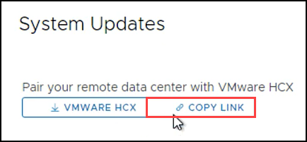
    
2. Open VMware vSphere tab where you have logged in earlier. If not opened then follow the below steps to re-login. You can skip steps 3 through 5 if VMware vSphere is already logged in.

3. On the Azure VMware Solution page; click on **VMware credentials (1)** under Manage tab and then copy the **Web client URL**, **Username** and **Password** under vCenter Server Credentials **(2)** and save it in notepad.

   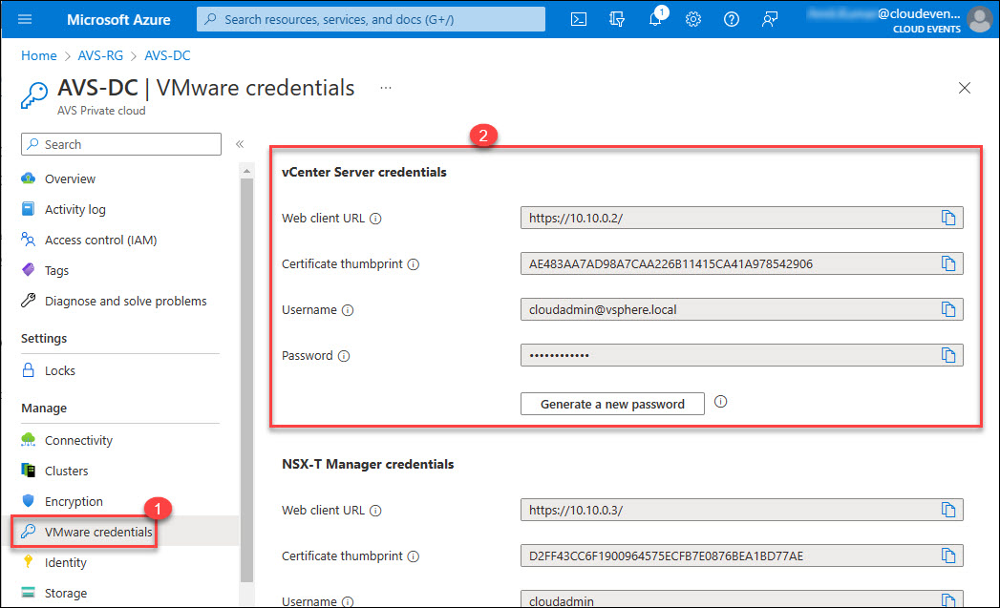

4. Open a new tab in the Microsoft Edge browser, Enter the **Web Client URL** that you copied in step 3, You may see a warning `Your connection isn't private`, then click on **Advanced** button and proceed with **Continue to 10.10.0.2 (unsafe)**. 

   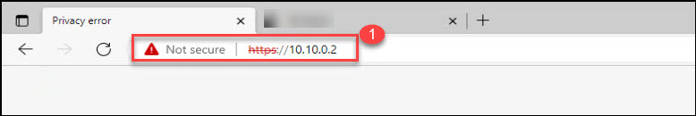

5. Log in to the **VMware vSphere**; Enter the **Username** and **password** that you copied in step 3 and click on **LOGIN**.

   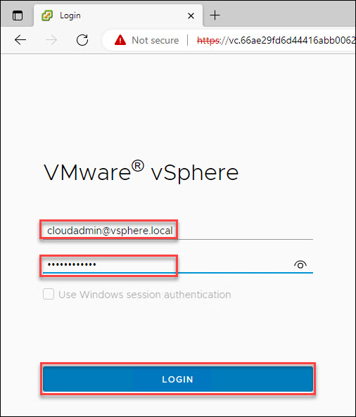    

6. From AVS vCenter, click on the **Menu (1)** bar and then click on **Content Libraries (2)** under Inventory.

   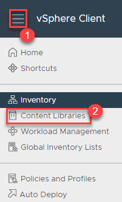

7. In the **Content Libraries**, select **Local-Lib**.   

   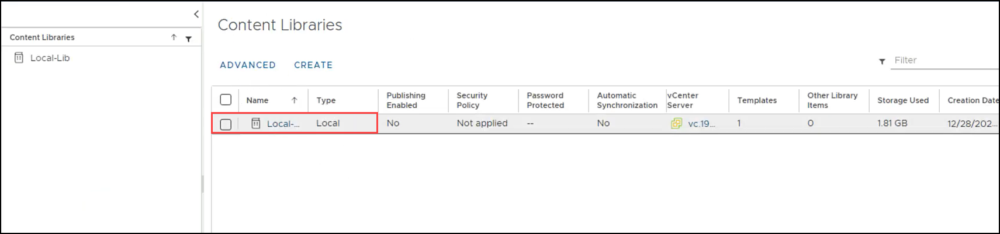
   
8. Enter the URL you copied earlier for **Source file (1)**, and click on **IMPORT**.
    
    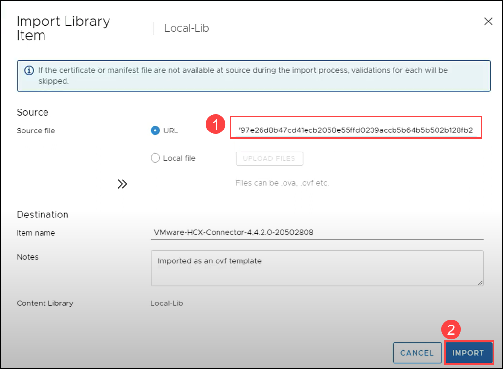
    
9. On the SSL certificate click on **Actions** and select **Continue**. 

    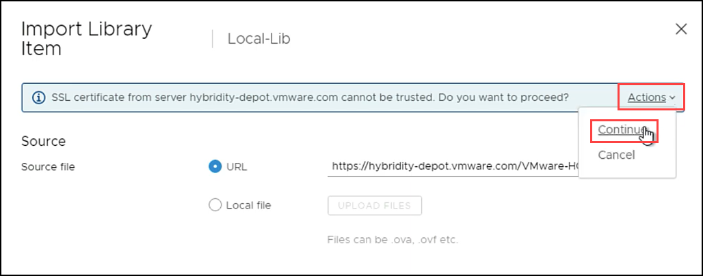
        
10. The **HCX OVA** will download to the library in the background.

    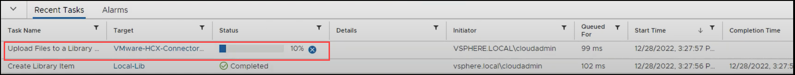
 
 
 #### Summary:
 In this task, you downloaded and deployed HCX from a vCenter Content Library.
 
 #### References:
    [Downloading the HCX OVAs](https://docs.vmware.com/en/VMware-HCX/4.6/hcx-user-guide/GUID-2698A63D-178B-4252-AFBC-652CBF98F104.html#:~:text=The%20installer%20OVA%20provides%20the%20image%20necessary%20to,have%20fully%20deployed%20and%20activated%20HCX%20Cloud%20Manager.)
