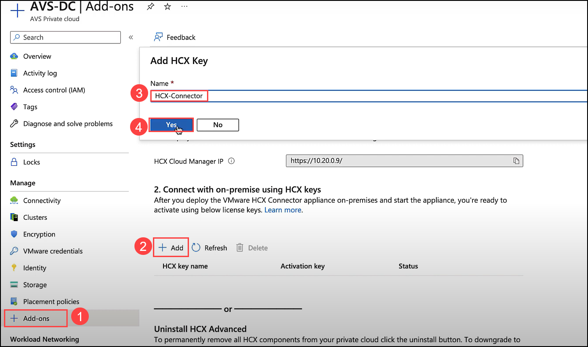
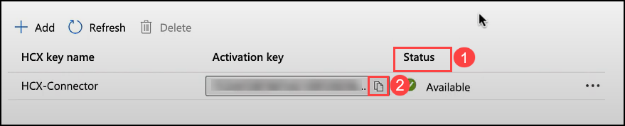

# Task 5: Obtain HCX License Key

While the HCX installation runs, we will need to obtain a license key to activate HCX. This is available from the AVS blade in the Azure Portal.

## Exercise 1: Add HCX Key 
1. Navigate back to the **Azure portal** where the **Azure VMware Solution page** is open.

2. Click on **+ Add-ons (1)**. Select **+ Add (2)**. Give `HCX-Connector` **(3)** as the HCX Key a name, then click **Yes (4)**.
 
     
    
3. You will receive a notification after the HCX Key is successfully created.
 
     
   
4. Now, click on **Status (1)** and copy the **Activation Key (2**) and save it in notepad for later use.

     
