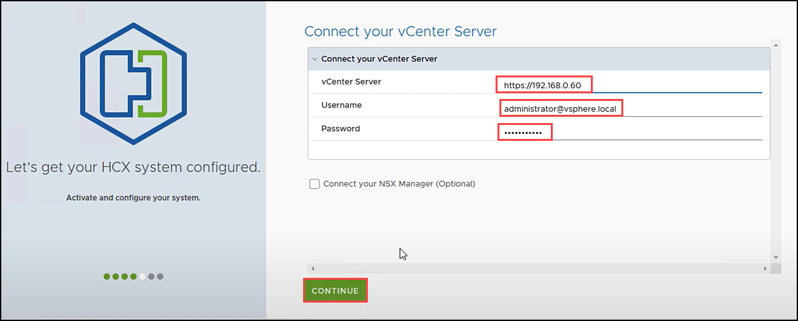
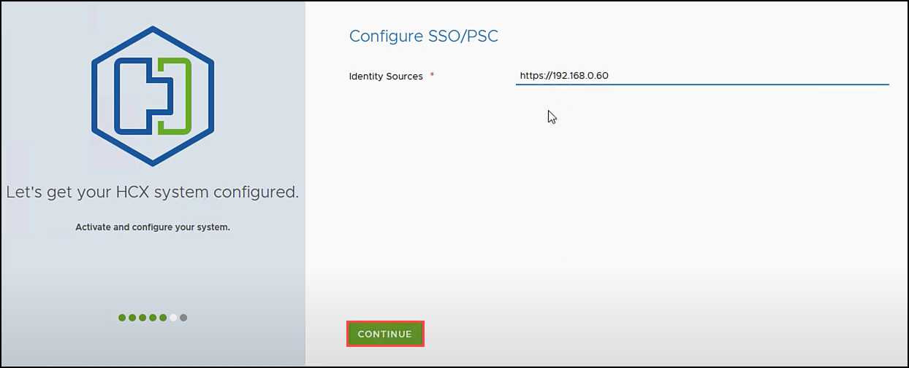
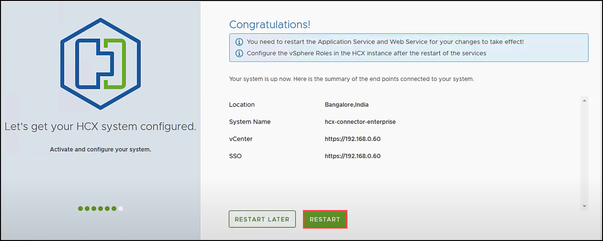
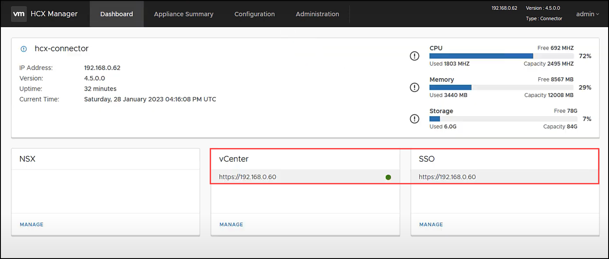
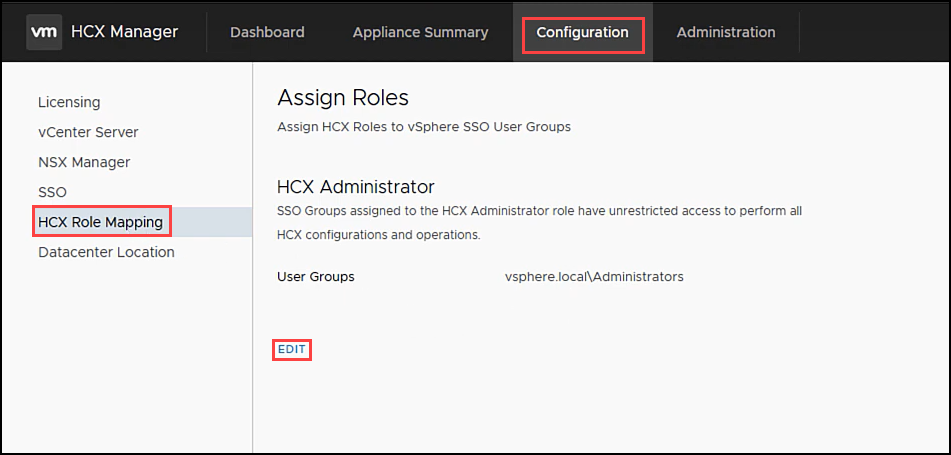

# Task 7: Configure HCX and connect to vCenter

In this section, we will integrate and configure HCX Manager with the On-Premises vCenter Server.

## Exercise 1: Complete Configuration of On-Premises HCX

1. In **Connect your vCenter Server**, provide the following details and click on **Continue**.
     
     - **vCenter Server**: `https://192.168.0.60`
     - **Username**: `administrator@avs.lab`
     - **Password**: To be provided by your instructor 

    
    
2. On **Configure SSO/PSC** blade, provide the same **vCenter IP address**. Click **CONTINUE**.

    
    
3. Verify that the information entered is correct and select **RESTART**.

      > **Note**: The restart may take up to 10 minutes.    

    
    
4. After the services restart, you’ll see vCenter showing as Green on the screen that appears. Both vCenter and SSO must have the appropriate configuration parameters, which should be the same as the previous screen.

    
     
5. Next, click on **Configuration** to complete the HCX configuration. Select **HCX Role Mapping** and then, click **Edit**. 

     
     
> **Note**: Please note that by default HCX assigns the HCX administrator role to “vsphere.local\Administrators”. In real life, customers will have a different SSO domain than vsphere.local and needs to be changed. This is the case for this lab and this needs to be changed to avs.lab.
> 
> **Note**: It may take an additional 5-10 minutes for the HCX plugins to be installed in vCenter, log back out and log back in if it does not show up automatically.
    

#### Summary:
In this task, you completed the configuration of On-Premises HCX.

#### References:
 [Configure HCX and connect to vCenter](https://docs.oracle.com/en/learn/oci-ocvs-hcx/index.html#task-2-request-download-link-for-the-vmware-hcx-connector-bundle)
