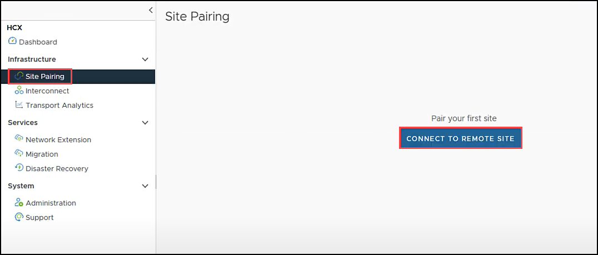
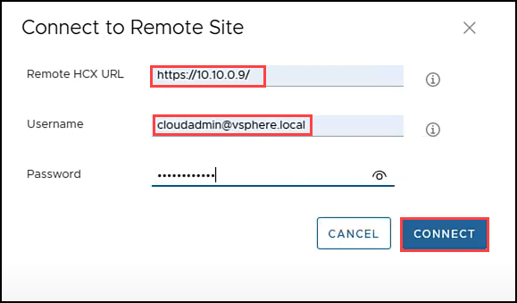
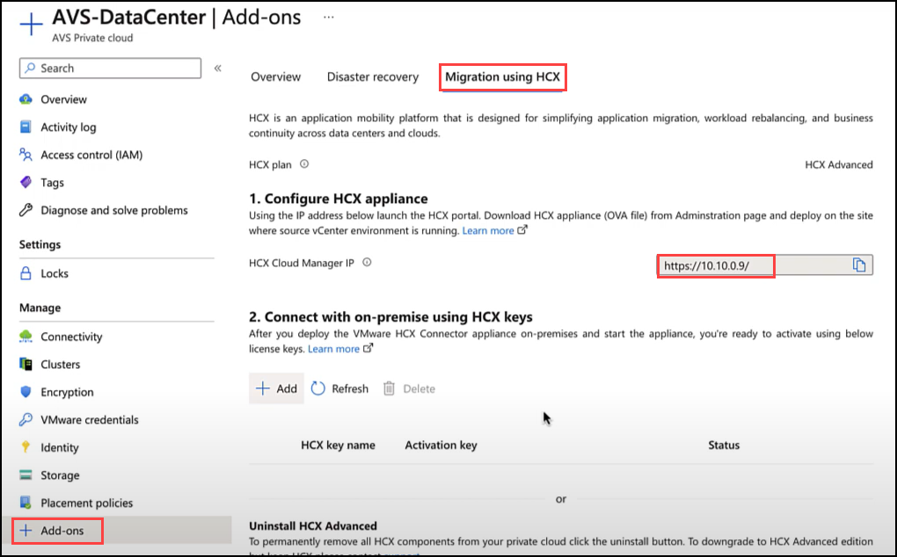
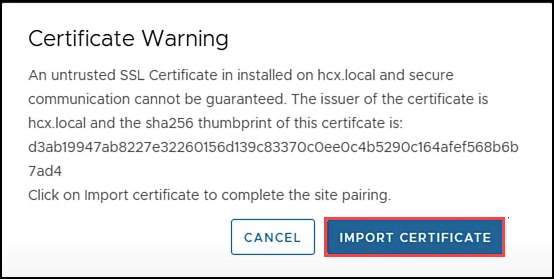
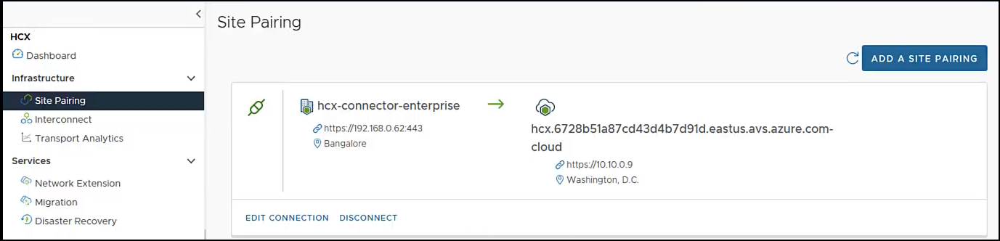

# Task 8: Create Site Pairing from On-premises HCX to AVS HCX

## HCX Site Pairing

In this task, we will be creating the Site Pairing to connect the On-Premises HCX appliance to the AVS HCX appliance.

# Exercise 1: Pair On-Premises HCX to AVS HCX 

1. Navigate to **vSphere client** tab on your browser. Click on **Menu** and select **HCX**.

    
    
2. Click **Site Pairing** in the left pane and click **CONNECT TO REMOTE SITE**.    

    

3. Enter credentials for your **AVS vCenter** found in the Azure Portal and click **CONNECT**.

    

     > **Note**: The Remote HCX URL is found under the **Add-ons** blade and it is NOT the vCenter URL.  
   
    

4. Accept certificate warning and Import. 
    
    
     
5. Connection to the remote site will be established.     

    
   
