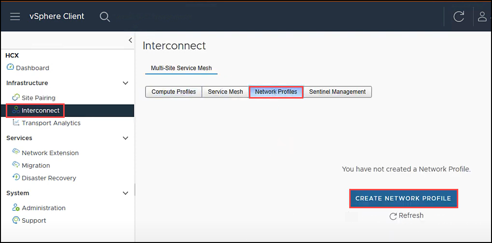
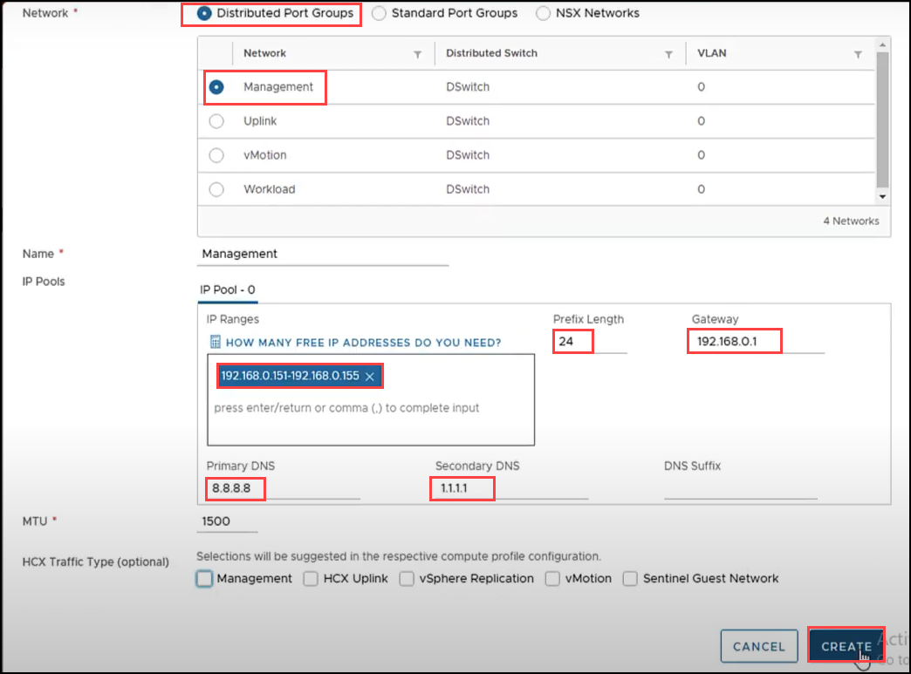
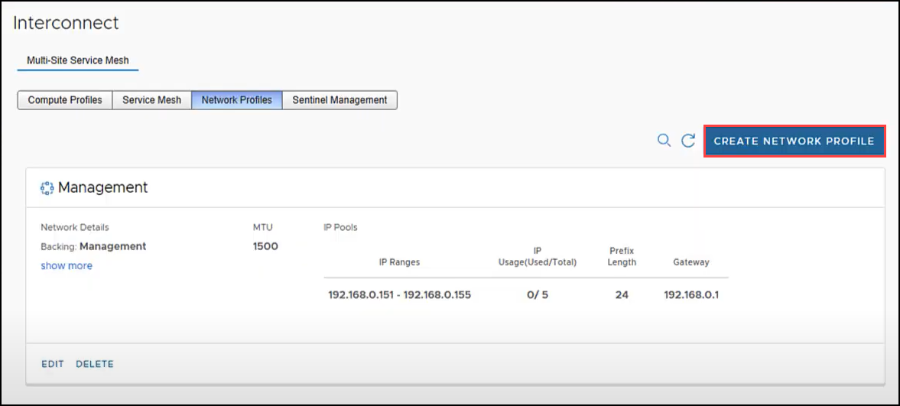
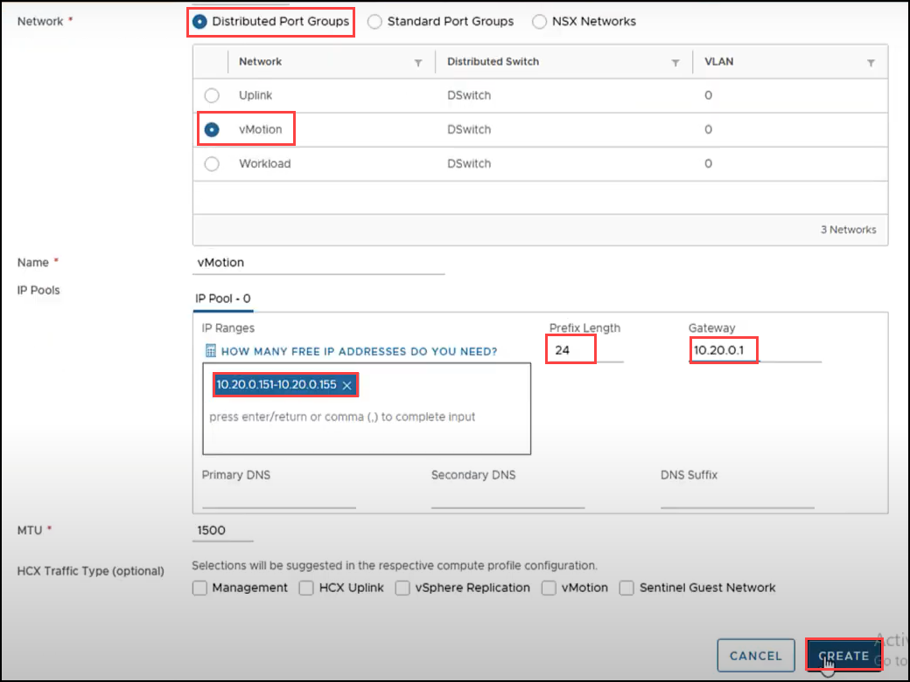
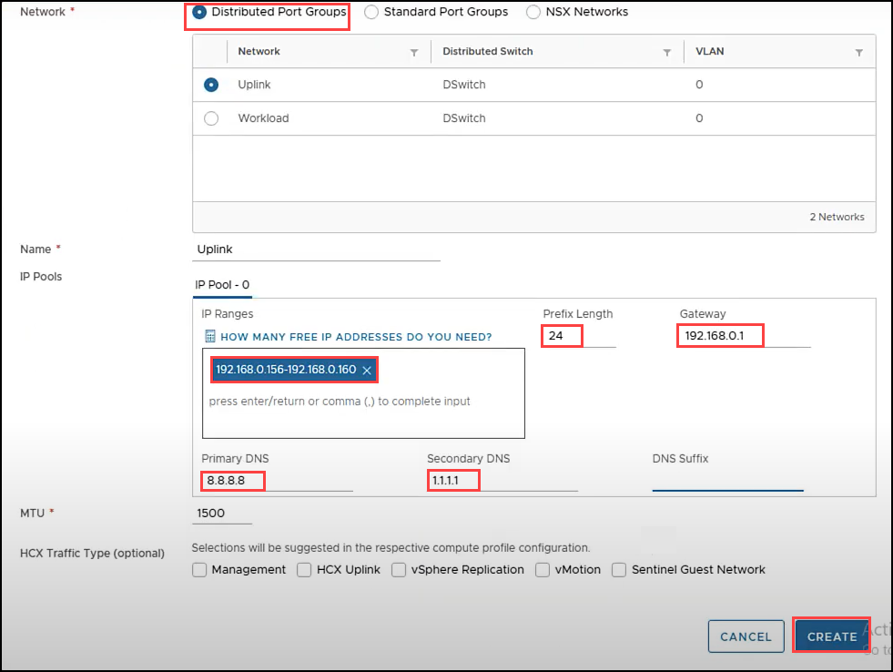

# Task 9: Create network profiles

## HCX Network Profiles
A Network Profile is an abstraction of a Distributed Port Group, Standard Port Group, or NSX Logical Switch, and the Layer 3 properties of that network. A Network Profile is a sub-component of a complete Compute Profile.

Customer’s environments may vary and may not have separate networks.

In this Task you will create a Network Profile for each network intended to be used with HCX services. More information can be found in VMware’s Official Documentation, Creating a Network Profile.

- **Management Network** - The HCX Interconnect Appliance uses this network to communicate with management systems like the HCX Manager, vCenter Server, ESXi Management, NSX Manager, DNS, NTP.
- **Motion Network** - The HCX Interconnect Appliance uses this network for the traffic exclusive to vMotion protocol operations.
- **vSphere Replication Network** - The HCX Interconnect Appliance uses this network for the traffic exclusive to vSphere Replication.
- **Uplink Network** - The HCX Interconnect appliance uses this network for WAN communications, like TX/RX of transport packets.

These networks have been defined for you, please see below section.

In a real customer environment, these will have been planned and identified previously, see here for the [planning phase](https://docs.microsoft.com/en-us/azure/azure-vmware/plan-private-cloud-deployment#define-vmware-hcx-network-segments)

# Exercise 1: Create Network Profiles

1. Navigate to **Interconnect** on **vShpere client** page. Click on **Network Profiles** and select **CREATE NETWORK PROFILE**.

 - We will create  separate network profiles:
      
      - Management
      - vMotion
      - Uplink

    

2. Select **Distributed Port Groups** then select **Management Network**. Enter the **Management Network IP** range from the table below. Click **CREATE**.

   | Property | Value|
   |---|---|
   | Management Network IP| 192.168.0.151-192.168.0.155 |
   | Prefix Length| 24|
   | Management Network Gateway| 192.168.0.1|
   |Primary DNS	| 8.8.8.8|‭
   |Secondary DNS | ‬1.1.1.1|
   
   
   
3. Now, back on the **Interconnect** pane select **CREATE NETWORK PROFILE**.  

    
   
4.  Select **Distributed Port Groups** then select **vMotion Network**. Enter the **vMotion Network IP** range from the table below. Click **CREATE**.

     | Property | Value|
     |---|---|
     | vMotion Network IP| 10.20.0.151-10.20.0.155  |
     | Prefix Length| 24|
     | vMotion Network Gateway| 10.20.0.1|

     
     
5. Repeat Step-3 to create **Uplink Network Profile**. Select **Distributed Port Groups** then select **Uplink Network**. Enter the **Uplink Network IP** range from the table below. Click **CREATE**.    

     | Property | Value|
     |---|---|
     | Uplink Network IP| 192.168.0.156-192.168.0.160  |
     | Prefix Length| 24|
     | Uplink Network Gateway| 192.168.0.1|
     |Primary DNS	| 8.8.8.8|‭
     |Secondary DNS | ‬1.1.1.1| 
 
     
