# Task 10: Create compute profiles

## HCX Compute Profile

A compute profile contains the compute, storage, and network settings that HCX uses on this site to deploy the interconnected dedicated virtual appliances when service mesh is added. For more information on compute profile and its creation please refer to [VMware documentation](https://docs.vmware.com/en/VMware-HCX/4.2/hcx-user-guide/GUID-BBAC979E-8899-45AD-9E01-98A132CE146E.html#:~:text=A%20Compute%20Profile%20contains%20the%20compute%2C%20storage%2C%20and,virtual%20appliances%20when%20a%20Service%20Mesh%20is%20added.).

# Exercise 1: Create Compute Profile 

1. In your on-premises HCX installation, click **Interconnect**. Select **Compute Profiles** and click C**REATE COMPUTE PROFILE**.

   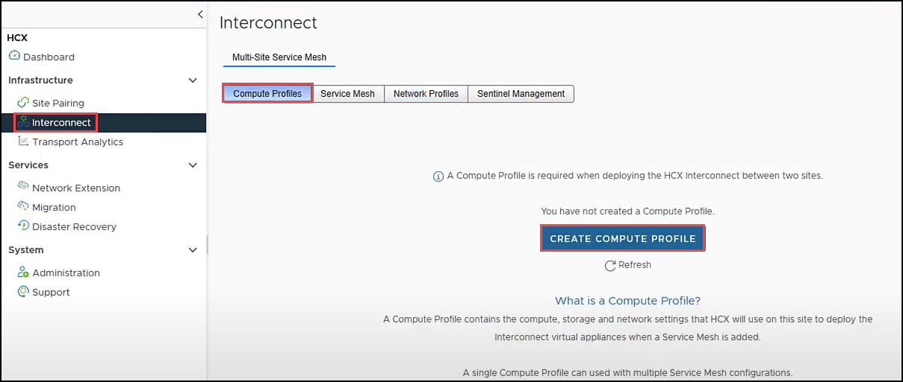
   
2. On **Create Compute Profile** pane, enter `OnPremCompute` for **Name your Compute Profile** and click **CONTINUE**.  

    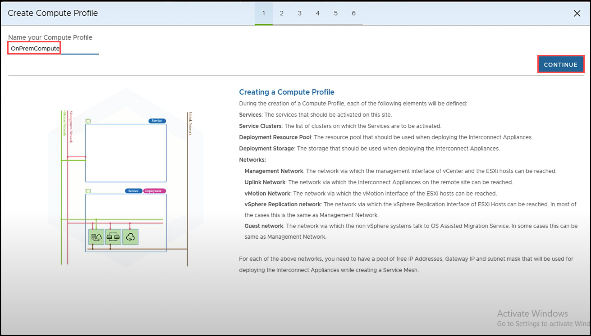
 
3. Review the selected services. By default all the above services are selected. In a real world scenario, if a customer let’s say doesn’t need Network Extension, you would unselect that service here. Leave all defaults for the purpose of this workshop. Click **CONTINUE**. 

    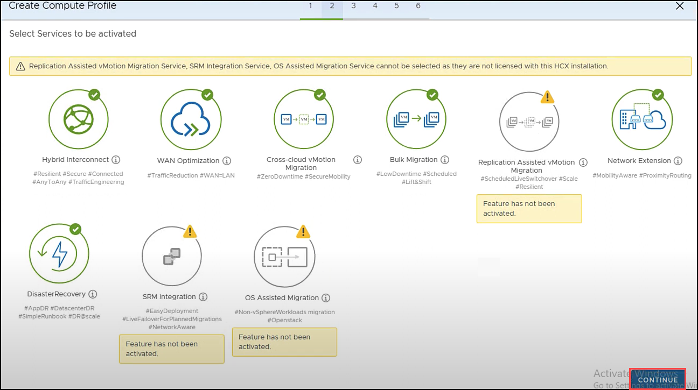

4. Click the arrow next to **Select Resource(s)**. In this on-premises simulation, you only have one Cluster called OnPrem-SDDC-Datacenter. In a real world scenario, it’s likely your customer may have more than one Cluster. HCX Service Resources are resources from where you’d like HCX to either migrate or protect VMs from. Select the top level **OnPrem-SDDC-Datacenter**. Click **OK**. Click **CONTINUE**.

    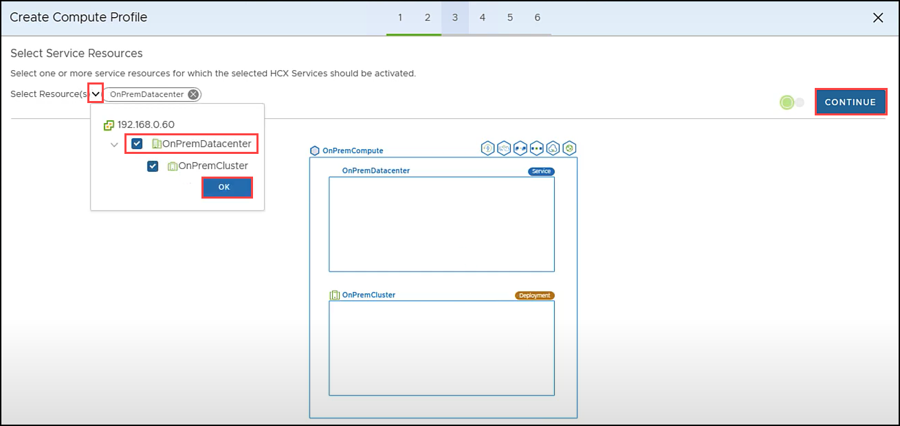

5. Click the arrow next to **Select Resource(s)** and select **OnPremCluster**. For Select Datastore click and select the **TrueNAS** that exists in your simulated on-premises environment. This will be the on-premises Datastore the additional HCX appliances will be placed in. Click **CONTINUE**.

    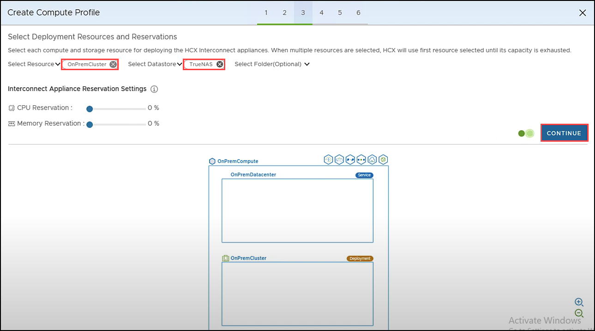

6. Select the **Management Network Profile** you created in a previous step. Click **CONTINUE**.

    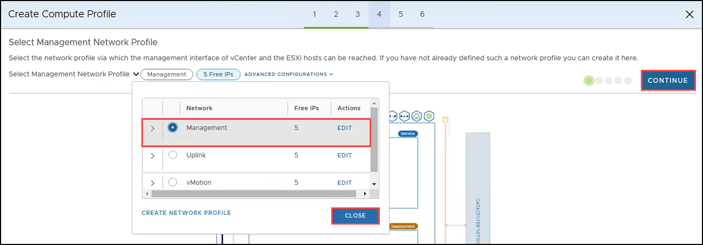

7. Select the **Uplink Network profile** you created in a previous step. Click **CONTINUE**.

     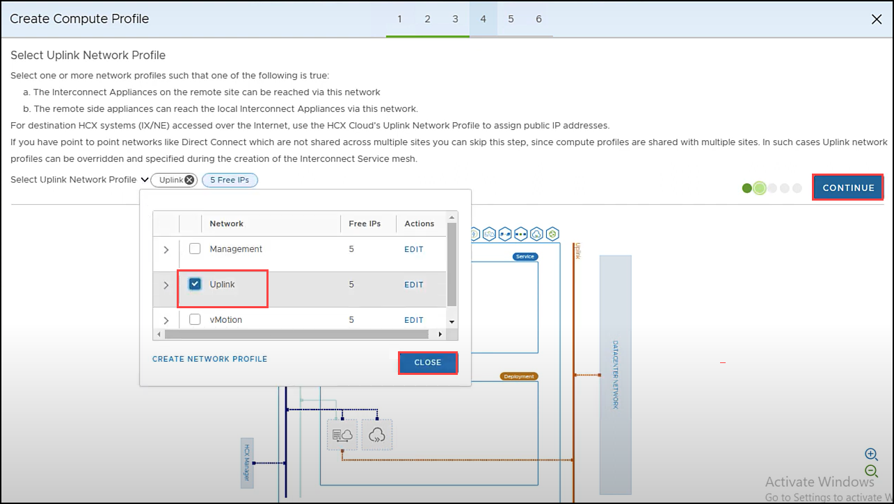

8. Select the **vMotion Network Profile** you created in a previous step. Click **CONTINUE**.

     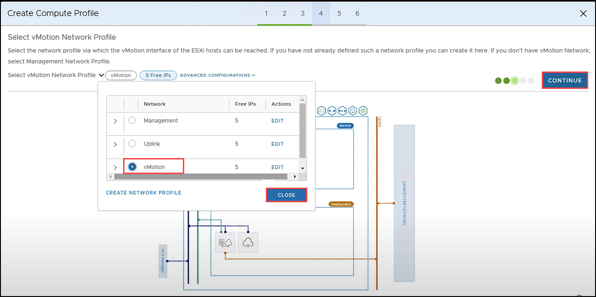

9. Leave default the **vSphere Replication Network Profile** you created in a previous step. 

      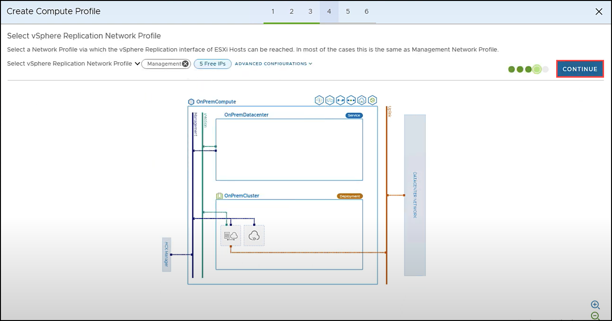

10. Click the arrow next to Select Network Containers.Select **DSwitch** to make eligible for Network Extension. Click **CLOSE** and click **CONTINUE**.\

     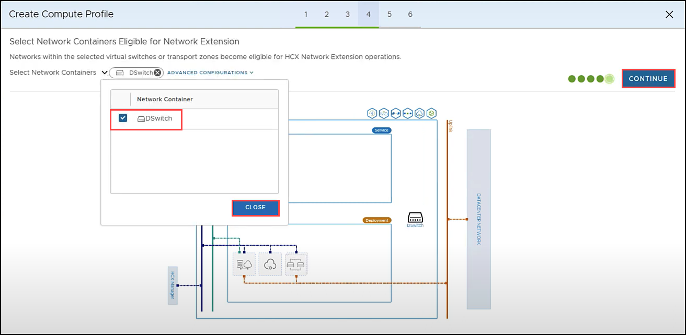

11. On **Review Connection Rules** click **CONTINUE**.

      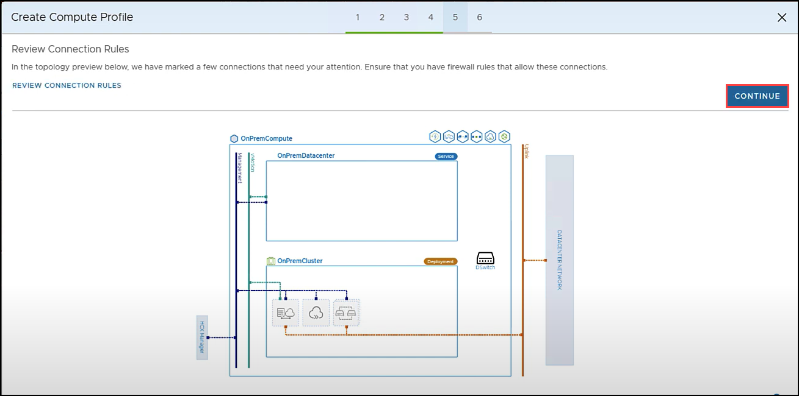

12. Click **FINISH** to create the compute profile.

      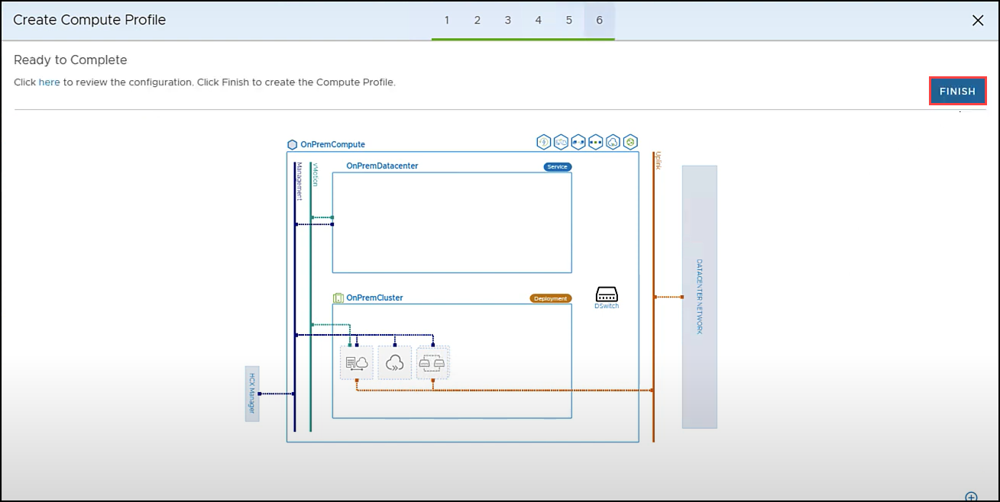

13. Your **Compute Profile** is created successfully.

      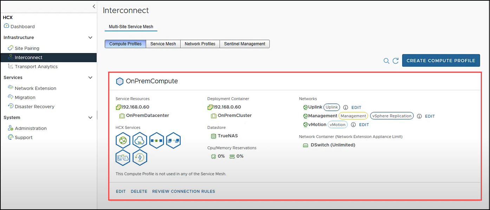 
