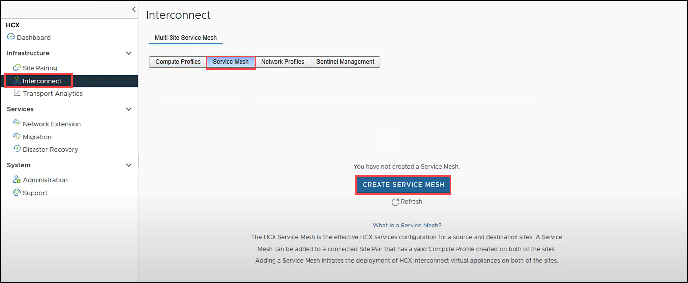
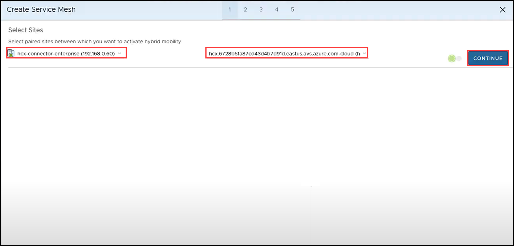
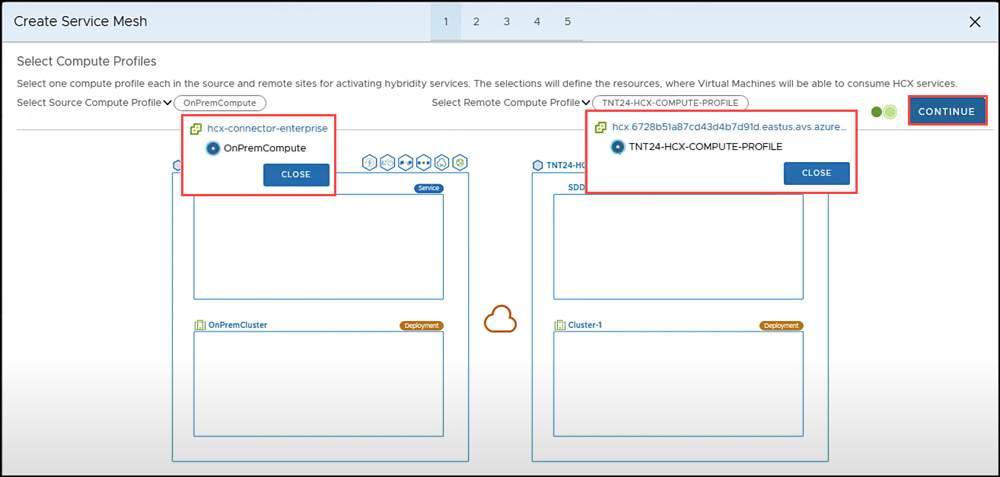
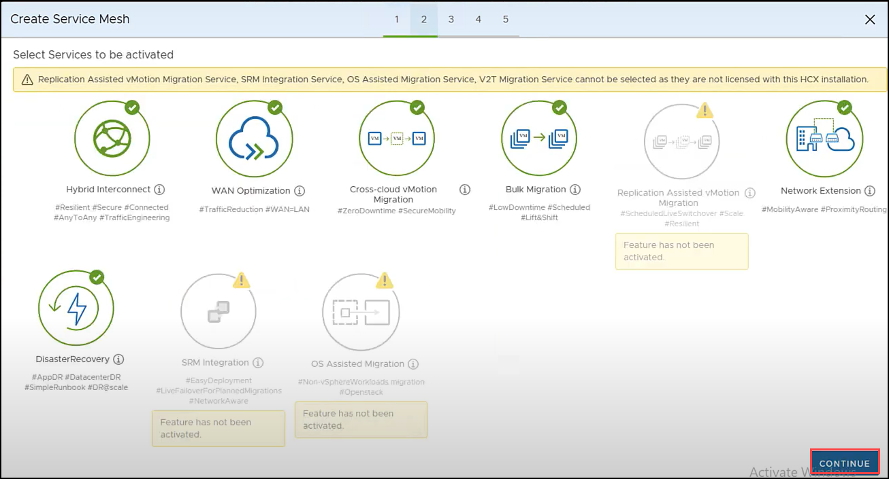
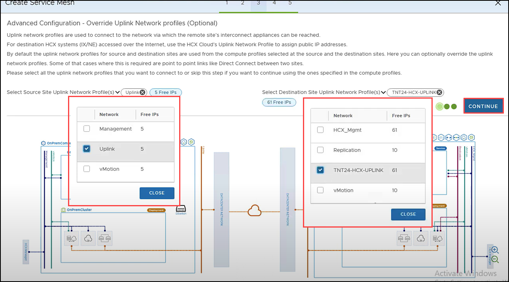
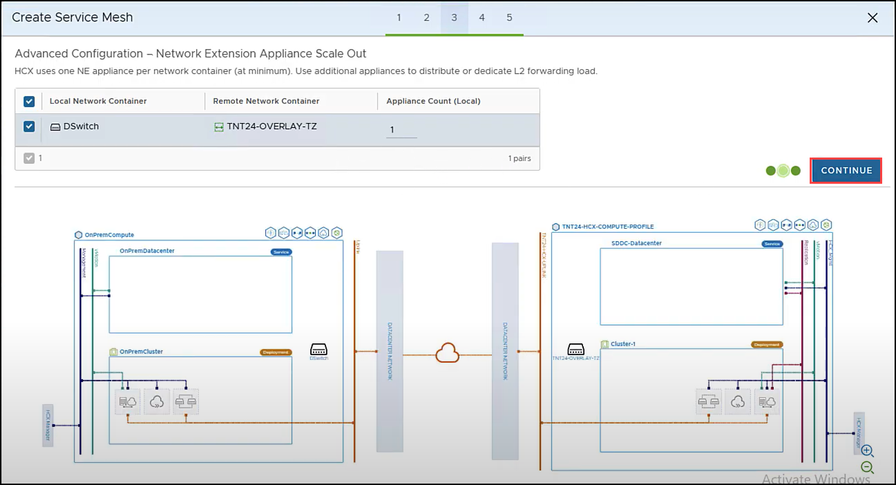
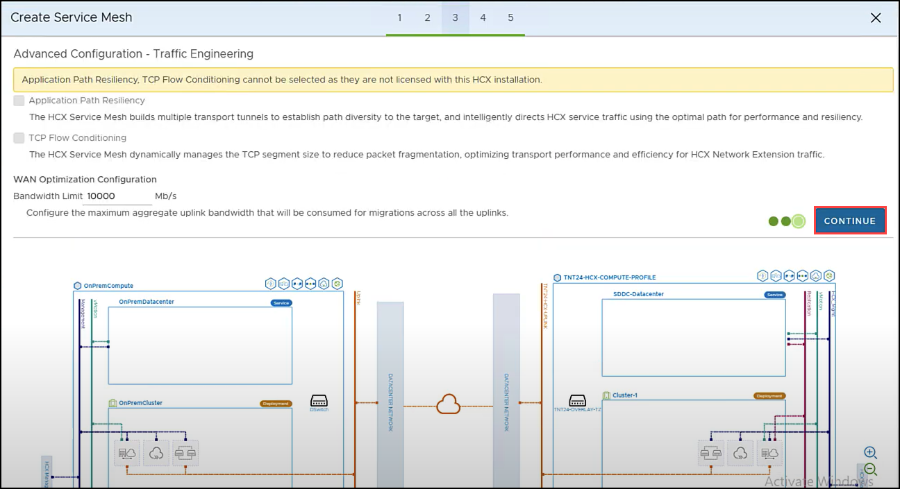
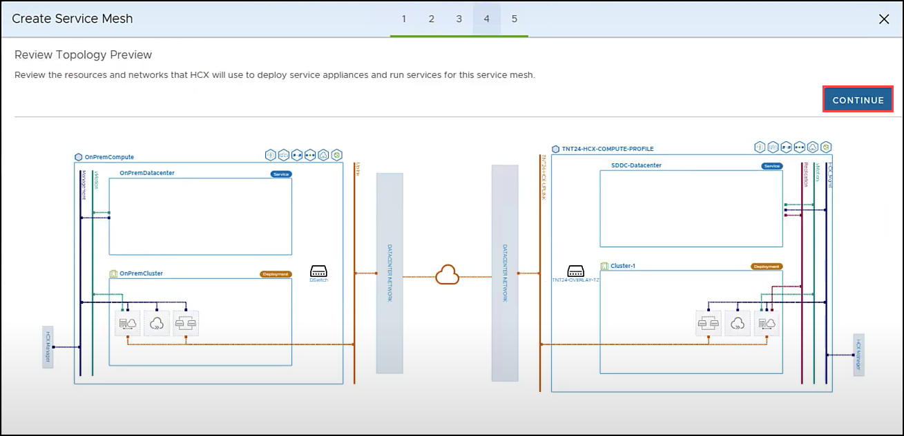
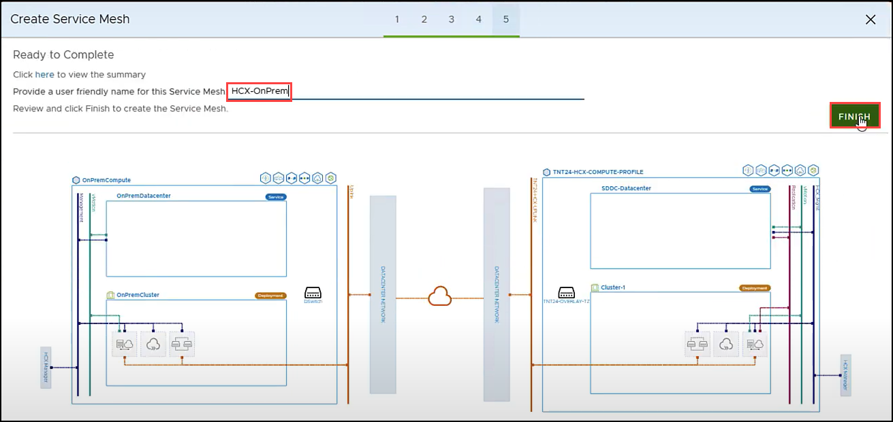
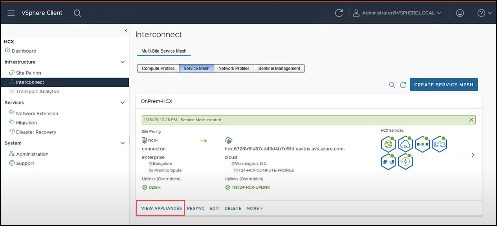

# Task 11: Create a service mesh

## HCX Service Mesh Creation

An HCX Service Mesh is the effective HCX services configuration for a source and destination site. A Service Mesh can be added to a connected Site Pair that has a valid Compute Profile create on both of the sites.

Adding a Service Mesh initiates the deployment of HCX Interconnect virtual appliances on both sites. An interconnect Service Mesh is always created at the source site.

# Exercise 1: Create HCX Service Mesh

  > **Important Note**: Make sure port UDP 4500 is open between your On-Premises VMware HCX Connector ‘uplink’ network profile addresses and the Azure VMware Solution HCX Cloud ‘uplink’ network profile addresses.

1. On the **Interconnect** page, select **Service Mesh** tab and click on **CREATE SERVICE MESH**.

   

2. Ensure the right source site (on-premises) and destination site (AVS) are selected. Then click **CONTINUE**. 

    

3. For **Select Source Compute Profile** choose **OnPremCompute** , **click CLOSE**. Then for  **Select Remote Compute Profile** select **Remote Compute Profile** which you recently created and click **CLOSE**. Click **CONTINUE**.

    

4. On **Select Services to be activated** leave the Default Services and click **CONTINUE**.

    

5. For **Select Source Site Uplink Network Profile(s)** select **Uplink** network profile, click **CLOSE**. Then for **Select Destination Site Uplink Network Profile(s)** select the Destination Uplink Network Profile (usually TNTXX-HCX-UPLINK), click **CLOSE** and click **CONTINUE**.

    

6. In **Advanced Configuration – Network Extension Appliance Scale Out**, keep the defaults and then click **CONTINUE**.

    

7. In **Advanced Configuration – Traffic Engineering**, review, leave the defaults and click **CONTINUE**.

    

8. Review the topology preview and click **CONTINUE**.

    

9. Enter a name for your Service Mesh as `HCX-OnPrem`. Click **FINISH**.

    

10. The Service Mesh deployment will take 5-10 minutes to complete. Once successful, you will see the services as green. Click on **VIEW APPLIANCES**. 

     

11. You’re ready to migrate and protect on-premises VMs to Azure VMware Solution using VMware HCX. Azure VMware Solution supports workload migrations (with or without a network extension). So you can still migrate workloads in your vSphere environment, along with On-Premises creation of networks and deployment of VMs onto those networks. For more information, see the [VMware HCX Documentation](https://docs.vmware.com/en/VMware-HCX/index.html).

#### Summary:
In this task, you created service mesh which initiates the deployment of HCX Interconnect virtual appliances.

#### References:
- [Creating a Service Mesh](https://docs.vmware.com/en/VMware-HCX/4.3/hcx-user-guide/GUID-46AED982-8ED2-4CB1-807E-FEFD18FAC0DD.html).
- [VMware HCX Documentation](https://docs.vmware.com/en/VMware-HCX/index.html).
