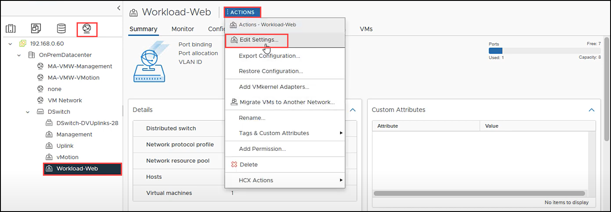
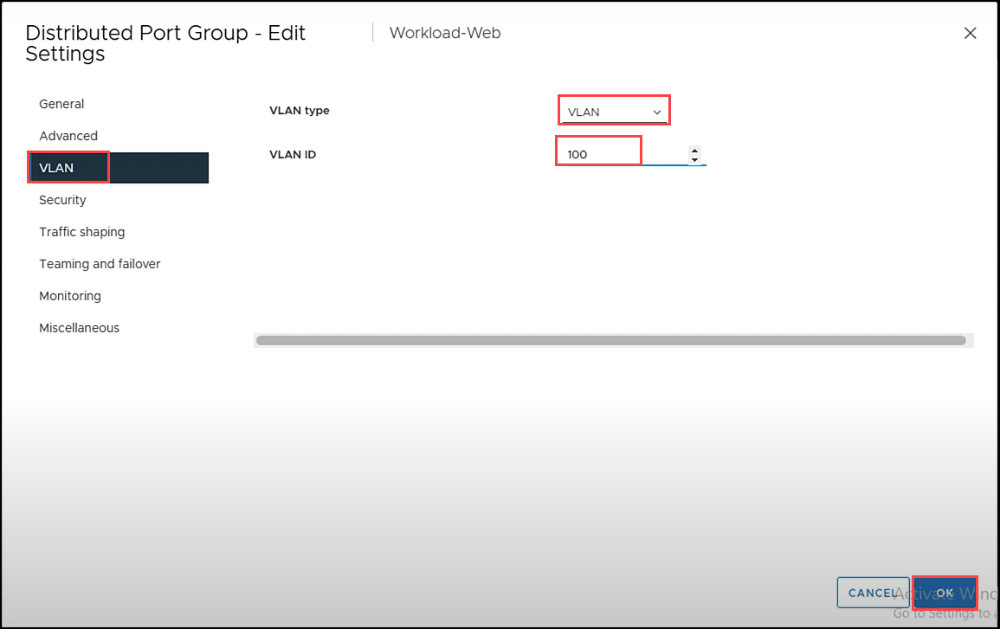
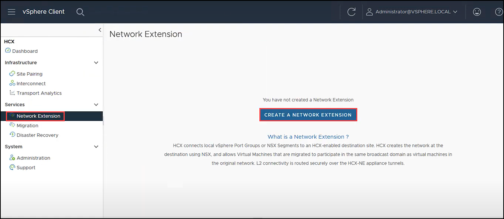
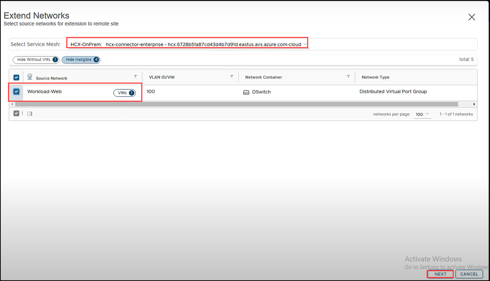
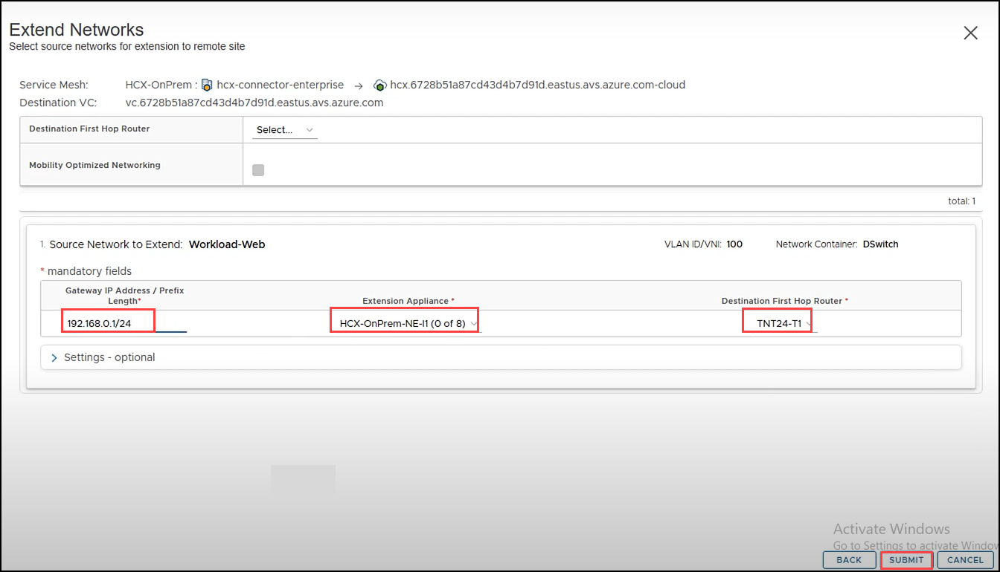
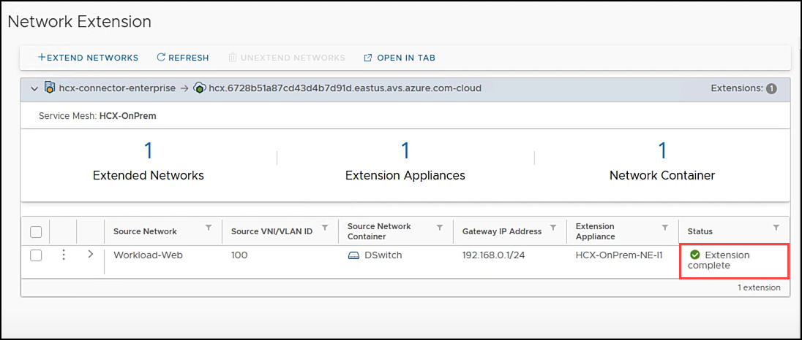
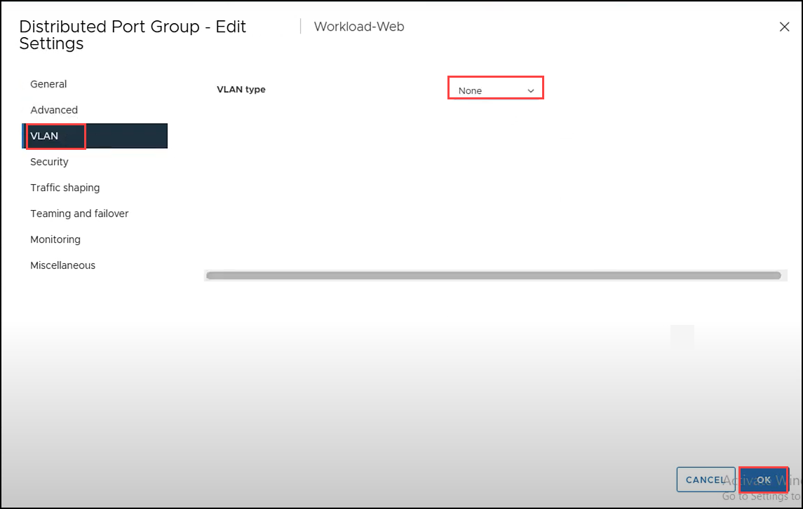

# Task 12: Network Extension

# HCX Network Extension

You can extend networks between and HCX-activated on-premises environment and Azure VMware Solution (AVS) with HCX Network Extension.

With VMware HCX Network Extension (HCX-NE), you can extend a VM’s network to a VMware HCX remote site like AVS. VMs that are migrated, or created on the extended network at the remote site, behave as if they exist on the same L2 network segement a VMs in the source (on-premises) environment. With Network Extension from HCX, the default gateway for an extended network is only connected at the source site. Traffic from VMs in remote sites must be routed to a different L3 network will flow through the source site gateway.

With VMware HCX Network Extension you can:

  - Retain the IP and MAC addresses of the VMs and honor existing network policies.
  - Extend VLAN-tagged networks from a VMware vSphere Distributed Switch.
  - Extend NSX segments.

Once the Service Mesh appliances have been deployed, the next important step is to extend the on-premises network(s) to AVS, so that any migrated VM’s will be able to retain their existing IP address.

# Exercise 1: Create a Network Extension

1. We will temporarily tag our network with a VLAN to enable it for extension. In order to do this navigate to **Networks** tab on vsphere, select **Workload-Web** and click on the **ACTIONS** and select **Edit Settings** from the drop-down menu.

    

2. Select **VLAN** on the left menu, choose **VLAN** for **VLAN type** and for **VLAN ID** enter **100** and click **OK**.

    

3. Navigate to **vSphere client** tab on your browser. Click on **Menu** and select **HCX**.

    

4. Select **Network Extension** on the left menu. Click **CREATE A NETWORK EXTENSION**.

    

5. For **Select Service Mesh** ensure you select your own Service Mesh you created in an earlier step. Select **Workload-Web** network. Click **NEXT**.

     

6. Under **Source Network to Extend** for **Gateway IP Address / Prefix Length** enter the OnPrem-workload IP address `192.168.0.1/24`. Ensure your own **Extension Appliance** is selected. Select your own T1 under **Destination First Hop Router** (usually **TNTXY-T1**) and click **SUBMIT**.

    

    > **Note**: It might take 5-10 minutes for the Network Extension to complete.

7. Confirm the status of the Network Extension as **Extension complete**.

    

8. Once the extension creation is completed navigate back to **Networks** tab on vsphere, select **Workload-Web** and click on the **ACTIONS** and select **Edit Settings** from the drop-down menu.

    

9. Select **VLAN** on the left menu, choose **None** for **VLAN type** and click **OK**.

    
    
    
#### Summary:
In this task, you created a network extention.

#### References:
[Extending Networks with VMware HCX](https://docs.vmware.com/en/VMware-HCX/4.3/hcx-user-guide/GUID-DD9C3316-D01C-4088-B3EA-84ADB9FED573.html).
