# Task 13: Migrate a VM using HCX vMotion
## Migrate a VM using HCX vMotion

Now that your Service Mesh has deployed the additional appliances HCX will utilize successfully, you can now migrate VMs from your on-premises environment to AVS. In this module, you will migrate a test VM called Workload-XY-1 that has been pre-created for you in your simulated on-premises environment using HCX vMotion.

# Exercise 1: Migrate VM to AVS 

1. Click the **VMs and Templates** icon in your on-premises vCenter Server. You will find the VM named **TestVM1**, select it. Notice the IP address assigned to the VM, this should be consistent with the network you stretched using HCX in a previous exercise.
Notice the name of the Network this VM is connected to **Workload-Web**.

    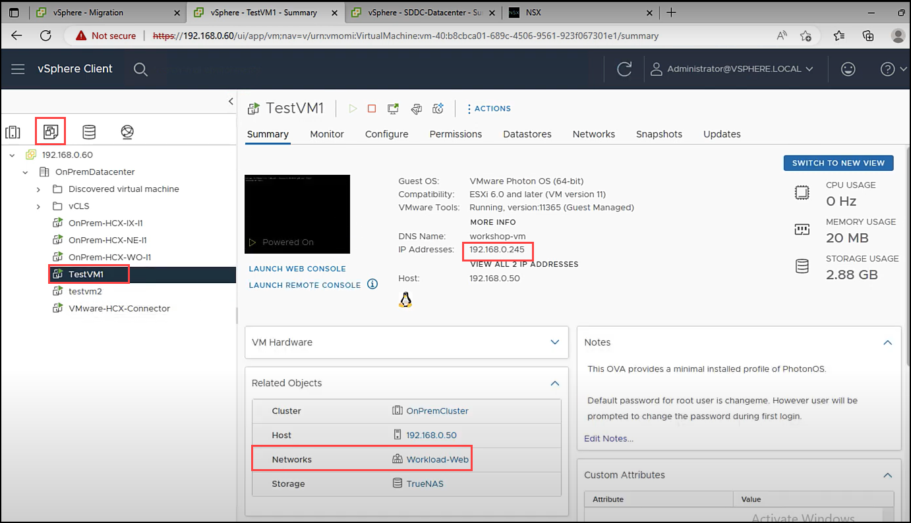

2. From the vCenter Server interface, click **Menu**. Click **HCX**.

    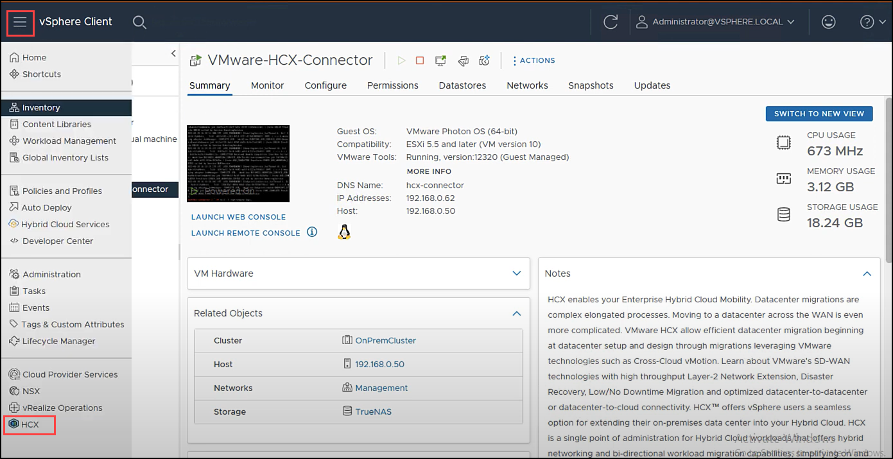

3. From the **HCX** interface click **Migration** in the left pane. Click **MIGRATE**.

    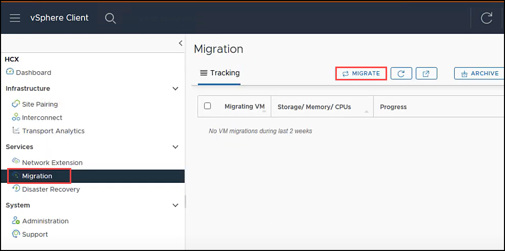

4. Click the checkbox to select your VM named **TestVM1**. Click **ADD**.

    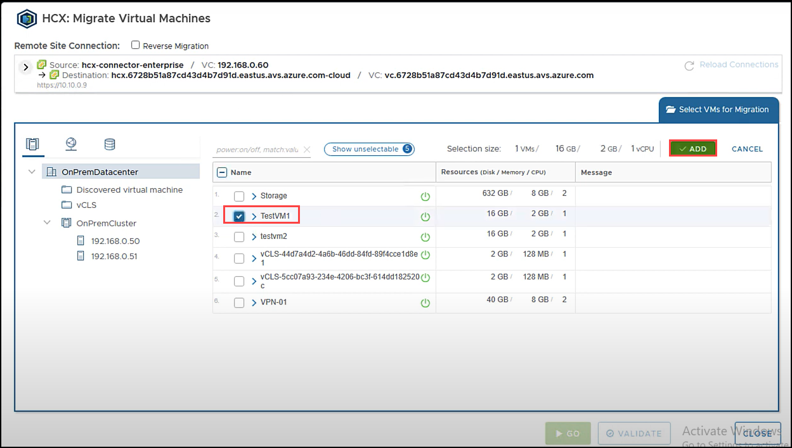

5. Set the following values in **Transfer and Placement** and click on **Validate**.

    |Option| Value|
    |---|---|
    |Compute Container|	Cluster-1|
    |Storage|	vsanDatastore|
    |Format| Same format as source|
    |Migration Profile|	vMotion|

    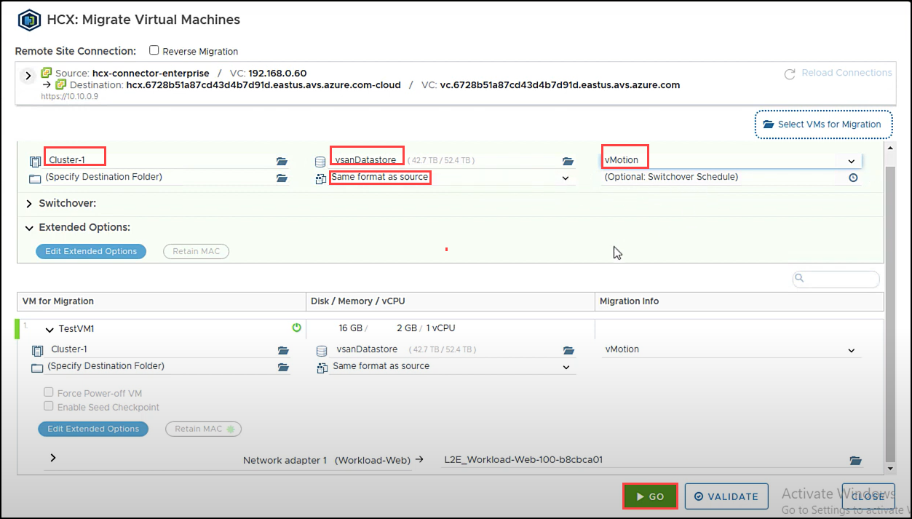

6. Once the validation is successful click on **GO**.

    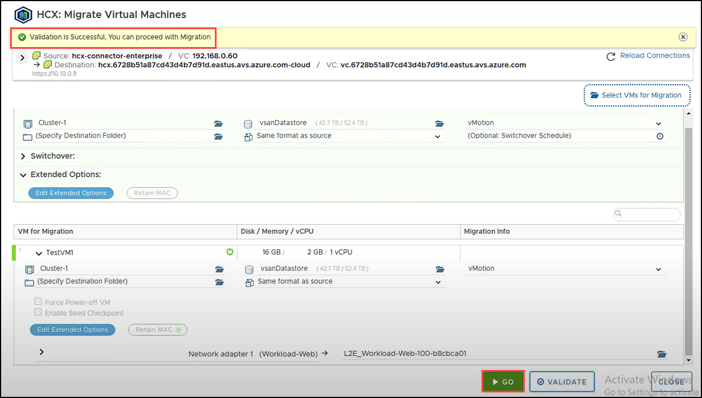

7. Ensure your VM was successfully migrated. You can also check for the VM in your AVS vCenter to Ensure it was migrated.

    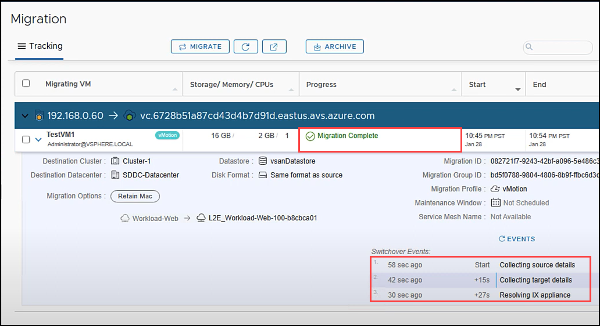

8. VMware HCX also supports **Reverse Migration**, migrating from AVS back to on-premises. Click on the **Migration** button.

    > **IMPORTANT** - All migrations, including reverse migrations must be initiated from the source site (on-premises in this case).
    
    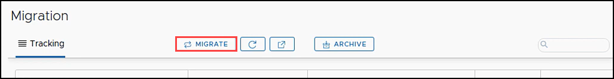

9. On the **Migrate Virtual Machines** tab click **Reverse Migration** checkbox. Select **TestVM1** and click on **ADD**.

    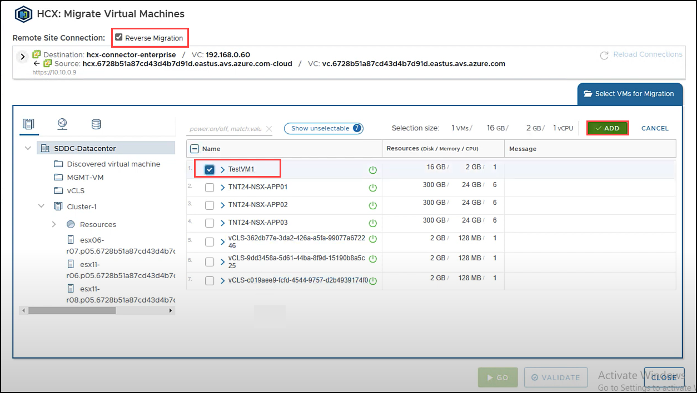

10. Set the following values in **Transfer and Placement** and click on **Validate**.

    |Option| Value|
    |---|---|
    |Compute Container|	OnPremCluster|
    |Storage|	TrueNAS|
    |Format| Same format as source|
    |Migration Profile|	vMotion|

    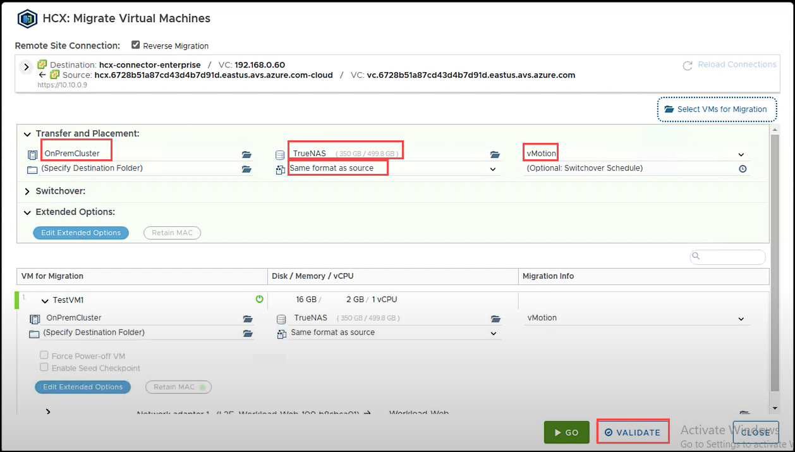

11. Once the validation is successful click on **GO**.

    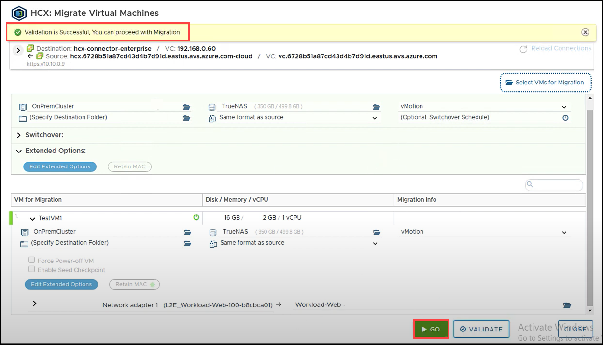

12. You have now successfully completed **Resverse Migration**.

    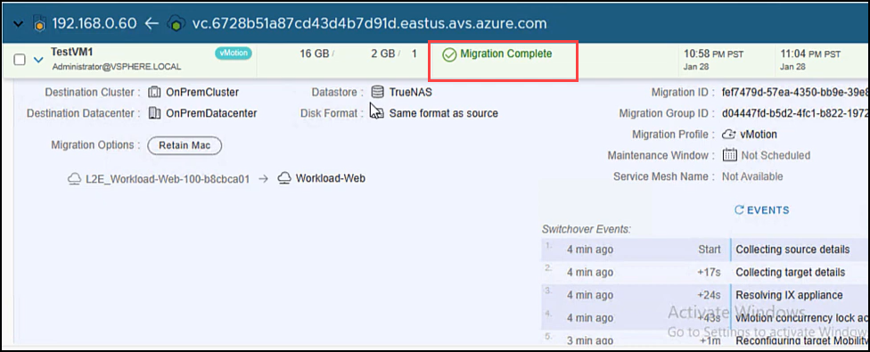
    
#### Summary:
In this task, you migrated the VM to AVS and performed Reverse Migration.

#### References:
[Migrating Virtual Machines with VMware HCX](https://docs.vmware.com/en/VMware-HCX/4.4/hcx-user-guide/GUID-D0CD0CC6-3802-42C9-9718-6DA5FEC246C6.html)

