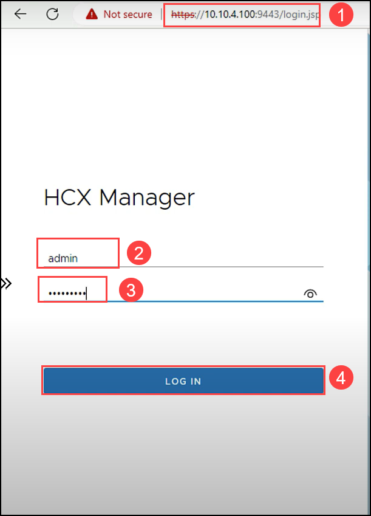
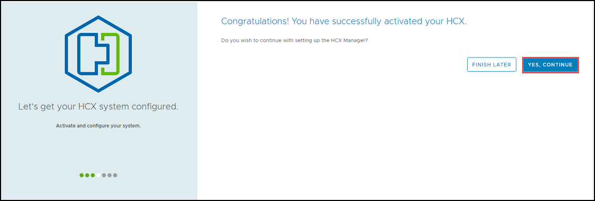

# Task 6: Activate VMware HCX

In this task, we will activate the On-Premises HCX appliance that we just deployed in Task 4.

## Exercise 1: Activate On-Premises HCX

1. Browse to the On-Premises HCX Manager IP `https://10.10.4.100:9443` **(1)** specified in Task 4 on port 9443 IP.

2. Login using the HCX Credentials, and **LOG IN (4)**.
   
   - Username: admin **(2)**
   - Password: MSFTavs1! **(3)**

   

3. On the **Activate your HCX instance** page, for **HCX License Key (1)** enter the **Activation key** you copied earlier and click **ACTIVATE (2)**.
 
    > **Note:** This process can take several minutes.
  
   
   
4. Next on **Where is your HCX system located?** page provide the nearest city to your location **(1)** for installing the VMware HCX Manager On-Premises. Then select **Continue (2)**.   

   
   
5. On the **System Name** page leave default and click on **Continue**.

    
    
6. Click **YES, CONTINUE** to complete activating your HCX. After a few minutes HCX should be successfully activated.    

       
