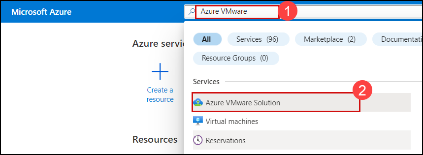
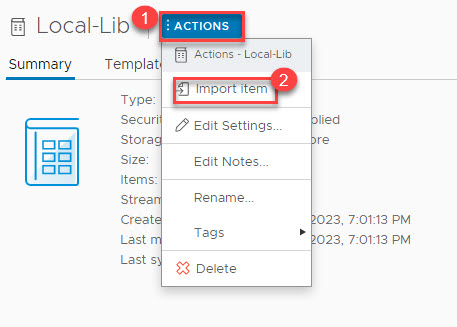

# Exercise 1: Create a content Library

1. Search **Azure VMware Solution (1)** and then select **Azure VMware Solution (2)**.

   

1. Select your **Azure VMware Solution**.
1. On the Azure VMware Solution page click on **VMware credentials (1)** under Manage and then copy the **Username** and **Password** under vCenter Server Credentials **(2)** and paste in in notepad for later use.

   

1. Open a new tab in the Microsoft edge browser, Enter the URL that you copied. 

   

1. Login to the **VMware vSphere**; Enter the **Username** and **password** that you copied in step 3 and click on **LOGIN**.

   

1. From AVS vCenter, click on the **Menu (1)** bars and then click on **Content Libraries (2)** under Inventory.

   

1. click on the **Create** button to create the **New Content Library**.

   

1. On the **Name and location** pane; Enter name your Library as **Local-Lib (1)** and click on **NEXT (2)**.

   

1. On the **Configure content library** pane; Leave it as default and click on **NEXT**.

   

1. On the **Apply security policy** pane; Leave it as default and click on **NEXT**.

   

1. On the **Add storage** pane; Select the **Storage (1)** and click on **NEXT (2)**.

   

1. On the **Ready to complete** pane; Review your content library settings and click on **FINISH**.

   

1. Click on your newly created Library i.e. **Local-Lib**.

   

1. On the Local-Lib Library, click on **ACTIONS (1)** and then click on **Import item (2)**.

   

1. Under Source tab, Enter URL as **https://gpsusstorage.blob.core.windows.net/ovas-isos/workshop-vm.ova (1)** and click on **IMPORT (2)**.

   

1. After Successfully Import the Source file, click on **Actions** on the top right and click on **Continue**.

   

1. You will see the **workshop-vm** under the OVF & OVA Templates.

   

1. Select the workshop-vm and right click on **workshop-vm (1)** and then click on **New VM from This Template... (2)**.

   

1. On the **Select a name and folder** pane; Enter Virtual machine name as **TestVM (1)** and then Select a location for the virtual machine i.e. **SDDC-Datacenter (2)**, click on **NEXT (3)**.

1. On the **Select a compute resource** pane; Select the destination compute resource for this operation i.e. **Cluster-1 (1)** and click on **NEXT (3)**.

1. On the **Review details** pane; you can verify the template details and click on **NEXT**.

1. On the **License agreements** pane; Accept the terms and click on **NEXT**.

1. On the **Select stoarge** pane; Select the **Storage (1)** and click on **NEXT (2)**.

1. On the **Select networks** pane; Select the Destination Network as **Web-Segment** and click on **NEXT**.

1. On the **Ready to complete** pane; click on **FINISH**.
