# Create Test VMs and connect to Segment

## Create Test VMs
Now that we have our networks created, we can deploy virtual machines and ensure we can get an IP address from DHCP. Go ahead and Login into your AVS vCenter.

# Exercise 1: Create a Content Library

1. Under Resource groups tab, launch **AVS-RG**.

   

2. Select your **Azure VMware Solution** `AVS-DC`.

   

3. On the Azure VMware Solution page; click on **VMware credentials (1)** under Manage tab and then copy the **Web client URL**, **Username** and **Password** under vCenter Server Credentials **(2)** and save it in notepad for later use.

   

4. Open a new tab in the Microsoft Edge browser, Enter the **Web Client URL** that you copied in step 3. 

   

5. Log in to the **VMware vSphere**; Enter the **Username** and **password** that you copied in step 3 and click on **LOGIN**.

   

6. From AVS vCenter, click on the **Menu (1)** bar and then click on **Content Libraries (2)** under Inventory.

   

7. click on the **CREATE** button to create the **New Content Libraries**.

   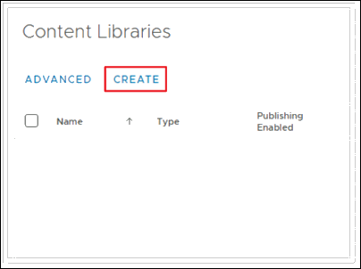

8. On the **Name and location** pane; Enter name your Library as **Local-Lib (1)** and click on **NEXT (2)**.

   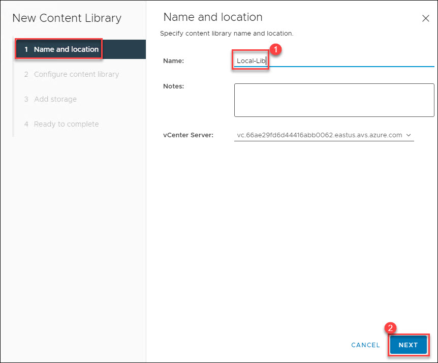

9. On the **Configure content library** pane; Leave it as default and click on **NEXT**.

   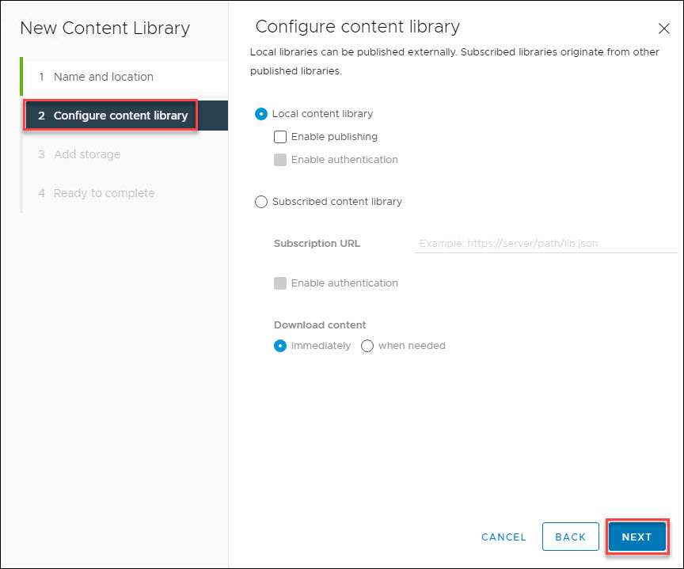

10. On the **Apply security policy** pane; Leave it as default and click on **NEXT**.

   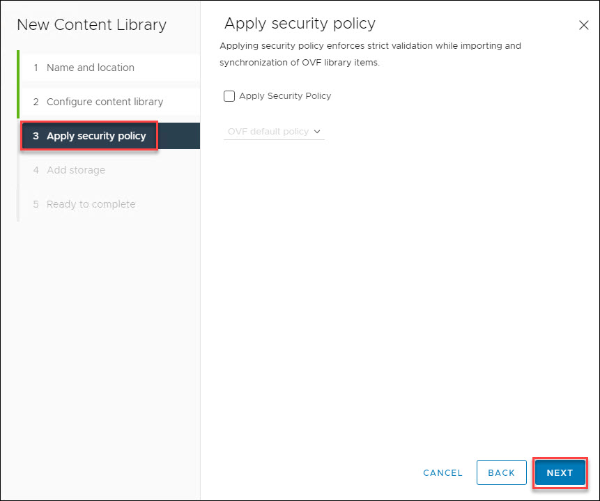

11. On the **Add storage** pane; Select **Storage (1)** and click on **NEXT (2)**.

   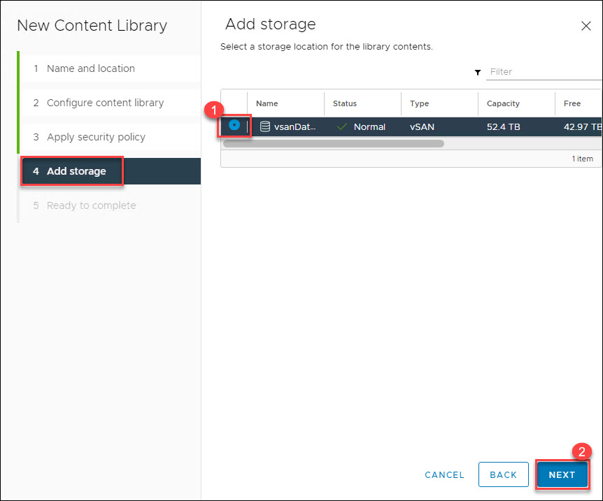

12. On the **Ready to complete** pane; Review your content library settings and click on **FINISH**.

   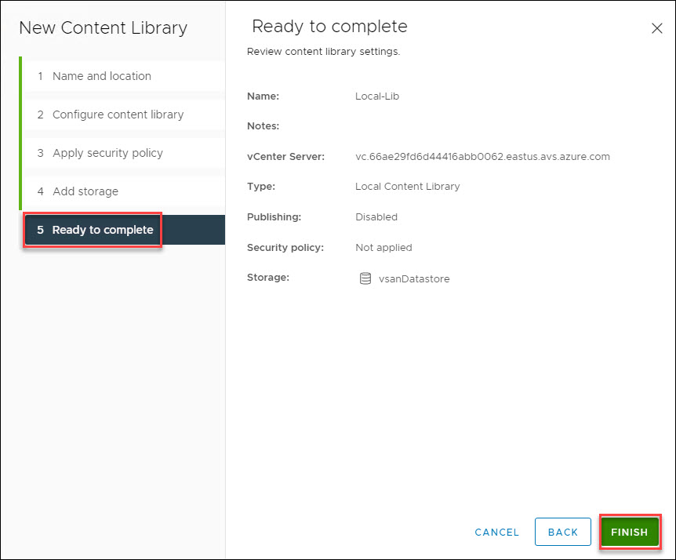
   
# Exercise 2: Import Item to Content Library 

1. Click on your newly created Library i.e. **Local-Lib**.

   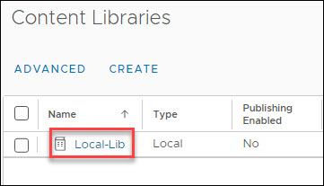

1. On the Local-Lib Library, click on **ACTIONS (1)** and then click on **Import item (2)**.

   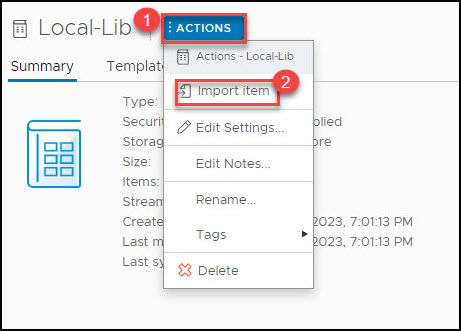

1. Under the Source tab, Enter the URL as **https://gpsusstorage.blob.core.windows.net/ovas-isos/workshop-vm.ova (1)** and click on **IMPORT (2)**.

   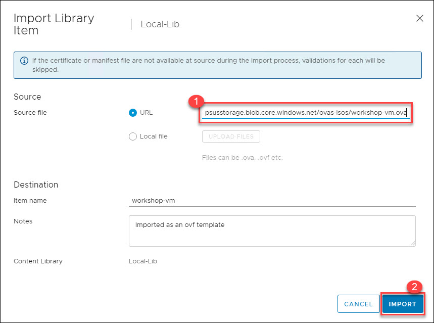

1. After Successfully Importing the Source file, click on **Actions** on the top right and click on **Continue**.

   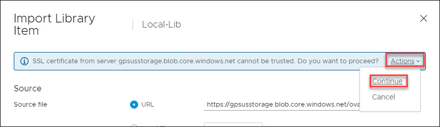

1. You will see the **workshop-vm** under the OVF & OVA Templates.

   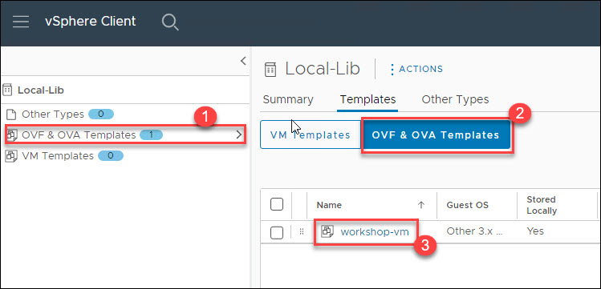
   
# Exercise 3: Create VMs

1. Select the workshop-vm, right click on **workshop-vm (1)**, and then click on **New VM from This Template... (2)**.

   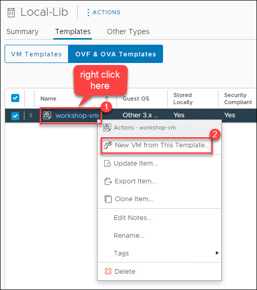

1. On the **Select a name and folder** pane; Enter the Virtual machine name as **TestVM (1)** and then Select a location for the virtual machine i.e. **SDDC-Datacenter (2)**, and click on **NEXT (3)**.

   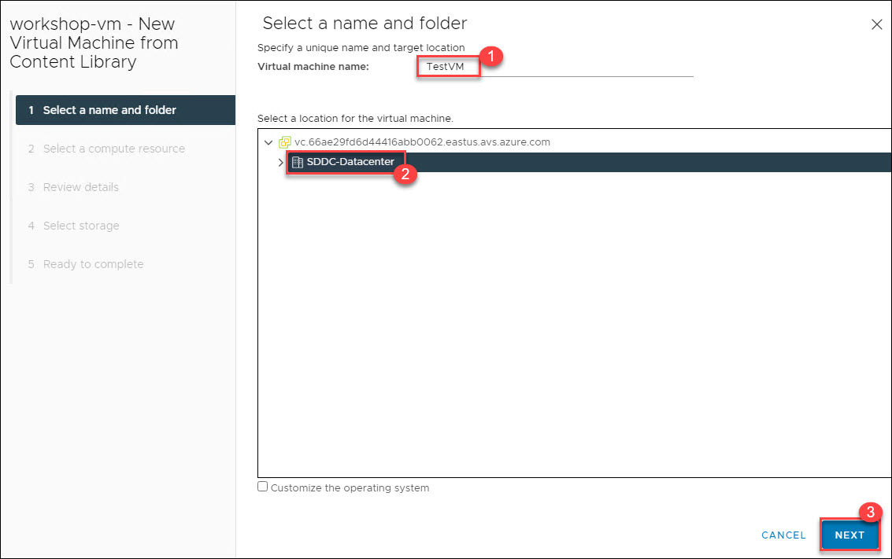

1. On the **Select a compute resource** pane; Select the destination compute resource for this operation i.e. **Cluster-1 (1)** and click on **NEXT (3)**.

   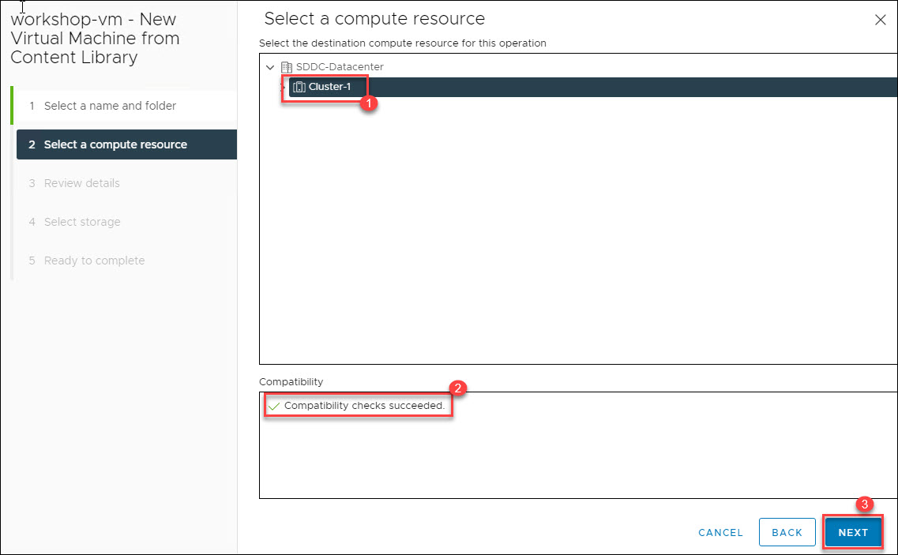

1. On the **Review details** pane; you can verify the template details and click on **NEXT**.

   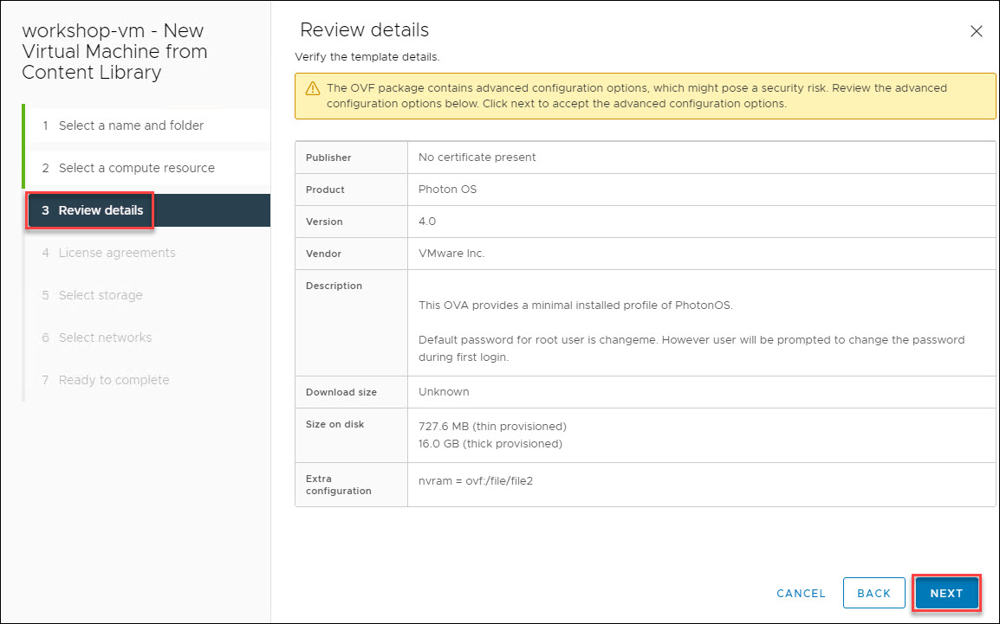

1. On the **License agreements** pane; Accept the terms and click on **NEXT**.

   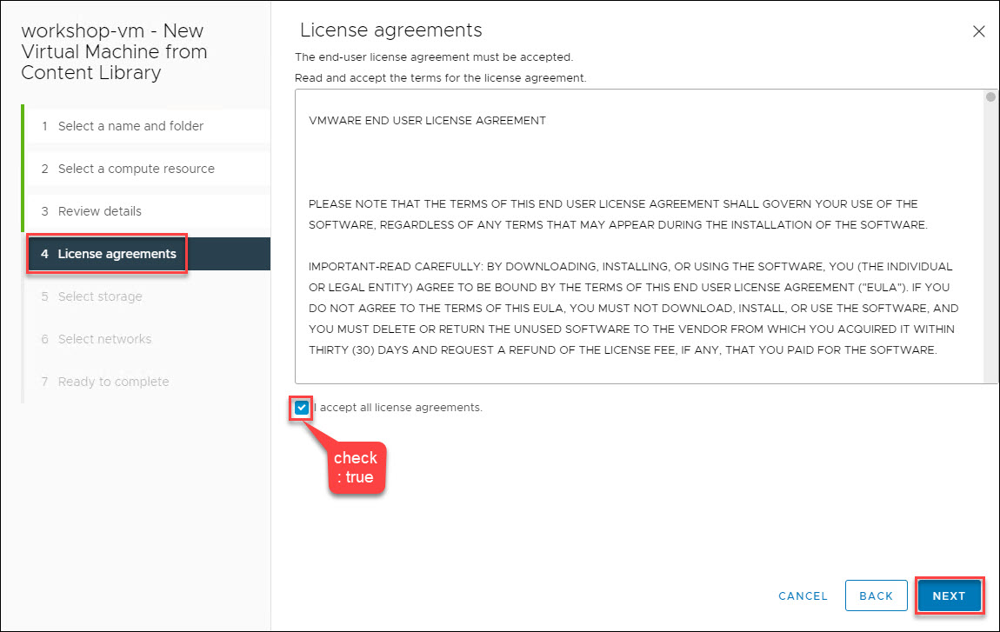

1. On the **Select storage** pane; Select **Storage (1)** and click on **NEXT (2)**.

   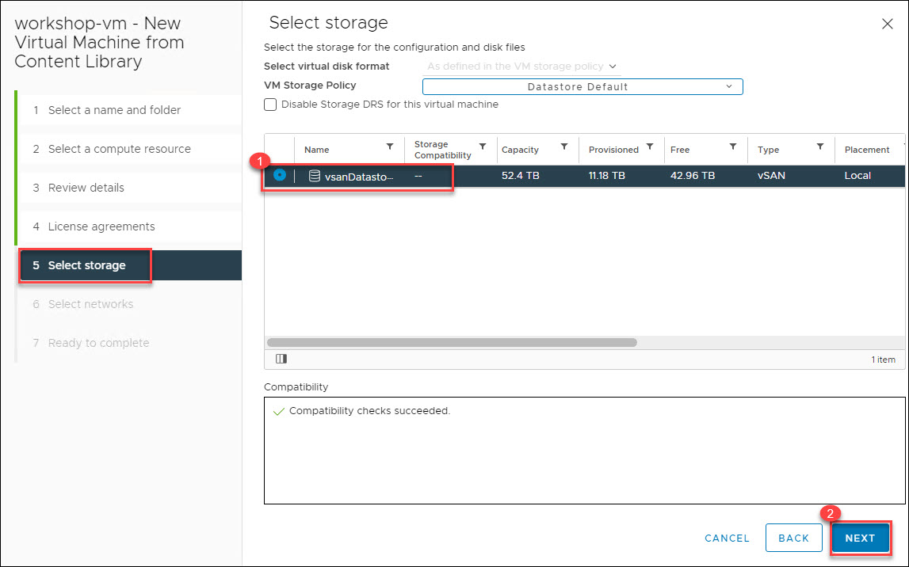

1. On the **Select networks** pane; Select the Destination Network as **Web-Segment** and click on **NEXT**.

   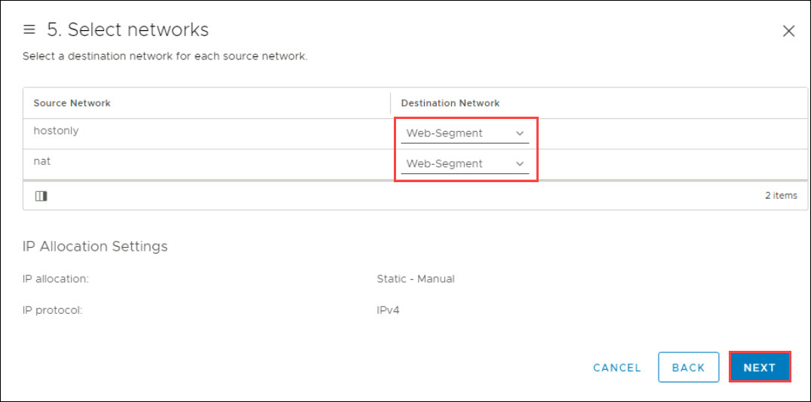

1. On the **Ready to complete** pane; click on **FINISH**.

   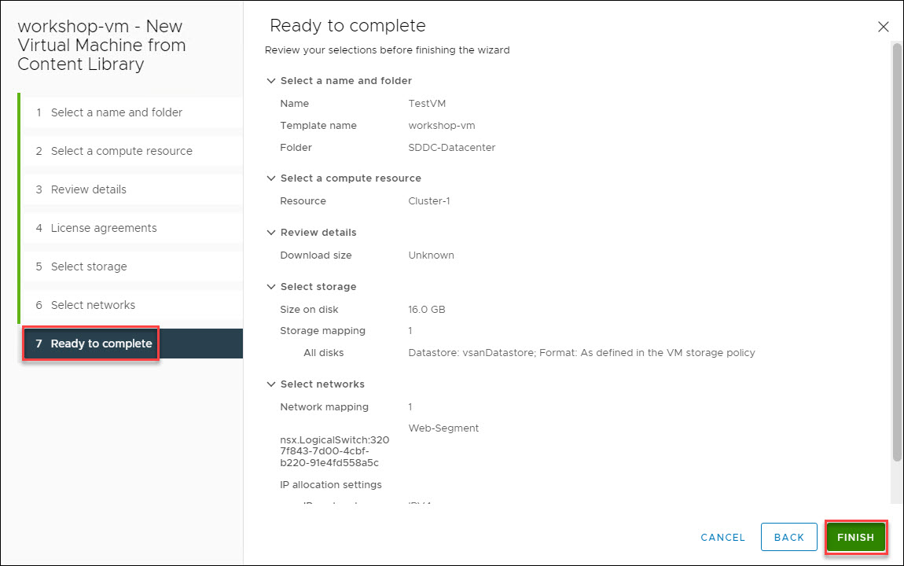
   
1. Repeat the above steps and create a new VM with name **TestVM-2**.

   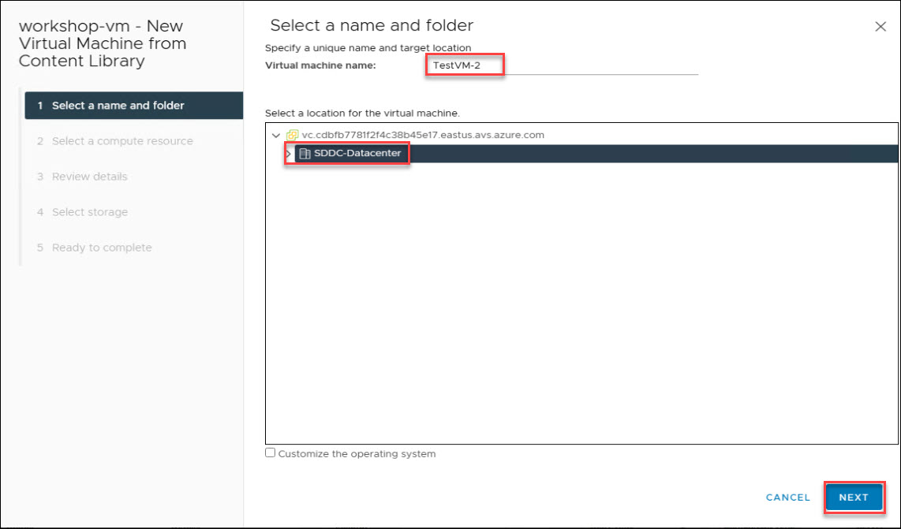
