## Task 4: Advanced NSX-T Features within AVS
You can find more information about NSX-T capabilities in VMware’s website under [VMware NSX-T Data Center Documentation](https://docs.vmware.com/en/VMware-NSX-T-Data-Center/index.html).

In this Section, you will learn just a few additional NSX-T Advanced Features. You will learn how to:
  * Create NSX-T tags for VMs
  * Create NSX-T groups based on tags
  * Create Distributed Firewall Rules in NSX-T

### Exercise 1: Assign NSX-T Tags to VMs
**NSX-T Tags** help you label NSX-T Data Center objects so that you can quickly search or filter objects, troubleshoot and trace, and do other related tasks.
You can create tags using both the **NSX-T UI** available within AVS and APIs.

More information on NSX-T Tags can be found here: [VMware NSX-T Data Center Documentation](https://docs.vmware.com/en/VMware-NSX-T-Data-Center/3.2/administration/GUID-358DF469-75C8-48C4-B0E2-279E55C7BB3E.html#:~:text=Tags%20Tags%20help%20you%20to%20label%20NSX-T%20Data,create%20tags%20using%20both%20the%20UI%20and%20APIs.).

1. Open the **NSX-T** UI page which you have already connected in Edge browser, if you have closed the page you can reopen it using `https://10.10.0.3/` in edge browser of JumpBox. 

2. Under **Inventory (2)**, click on the **Virtual Machines (3)** option; Locate your two Virtual Machines you created in the previous task **TestVM-1** and **TestVM-2**.
 
   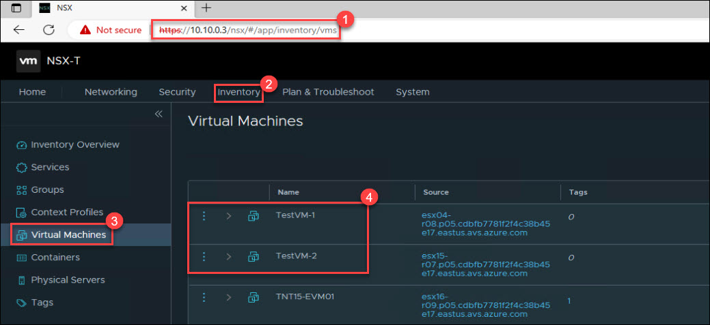
   
3. Click the **elipsis(...) (1)** next to the **TestVM-1** VM and click **Edit (2)**.

   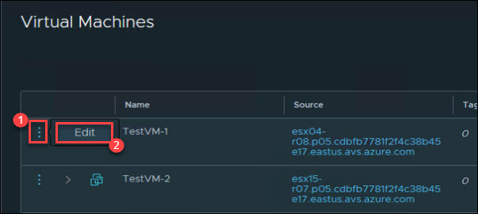
   
4. Locate the **Tag** area under VM edit section; add a tag with name `Web` (1) and then click on **Add item(s); Web (2)**. Now, click on the **Save (3)** to make the changes.

   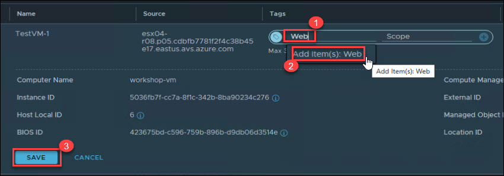
   
5. Let us add the same tag for **TestVM-2**;  Click the **elipsis(...) (1)** next to the **TestVM-2** VM and click **Edit (2)**.

   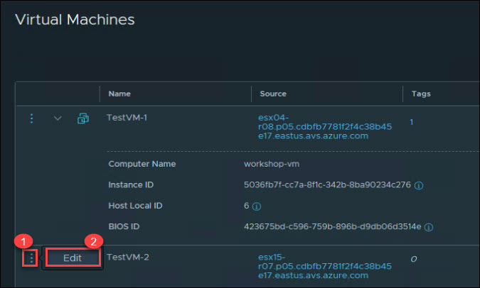
   
6. Locate the **Tag** area under VM edit section; add a tag with name `Web` (1) and then click on **Add item(s); Web (2)**. Now, click on the **Save (3)** to make the changes.

   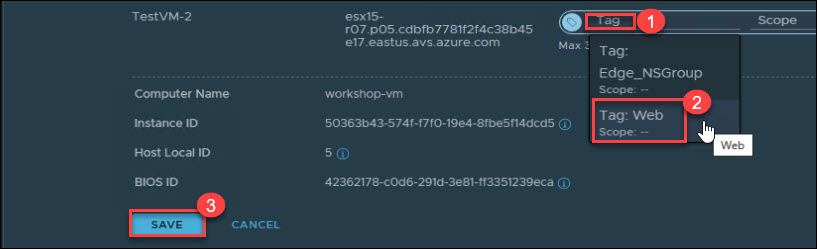 
   
You have successfully added the Tag to the Virtual Machines, now let's us create a group by Tag name.

### Exercise 2: Create NSX-T Groups

**Groups** include different objects that are added both statically and dynamically, and can be used as the source and destination of a firewall rule.

Groups can be configured to contain a combination of Virtual Machines, IP sets, MAC sets, segment ports, segments, AD user groups, and other groups. Dynamic including of groups can be based on a tag, machine name, OS name, or computer name.

You can find more information on NSX-T Groups on [VMware’s NSX-T Data Center docs](https://docs.vmware.com/en/VMware-NSX-T-Data-Center/3.2/administration/GUID-9DFF6EE2-2E00-4097-A412-B72472596E4D.html).

1. Under **Inventory (1)**, click on the **Groups (2)** option and then **ADD GROUP (3)**

   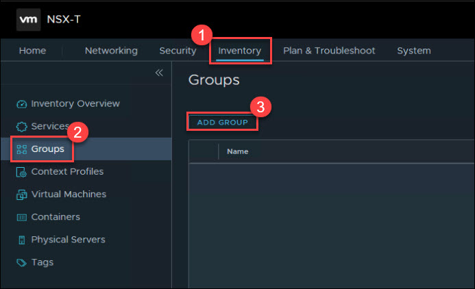
  
2. Provide `WebVms` (1) in group Name and then click on **Set Members (2)**.

   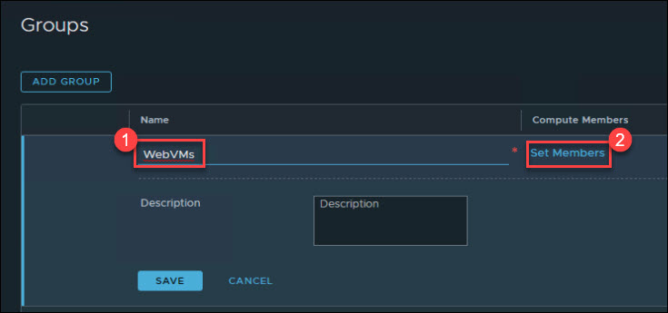
   
3. Under **Select Members | WebVms** tab, click on **+ ADD CRITERIA (2)** in Membership Criteria. Now, under **Criteria 1** select **Virtual Machines (3)** from the available options. Select **Web (4)** for Tag Equals and click on **APPLY (5)**. 

   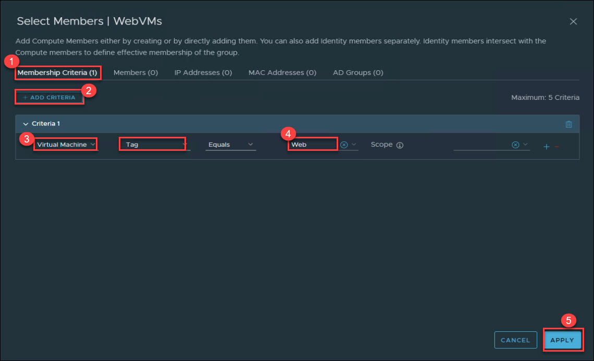
   
4. Once the criteria is added **Save** the group **WebVms**.

   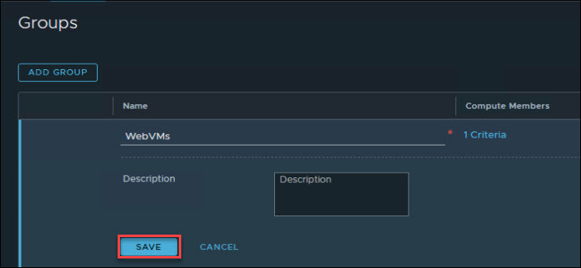
   
5. Click on **View Members** to check the members of newly created group. 

   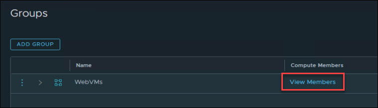
   
6. You can see the two members under **Virtual Machines** option which are **TestVM-1** and **TestVM-2** where we added the Web as tag. Now, you can **CLOSE** the tab.

   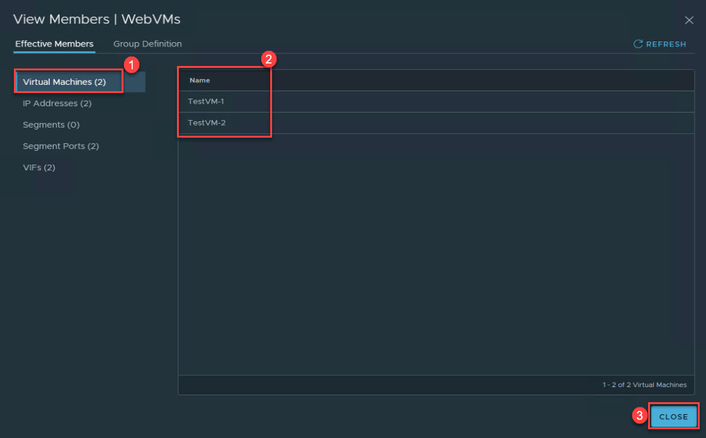

### Exercise 3: Create an NSX-T Distributed Firewall Policy

**NSX-T Distributed Firewall** monitors all East-West traffic on your AVS Virtual Machines and allows you to either deny or allow traffic between these VMs even if the exist on the same NSX-T Network Segment. This is the example of your 2 VMs and we will assume they’re 2 web servers that should never have to talk to each other. More information can be found here: [Distributed Firewall](https://docs.vmware.com/en/VMware-NSX-T-Data-Center/3.2/administration/GUID-6AB240DB-949C-4E95-A9A7-4AC6EF5E3036.html).

1. Under **Security (1)** tab, click on the **Distributed Firewall (2)** and then **+ ADD POLICY (3)**. In place of **New Policy** provide policy name as **WebSecPolicy (4)**.

   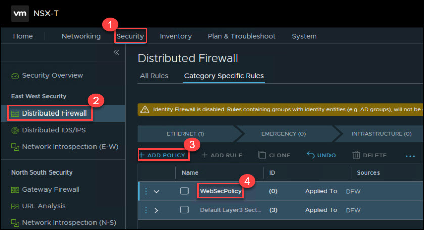
   
2. Click in the **ellipses (1)**, and then **Add Rule (2)** for **WebSecPolicy**.

   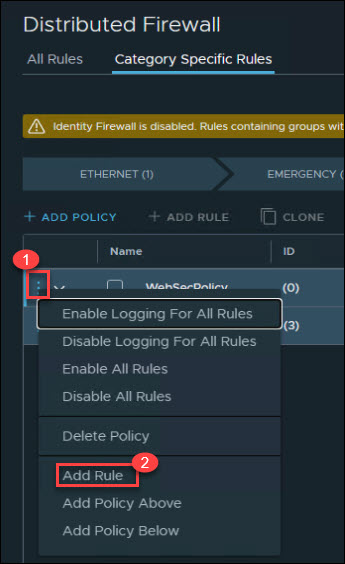
   
3. Enter the policy name as `RuleDemo` (1) and then click on **edit 🖋 (2)** button for Sources.

   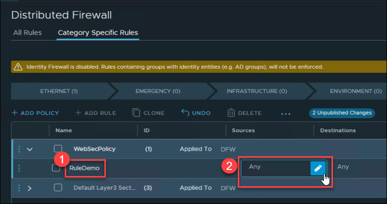
   
4. On **Set Sources** tab, select the **checkbox ☑ (1)** for **WebVMs** group and click on **APPLY (2)**.

   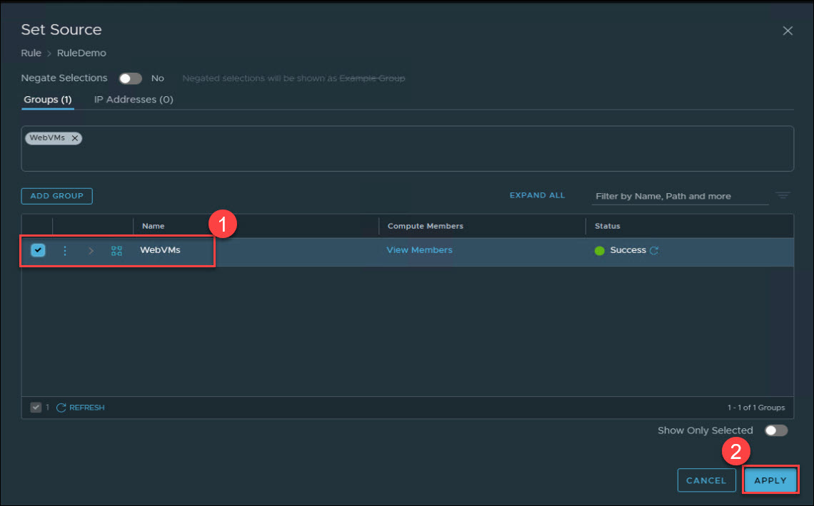
   
5. Similarly add the **Destinations** to **WebVMs (3)** group and make sure entries as per screen below; now click on **PUBLISH** to pulish the newly created Distributed Firewall Rule.

   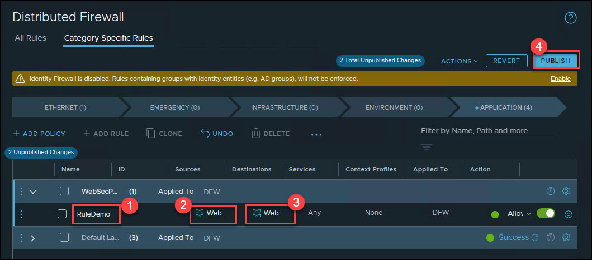
   
6. Once you publish the Distributed Firewall Rule, it will take about 15-20 seconds to get succeed; till then it will show as **In Progress**.

   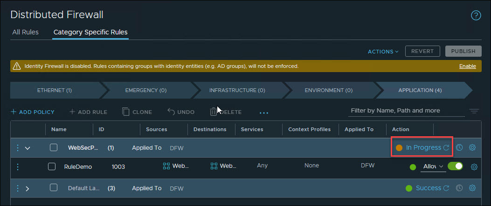
   
7. You will see the **Success** status once it is successfully published.

   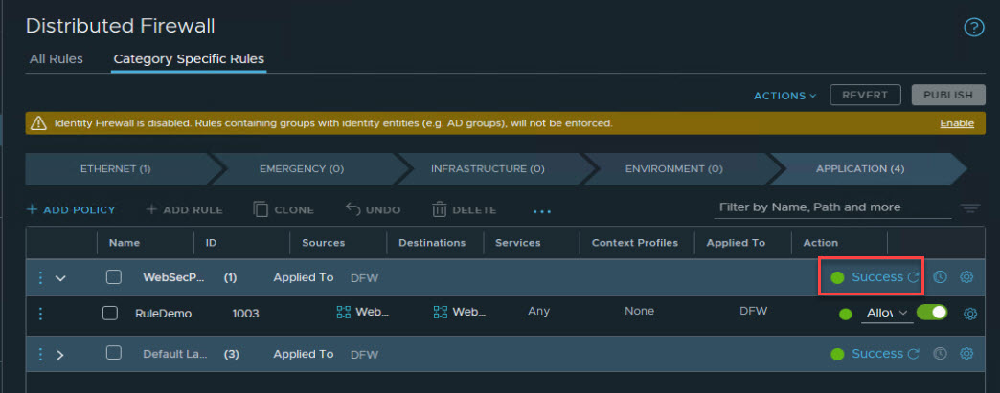
   
8. Once the rule is published, you can try to to ping the VMs from each other. Hopefully you still have the SSH sessions open to your 2 VMs you created earlier. If not, just SSH again. From one of the VMs, run a continuous ping to the other VM’s IP address like the example below.
   * Ping TestVM-2 (10.10.4.5) from TestVM-1 (10.10.4.4): `ping 10.10.4.5`
   * Ping TestVM-1 (10.10.4.4) from TestVM-2 (10.10.4.5): `ping 10.10.4.4`

    
   
9. Change the Action in your **WebSecRule** Rule **RuleDemo** action to **Reject (1)** and click **Publish (2)**. In few seconds status will be updated to **Success (3)**.

   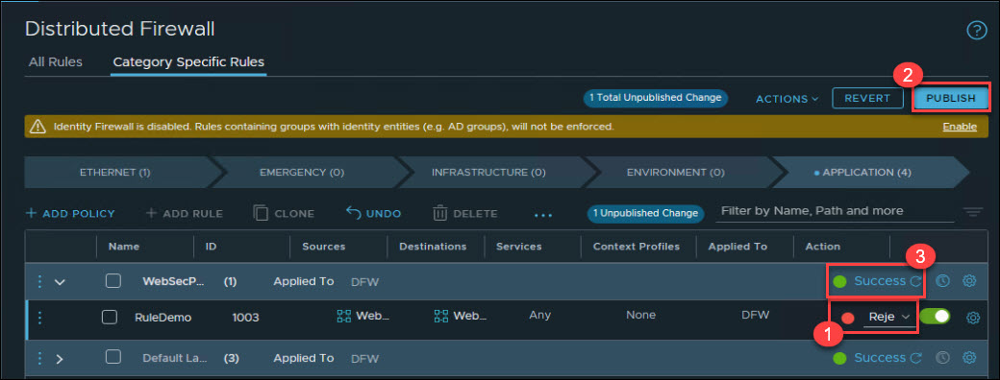

10. Now, switch back to the SSH VMs connection and You can notice that after publishing the change to Reject on your rule, the ping now displays “Destination Host Prohibited”. NSX-T DFW feature is allowing the packet to get from one VM to another but it rejects it once the second VM receives the packet.

    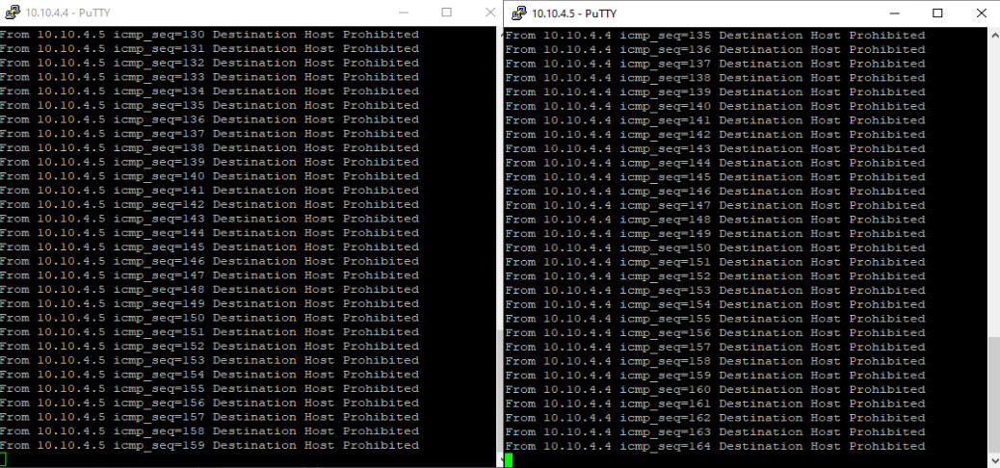
   
11. You can also change this option to **Drop** where the packet is completely dropped by the second VM.

   

