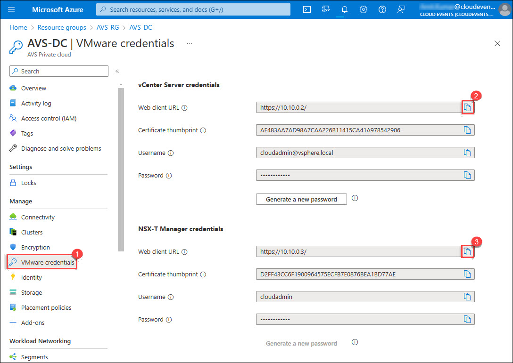

# Exercise 2: Connect Azure VNET to AVS using Express Route Connectivity 

Azure VMware Solution offers a private cloud environment accessible from On-Premises and Azure-based resources. Services such as Azure ExpressRoute, VPN connections, or Azure Virtual WAN deliver the connectivity.

## Lab objectives

In this Exercise, you will complete the following tasks:

+ Task 1: Create connection in VNet Gateway
+ Task 2: Confirm access from Jumpbox

### Task 1: Create connection in VNet Gateway

1. Once authorization key is created, the new key appears in the list of authorization keys for the private cloud. Copy the **authorization key** and **ExpressRoute ID** and keep it handy. You will need them to complete the peering. The authorization key disappears after some time, so copy it as soon as it appears.

   

2. From Azure portal, go to the Resource groups and click on **JumpBox-RG**.

   

3. From **JumpBox-RG** overview blade, click on **AVS-GW**.

   

4. From the **AVS-GW** blade, click on on the **Connections** under **Settings** and then **+ Add** to add the gatway connection.
    
   
   
5. On **Basic** blade, enter following details:

   * Subscription (1): Leave default

   * Resource group (2): Select **JumpBox-RG** from the drop-down.

   * Connection type (3): `ExpressRoute`

   * Name (4): `AVS-vNet`

   Now, click on the **Next : Setting > (5)**

   

6. On **Setting** blade, enter following details:
     
     * Virtual network gateway (1): Select **AVS-GW**

     * Enable check box for **Redeem authorization** (2)

     * Authorization key (3): paste the authorization key **az-vnet-key** value which you noted in previous steps. 
     * Peer circuit URI (4): paste the **ExpressRoute ID** value which you noted in previous steps
     * Routing weight (5): Leave default

    Now, click on the **Review + create (6)** button to add the connection, and wait for few seconds to get the connection succeed.
    
   
    
6. Within few second you will find the connection is added and in succeeded state.

      

### Task 2: Confirm access from Jumpbox

1. Now, from **AVS-DC** blade, click on **VMware credentials** (1), then copy **Web client URL of vCenter Server**.

    * Web client URL of vCenter Server: `https://10.10.0.2/`

      

2. Now, enter the vCenter Server **Web client URL**(1) in edge browser. Click on the **Advanced button**(2).

   

3. Click on **Continue to 10.10.0.2 (unsafe)** to open the vCenter Server. 

   
   
4. You will see that now you can launch the vSphere client (HtML5) successfully now. After launching vSphere client you will have to click on **Advance** button and then proceed with unsafe link. You will see the **VMware vSphere** login screen now.

   
   
5. Repeat same steps to access NSX-T Manager using the Web Client URL.
    * https://10.10.0.3/

       
   

## Review
In this exercise, you have completed:
- Created connection in VNet Gateway
- Confirmed access from Jumpbox
 
